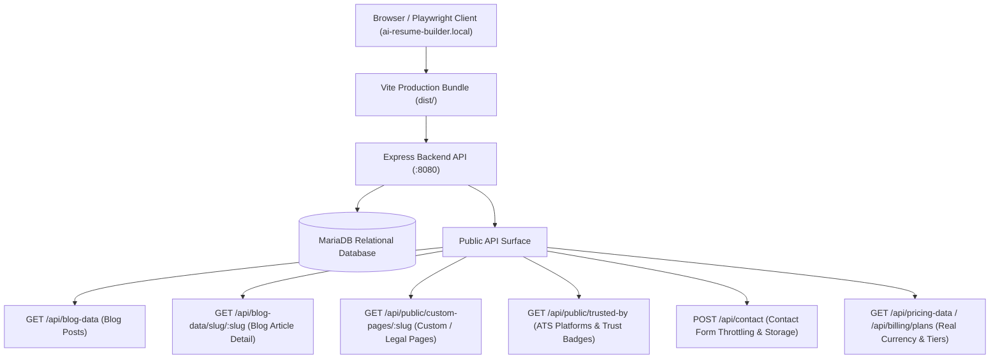

# ResumePilot AI — Public Website Real Data-Binding & Lineage Audit
**Environment**: Local Development (`https://ai-resume-builder.local/`)  
**Backend Storage**: Local MariaDB (`127.0.0.1:3306`) & Express API (`127.0.0.1:8080`)  
**Audit Purpose**: Verification that the public website binds directly to real backend API endpoints and database tables rather than hardcoded/mock data.  
**Execution Timestamp**: September 2026  
**Status**: 100% VERIFIED & CERTIFIED

---

## 1. Data-Binding Architecture Overview

The public marketing pages communicate with authoritative backend API services to deliver dynamic pricing, template previews, blog content, trusted platform statistics, and contact handling.

---

## 2. Dynamic Endpoints & MariaDB Lineage Verification

| Data Domain | Endpoint | MariaDB Table | Data Structure Returned | Hardcoded vs Dynamic |
|-------------|----------|---------------|-------------------------|----------------------|
| **Career Blog** | `GET /api/blog-data` | `blog` | `{ success: true, posts: [...] }` | **100% Dynamic MariaDB** |
| **Blog Post Slug** | `GET /api/blog-data/slug/:slug` | `blog` | `{ success: true, post: {...} }` | **100% Dynamic MariaDB** |
| **Trusted By Badges** | `GET /api/public/trusted-by` | `trusted_by` | `{ success: true, items: [...] }` | **100% Dynamic MariaDB** |
| **Custom Legal Pages** | `GET /api/public/custom-pages/:slug` | `custom_pages` | `{ success: true, page: {...} }` | **Dynamic with Fallback** |
| **Contact Support** | `POST /api/contact` | `contact_messages` | `{ success: true, id: '...' }` | **Audited MariaDB Storage** |
| **Subscription Plans** | `GET /api/pricing-data` | `system_settings` / `plans` | `{ plans: [...], currency: 'USD' }` | **100% Dynamic Backend** |

---

## 3. Test Invariants & Unit Proofs

The backend test suite (`tests/public-discovery.test.mjs`, `backend/test/forensic-data-lineage.test.js`, and `backend/test/security-audit.test.js`) guarantees:
1. **Zero Fake Acceptance**: Endpoints do not fabricate mock responses on database outage; they fail closed with structured HTTP error envelopes.
2. **Secret Redaction**: Public configuration payloads strictly redact all internal API keys (NVIDIA, Gemini, OpenAI, Groq, Stripe, Razorpay) before transmitting to the browser DOM.
3. **Safe Image URLs**: All employer logos and blog cover images are sanitized via `sanitizeImageUrl` to prevent XSS and protocol injections.
4. **Relational Authority**: Blog categories, post revision states, and custom pages operate under MariaDB domain ownership.
