# Super Admin Control Plane — UX & Information Architecture Blueprint

> **Document Version**: 2.0 (Post-Remediation Architecture)  
> **Status Tag**: Production Standard Architecture  
> **Classification Keys**: `[EXISTING]`, `[REMEDIATED]`, `[RECOMMENDED]`  

---

## 1. Information Architecture & Navigation Structure

```mermaid
graph TD
    AdminRoot["/adm (Admin Root)"] --> CommandCenter["Command Center (/adm/dashboard)"]
    AdminRoot --> ControlPlaneGroup["Control Plane Group"]
    AdminRoot --> IdentityGroup["Identity Group"]
    AdminRoot --> ConsumerGroup["Consumer Product Group"]
    AdminRoot --> SettingsGroup["Settings Engine (/adm/settings)"]

    ControlPlaneGroup --> Tenants["Tenants Registry (/adm/tenants) [Tenant 360]"]
    ControlPlaneGroup --> Audit["Admin Audit Trail (/adm/audit-logs)"]
    ControlPlaneGroup --> Security["Security Events (/adm/security)"]
    ControlPlaneGroup --> Queues["Queue & DLQ Monitor (/adm/queues)"]
    ControlPlaneGroup --> Ops["Platform Operations (/adm/operations)"]
    ControlPlaneGroup --> Attention["Attention Alerts (/adm/attention)"]
    ControlPlaneGroup --> Health["Platform Health (/adm/health)"]

    IdentityGroup --> Users["Users Manager (/adm/users) [User 360]"]
    IdentityGroup --> Operators["Platform Operators (/adm/operators)"]

    ConsumerGroup --> EmployerApps["Employer Applications (/adm/employer-applications)"]
    ConsumerGroup --> Jobs["Jobs Manager (/adm/jobs-manager)"]
    ConsumerGroup --> Companies["Company Management (/adm/company-management)"]
    ConsumerGroup --> Blog["Blog Management (/adm/blog-management)"]
    ConsumerGroup --> Pages["Landing Pages (/adm/landing-pages)"]
    ConsumerGroup --> Reviews["Reviews (/adm/reviews)"]
    ConsumerGroup --> TrustedBy["Trusted By (/adm/trustedby)"]
    ConsumerGroup --> Messages["Messages (/adm/messages)"]
    ConsumerGroup --> HelpDesk["Help Desk (/adm/help-desk)"]
    ConsumerGroup --> Phrases["Phrases (/adm/phrases)"]

    SettingsGroup --> Settings31["31 Modular Settings Tabs"]
```

---

## 2. Component-by-Component Blueprint & Capability Census

### 1. Platform Command Center (`/adm/dashboard`)
- **[EXISTING]** Live Subsystems Telemetry Banner with node version, commit SHA, and uptime.
- **[REMEDIATED]** Dynamic 4-KPI Grid:
  - Gross Earnings (SQL sum from `payment_orders` with active subscription count)
  - Registered Accounts (SQL count from `users` with 30-day growth velocity)
  - Resumes & Portfolios Engineered (Aggregated document count)
  - Exports & Downloads Generated (Authoritative count from `stats.global_stats`)
- **[EXISTING]** Live Service Matrix Ribbon with microservice health indicators.
- **[EXISTING]** Signal-derived automated recommendations with contextual deep-links.
- **[EXISTING]** Attention Tenants & Live Admin Audit Stream.

---

### 2. User 360 Workspace Drawer (`/adm/users`)
- **[EXISTING]** Split-panel modal drawer with sticky left-rail navigation.
- **[EXISTING]** Tab 1: **Identity & Security** (Firebase Auth state, email verified toggle, MFA reset, session revocation, JSON GDPR export).
- **[REMEDIATED]** Tab 2: **Resumes & Content** (Engineered resumes with template badges, public portfolios with slugs, and compiled cover letters).
- **[EXISTING]** Tab 3: **Organization Tenancy** (Enterprise tenant memberships, workspace IDs, and 1-click binding/removal).
- **[EXISTING]** Tab 4: **Roles & Access (RBAC)** (Custom claims role assignment: `SUPER_ADMIN`, `ADMIN`, `AUDITOR`, `SUPPORT`, `EMPLOYER`, `USER`).
- **[EXISTING]** Tab 5: **Subscription & Billing** (Order history, payment status, currency, and invoice breakdown).
- **[EXISTING]** Tab 6: **AI Entitlements** (Daily quota limits, today's usage, and custom per-user allocation form).
- **[EXISTING]** Tab 7: **Audit Timeline** (Chronological merged security and admin audit logs for the target user).

---

### 3. Tenant 360 Workspace Modal (`/adm/tenants`)
- **[EXISTING]** Grand modal with dark header banner, slug, isolation tier, and lifecycle indicator.
- **[REMEDIATED]** Tab 1: **Topology & Overview** (Rename organization, telemetry cards, and **Configured Workspaces & Departments** grid).
- **[EXISTING]** Tab 2: **Users & Memberships** (Member list, role filter, 1-click member addition/removal, role changes).
- **[EXISTING]** Tab 3: **Commercials & SLA** (Contracted plan preset, seat limits, billing currency, billing status).
- **[EXISTING]** Tab 4: **AI Quotas & BYOK Keys** (Dedicated tenant API keys for NVIDIA, Gemini, OpenAI, Groq, OpenRouter, DeepSeek with live testing).
- **[EXISTING]** Tab 5: **Usage & Telemetry** (Token consumption summary, request totals, and tenant audit events).
- **[EXISTING]** Tab 6: **Decommission Zone** (Reason-gated retirement moving tenant to `DELETING` state).

---

### 4. Global Search & Command Palette (`Cmd+K`)
- **[EXISTING]** Instant keyboard-navigable shortcuts to all 20 admin screens and 31 settings tabs.
- **[REMEDIATED]** Live Multi-Entity Search:
  - Users (by email, display name, user ID)
  - Enterprise Tenants (by display name, slug, tenant ID)
  - Payment Orders (by order ID, provider transaction ID, UID)
  - Support Tickets (by ticket ID, subject, user ID)
- **[EXISTING]** Category badges and direct deep-link navigation.

---

### 5. Queue & DLQ Monitor (`/adm/queues`)
- **[EXISTING]** Real-time transactional outbox (`notification_outbox` & `enterprise_outbox`) inspector.
- **[EXISTING]** Health indicators and dead-letter count summary tiles.
- **[EXISTING]** 1-Click "Replay All Dead Letters" and "Purge DLQ" workflows with danger-gated confirmation modals.
- **[EXISTING]** Per-job inspection drawer showing recipient, attempt count, last error, and creation timestamp.

---

### 6. Settings & Configuration Engine (`/adm/settings`)
- **[EXISTING]** 31 distinct configuration panels categorized into 6 functional groups:
  1. *Modules & Addons*: `modulesSettings`
  2. *General & Branding*: `websiteSettings`, `brandingSettings`, `geoSeoSettings`, `llmGeoSettings`, `firebaseSettings`, `databaseSettings`, `socialAuthSettings`, `emailSettings`
  3. *AI Engine & Services*: `storageSettings`, `aiSettings`, `exportPdfSettings`, `jobScraperSettings`, `twilioSmsSettings`
  4. *Payments & Gateways*: `ordersManagement`, `subscriptionsSettings`, `watermarkSettings`, `currencySettings`
  5. *Security & Health*: `integrationsSettings`, `securityLimitsSettings`, `systemHealthSettings`, `featureFlagsSettings`, `platformConfigSettings`, `codeInjectionSettings`, `gdprLegalSettings`
  6. *Content & Media*: `templateManagerSettings`, `pages`, `blog`, `socialSettings`, `analytics`, `ads`
- **[EXISTING]** Optimistic concurrency enforcement (`expectedRevision`) preventing silent overwrites.
- **[EXISTING]** Zero-secret leakage invariant protecting server API credentials.

---

## 3. Ideal Operational Workflows & Incident Playbooks

### Workflow 1: User Diagnostic & Account Recovery
$$\text{Search (Cmd+K)} \longrightarrow \text{User 360 Drawer} \longrightarrow \text{Inspect Content \& Audit} \longrightarrow \text{Reset Password / Revoke Sessions} \longrightarrow \text{Durable Audit Log}$$

### Workflow 2: Enterprise Tenant Onboarding & Policy Configuration
$$\text{Provision Tenant Modal} \longrightarrow \text{Set Slug \& Isolation Tier} \longrightarrow \text{Assign Members} \longrightarrow \text{Configure AI BYOK Keys} \longrightarrow \text{Test Providers}$$

### Workflow 3: Payment Investigation & Refund Issuance
$$\text{Search Order ID} \longrightarrow \text{Invoices Tab} \longrightarrow \text{Inspect Order \& User} \longrightarrow \text{Issue Authoritative Refund} \longrightarrow \text{Generate Credit Note}$$

### Workflow 4: Outbox Incident Mitigation & DLQ Recovery
$$\text{Command Center Alert} \longrightarrow \text{Queue Monitor (/adm/queues)} \longrightarrow \text{Inspect Error Reasons} \longrightarrow \text{Replay Dead Letters} \longrightarrow \text{Verify Delivery}$$
