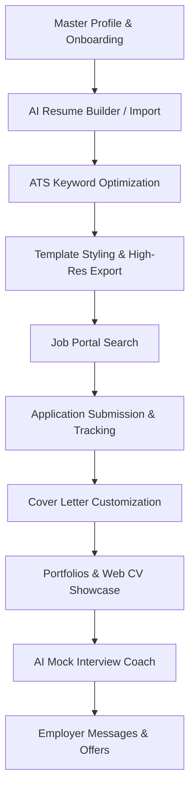

# USER Dashboard Information Architecture Audit

**Audit Date**: September 2, 2026  
**Auditor**: Principal UX Architect & Full-Stack Engineer  
**Objective**: Evaluate cognitive load, navigation unity, discoverability, and career journey coherence.

---

## 1. Information Architecture Overview

The candidate dashboard is structured around the natural **Candidate Career Progression**:



---

## 2. Navigation Structure (Consolidated Single Sidebar)

The application utilizes a single, collapsible sidebar (`ProfileDisplay.jsx`) eliminating duplicate menus, conflicting bars, and nested confusion:

```
[Brand Logo & Sidebar Collapse Toggle]
[User Profile Badge with Membership Indicator]
│
├── 1. MAIN WORKSPACE
│   ├── Overview & Resumes (/dashboard)
│   └── Enterprise Workspace (/enterprise) [Dark/Opt-in when enabled]
│
├── 2. CAREER SUITE (Accordion)
│   ├── AI Resumes & Master CV (/dashboard)
│   ├── Cover Letters (/dashboard/cover-letters) [When enabled]
│   └── Portfolios & Web CV (/dashboard/portfolios) [When enabled]
│
├── 3. JOB INTELLIGENCE (Accordion)
│   ├── Browse Job Portal (/jobs/portal) [Direct link to live jobs]
│   ├── Job Tracker (/dashboard/job-tracker) [When enabled]
│   ├── My Applications (/dashboard/applied-jobs) [When enabled]
│   ├── AI Interview Coach (/dashboard/interview)
│   └── Messages & Chat (/dashboard/messages) [When enabled]
│
├── 4. ACCOUNT & SECURITY (Accordion)
│   ├── Subscription & Plans (/dashboard/plans)
│   ├── Master Profile Data (/dashboard/settings?tab=Profile)
│   ├── Security & 2FA Hub (/dashboard/settings?tab=Account)
│   └── Help Desk & Support (/dashboard/support)
│
└── [STICKY FOOTER]
    ├── Notifications Bell (with unread badge counter)
    └── Secure Sign Out
```

---

## 3. Cognitive Load & Discoverability Assessment

| Criterion | Evaluation | Architectural Decision |
|---|---|---|
| **Discoverability** | High | All core modules are visible within 1-click in the sidebar or directly in the Career Command Center. |
| **Cognitive Load** | Low | Related items are grouped into clear functional accordions with intuitive icons. |
| **Navigation Clutter** | Zero | No double sidebars, no competing top bars, and clean auto-collapsing mobile drawer. |
| **Hierarchy Depth** | Shallow (Max 2 levels) | Every destination is reachable in 1 to 2 clicks from anywhere in the application. |
| **Mobile Drawer Experience** | Seamless | Slides from left on mobile (<1024px) with backdrop blur and touch target compliance (>44px). |
