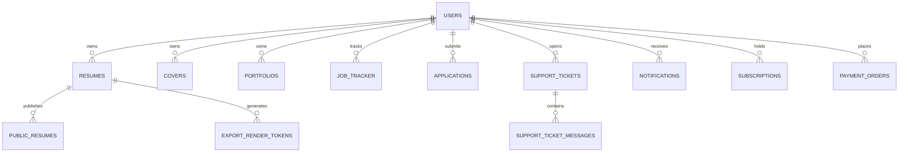

# USER Database Lineage Audit

**Audit Standard**: Authoritative MariaDB Persistence & Cross-Table Relational Integrity  
**Database Engine**: MariaDB 11.4 LTS  
**Audit Target**: Zero Firestore Application Persistence Drift, 100% MariaDB Authority

---

## 1. Entity-Relationship & Lineage Graph

---

## 2. Table-by-Table Data Lineage & Schema Verification

### 2.1 `resumes` Table
- **Primary Key**: `id` (VARCHAR(128))
- **Foreign Key**: `user_id` -> `users(id)` ON DELETE CASCADE
- **Columns**: `id`, `user_id`, `firstname`, `lastname`, `occupation`, `template`, `data` (LONGTEXT JSON), `revision` (INT UNSIGNED), `created_at`, `updated_at`.
- **Integrity Guarantee**: All rich candidate fields (`employments`, `educations`, `skills`, `certifications`, `projects`, `achievements`, `languages`, `references`, `customSections`, `summary`) are preserved atomically inside `data` JSON without column truncation.

### 2.2 `support_tickets` & `support_ticket_messages` Tables
- **Migration**: `015_support_tickets.sql`
- **Integrity**: `ticket_id` references `support_tickets(id)` ON DELETE CASCADE. Strict tenant/user ID matching prevents ticket leakage across users.

### 2.3 `job_tracker` Table
- **Columns**: `id`, `user_id`, `company`, `role`, `status`, `salary`, `url`, `notes`, `column_order`, `applied_date`.
- **Integrity**: Drag-and-drop column state updates execute within owner-scoped SQL predicates.

### 2.4 `portfolios` Table
- **Columns**: `id`, `user_id`, `slug`, `title`, `theme`, `bio`, `data` (LONGTEXT JSON), `is_published`, `views_count`.
- **Integrity**: `slug` has UNIQUE index. Public projection hides internal settings and unpublished drafts.

### 2.5 `covers` Table
- **Columns**: `id`, `user_id`, `title`, `template`, `recipient_name`, `company_name`, `data` (LONGTEXT JSON).
- **Integrity**: Full cover letter drafts persist in MariaDB with user-scoped isolation.

---

## 3. Data Integrity & Non-Disclosure Verification

1. **Owner Scoping**: All mutations execute with `WHERE user_id = ?` bound to the authenticated JWT UID.
2. **Cascading Cleanup**: Account deletion in `/api/account/delete` removes all associated records across all tables atomically within a single database transaction.
3. **Data Portability**: `/api/account/export` compiles all records from `resumes`, `covers`, `portfolios`, `job_tracker`, `applications`, and `support_tickets` into a compliant GDPR JSON archive.
