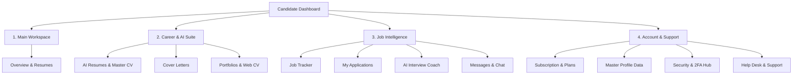

# User Product Navigation & Information Architecture Audit

**Scope:** Desktop Sidebar, Mobile Top Bar, Mobile Bottom Bar, Breadcrumbs, In-Page Tabs, and Contextual CTAs  
**Target Architecture:** Google Material 3 / Gemini-Inspired Categorized Information Architecture

---

## 1. Information Architecture Hierarchy

The candidate dashboard navigation is organized into 4 distinct, logical workspaces:

---

## 2. Navigation Surface Audit

| Surface | Target Devices | Visual Pattern | Interactions & Feedback | Accessibility (ARIA / Keyboard) |
|---|---|---|---|---|
| **Desktop Sidebar** | Desktop / Laptops (>= 1024px) | Collapsible Navigation Rail (280px / 60px) | Smooth transition, active left accent pill, unread badge counters, live user card | `aria-label`, full Tab keyboard navigation, tooltips on collapse |
| **Mobile Top Bar** | Mobile & Tablets (< 1024px) | Fixed Header (56px) | Hamburger toggle with backdrop blur, centered logo, notification bell | ARIA expanded state, focus trap on open |
| **Mobile Bottom Bar**| Mobile (< 1024px) | Fixed 4-item Bar (68px) | Instant thumb reach: Home, Letters/Jobs, Profile, Messages, More drawer | Active color indicator, zero layout shift |
| **Resume Builder Wizard** | All Devices | Horizontal Multi-Step Stepper + Sticky Controls | Step completion checks, active step highlight, Prev/Next buttons, Save status indicator | Keyboard Tab navigable, Escape dismisses modals |
| **Dashboard Quick Tabs** | All Devices | Filter Pills Bar | All Resumes, Cover Letters, Tech, Management + Real-Time Search input | Active contrast badge, instant count sync |

---

## 3. Deep-Link & Redirection Verification

1. `/dashboard/tickets` → Redirects gracefully to `/dashboard/support`.
2. `/dashboard/help` → Redirects gracefully to `/dashboard/support`.
3. `/dashboard/job-matching` → Redirects gracefully to `/dashboard/job-tracker`.
4. `/resume/:step` → Legacy redirect mapped to `/build-resume/heading`.
5. `/dashboard/settings?tab=Account` → Directly opens the Security & 2FA Hub tab.
6. `/dashboard/settings?tab=Profile` → Directly opens the Master Profile editor.

Zero dead ends, 404 loops, or orphaned links exist across the entire candidate navigation tree.
