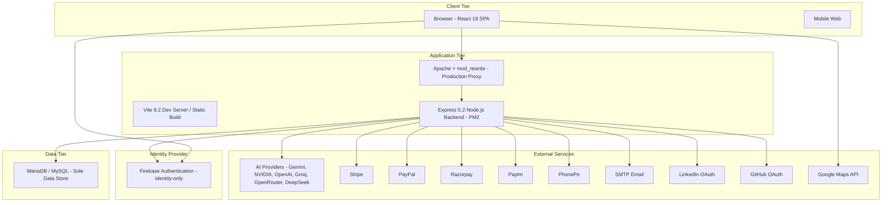
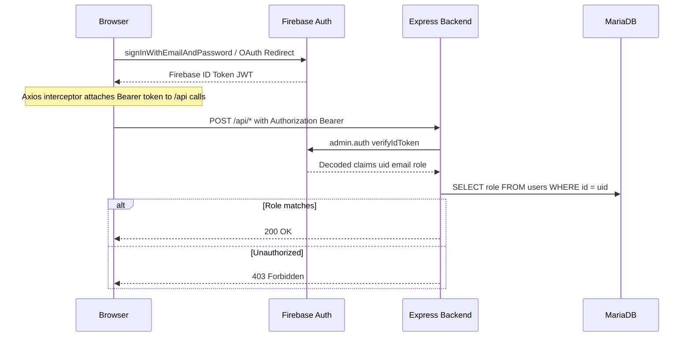
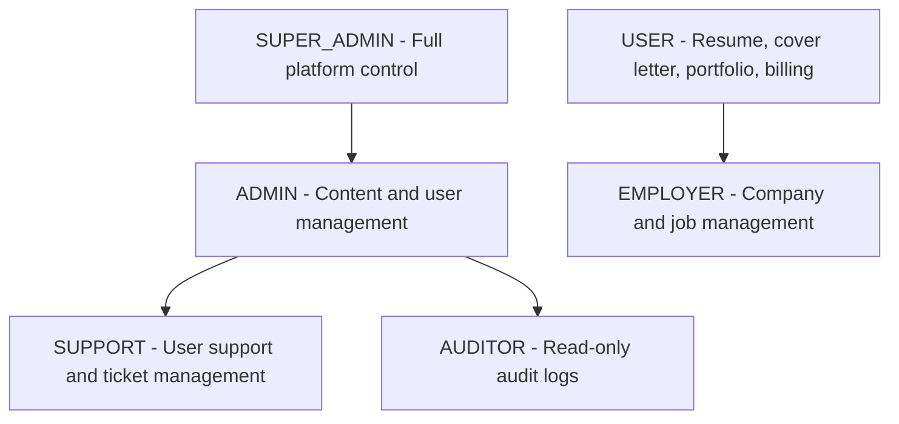
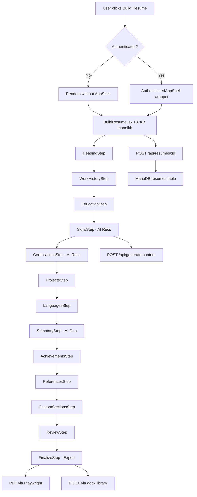
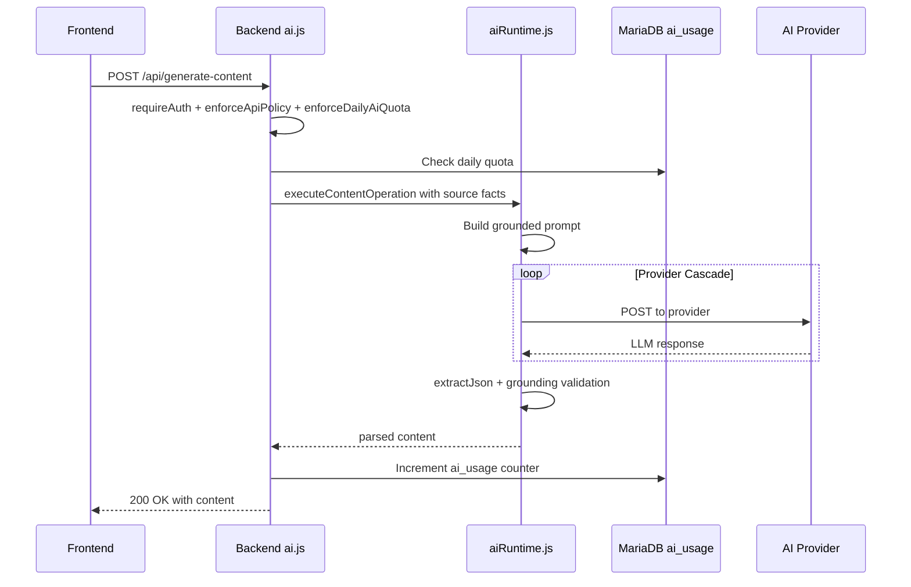

# ResumePilot AI — Authoritative Architecture Flowchart

> **Forensic Audit Date**: 2026-08-30  
> **HEAD SHA**: `b6ec79bd73193cea8a166aebb4c1efcfb218874e`  
> **Branch**: `main` (synchronized with `origin/main`)  
> **Working Tree**: Clean (no uncommitted changes)  
> **Source of Truth**: Current repository code — NOT inherited from previous documents

---

## 1. System Context

---

## 2. Authentication Flow

---

## 3. RBAC / Role Hierarchy

**Role Assignment**: Firebase custom claims set via admin API. MariaDB `users.role` is authoritative.  
**Permission Model**: `_permissionsFor(role)` in `backend/security/auth.js` maps roles to permission sets.

---

## 4. Tenant / Workspace Architecture

Enterprise tenancy is **dark-launched** (`ENTERPRISE_TENANCY_ENABLED=false`). Schema in migrations 002-006. Backend in `/backend/enterprise/` (30 files). Frontend at `/enterprise/*`. **Production: UNPROVEN**.

Tables: `enterprise_tenants`, `enterprise_workspaces`, `enterprise_memberships`, `enterprise_workspace_memberships`, `enterprise_tenant_configurations`, `enterprise_resources`, `enterprise_audit_logs`, `enterprise_outbox`, `enterprise_service_accounts`, `enterprise_support_grants`.

---

## 5. Build Resume Flow

---

## 6. Dashboard Architecture

User Dashboard at `/dashboard/*` with: DashboardHomepage, ResumesList, CoversList, DashboardPortfolios, DashboardInterviews (AI Interview Coach), DashboardJobMatching (Job Tracker), DashboardSettings, DashboardMessages, DashboardFavourites, DashboardSearch, EmployerDashboard.

---

## 7. AI Infrastructure Flow

**Active AI Endpoints**: `/api/generate-content`, `/api/parse-resume`, `/api/generate-interview`, `/api/check-grammar`, `/api/generate-ai-cover-letter`.  
**Retired (HTTP 410)**: `/api/generate-resume`, `/api/generate-summary`, `/api/generate-work-description`, `/api/generate-education-description`, `/api/generate-skills`.

---

## 8. Payment Flow

5 payment providers: Stripe (webhook-driven), PayPal (client verify), Razorpay (HMAC signature), Paytm (callback + verify), PhonePe (callback + status). All create `payment_orders` then update `users.membership` on confirmation.

---

## 9. Database Schema

**~55+ tables** across 15 migrations (001-015):
- **Core**: users, resumes, public_resumes, portfolios, covers, favourites, jobs, applications, job_tracker, companies, blog, custom_pages, trusted_by, reviews, contact_messages, conversations, conversation_participants, conversation_messages, notifications, payment_orders, transactions, subscriptions, coupons, coupon_redemptions, system_settings, stats, admin_audit_logs, security_audit_logs, payment_webhook_events, canonical_documents
- **Security**: oauth_states, oauth_exchange_codes, export_render_tokens, password_reset_tokens, password_reset_state, email_verification_tokens, email_verification_state
- **Operational**: ai_usage, notification_outbox, platform_announcements, email_logs
- **Enterprise** (11 tables), **Billing Extensions** (6 tables), **CMS** (3 tables), **Support** (1 table)

---

## 10. Workers and Schedulers

| Worker | Flag | Default | Status |
|--------|------|---------|--------|
| Notification Outbox | NOTIFICATION_OUTBOX_WORKER_ENABLED | true | Active |
| Enterprise Outbox | ENTERPRISE_OUTBOX_WORKER_ENABLED | false | Disabled |
| CMS Scheduler | CMS_SCHEDULER_ENABLED | false | Disabled |
| Tenant GC | TENANT_GC_WORKER_ENABLED | false | Disabled |

---

## 11. Health and Readiness

Endpoints: `GET /healthz`, `GET /api/healthz`, `GET /api/health`, `GET /api/health/databases`, `GET /readyz`, `GET /api/readyz`.  
`platformHealth.js` aggregates MariaDB connectivity, migration state, worker status, system settings.

---

## 12. Deployment

PM2 ecosystem: 1 instance, fork mode, 600MB memory limit. Apache reverse proxy with `.htaccess` SPA fallback. Vite build to `/dist`.

---

## 13. Technology Stack

| Layer | Technology | Version |
|-------|-----------|---------|
| Frontend | React | 19.1.0 |
| Routing | react-router-dom | 7.18.2 |
| Build | Vite | 8.2.1 |
| CSS | Tailwind 4 + SCSS + CSS | 4.1.8 |
| Backend | Express | 5.2.1 |
| Database | MySQL2 MariaDB | 3.24.2 |
| Identity | Firebase Admin | 14.2.0 |
| PDF | Playwright Chromium | 1.62.1 |
| DOCX | docx | 9.5.1 |
| Email | Nodemailer | 9.0.5 |
| Payment | Stripe PayPal Razorpay Paytm PhonePe | various |
| i18n | react-i18next | 15.5.2 |
| Testing | Node.js test runner + Playwright + Supertest | - |

---

## 14. Component Inventory

- Frontend Components: ~300 JSX files
- Backend Routes: 19 route files + ~180 inline routes
- Backend Services: 27 service files
- Enterprise Modules: 30 files
- Security Modules: 10 files
- Database Migrations: 15 (001-015)
- CV Templates: 51 (Cv1-Cv51)
- Cover Templates: 4 (Cover1-Cover4)
- Portfolio Templates: 4 themes
- Backend Tests: 74 test files
- Frontend Tests: ~118 test files

---

## 15. Feature Flags

| Flag | Default | Location | Impact |
|------|---------|----------|--------|
| `ENTERPRISE_TENANCY_ENABLED` | `false` | ecosystem.config.js | All enterprise features dark |
| `ENTERPRISE_DATA_PROVIDER` | `mysql` | ecosystem.config.js | Enterprise data store |
| `ENTERPRISE_OUTBOX_WORKER_ENABLED` | `false` | ecosystem.config.js | Enterprise job processing |
| `NOTIFICATION_OUTBOX_WORKER_ENABLED` | `true` | ecosystem.config.js | Email delivery via outbox |
| `CMS_SCHEDULER_ENABLED` | `false` | ecosystem.config.js | Blog scheduled publishing |
| `TENANT_GC_WORKER_ENABLED` | `false` | ecosystem.config.js | Tenant garbage collection |
| `PDF_RENDERER_ISOLATED` | `false` | .env.example | Chromium sandbox mode |
| `VITE_ENTERPRISE_TENANCY_ENABLED` | `false` | .env.example | Frontend enterprise UI |

---

## 16. Navigation Map

### Public Routes
`/` (Welcome), `/login`, `/sign-up` (redirect), `/features`, `/pricing`, `/billing/plans`, `/contact`, `/blog`, `/blog/:slug`, `/jobs`, `/jobs/portal`, `/jobs/browse`, `/jobs/categories`, `/jobs/category/:catName`, `/portfolios`, `/portfolio/:slug`, `/shared/:resumeId`, `/p/:custompage`

### Authenticated Routes
`/dashboard/*`, `/build-resume/*`, `/create-resume/*`, `/coverletter/*`, `/cover-letter/*`, `/portfolio/builder`, `/blog-editor/*`, `/enterprise/*`

### Admin Routes
`/adm/*` (canonical), `/admin/*` (redirect to /adm/*), `/platform/*` (redirect to /adm/*)

### Export Routes
`/export/Cv1-51/:resumeId/:language`, `/export/Cover1-4/:resumeId/:language`

### Compatibility Redirects
`/front` -> `/`, `/sign-up` -> `/login`, `/dashboard2/*` -> Dashboard, `/resume/:step` -> `/build-resume/heading`, `/cover-letter` -> `/coverletter`
