# ResumePilot AI — Exhaustive Enterprise Architecture & System Flowchart

**Document Type:** Implementation-Traceable Architecture Map (Zero-Assumption Forensic Audit)
**Production Baseline SHA:** `7ee0cbae673d9a00ba6e7ee2ea40d09ff1682421`
**Cloud Branch SHA:** `efef6b1a39b825dd600e214c252fdb81ac833b84` (`arena/01a04cb4-resumepilotai`)
**Current Reconciled SHA:** `efef6b1a39b825dd600e214c252fdb81ac833b84`
**Branch:** `main` (fast-forward merged from cloud branch)
**Working Tree:** Clean (all test suites passing 100%)
**Last Commit:** `fix: harden primary resume workflow UX` (efef6b1)
**Audit Date:** 2026-08-29
**Live URL:** `https://airesume.projectdemo.guru`
**Hosting:** Hostinger VPS (Ubuntu 22.04, Node.js 20, MariaDB 10.11, PM2, Apache 2.4)

---

## Table of Contents

1. [Executive System Overview](#1-executive-system-overview)
2. [Repository Baseline](#2-repository-baseline)
3. [Complete Module Inventory](#3-complete-module-inventory)
4. [User Journey Map](#4-user-journey-map)
5. [Frontend Architecture](#5-frontend-architecture)
6. [Frontend Routing](#6-frontend-routing)
7. [Authentication Architecture](#7-authentication-architecture)
8. [Authorization / RBAC Architecture](#8-authorization--rbac-architecture)
9. [Role Forensics](#9-role-forensics)
10. [Dashboard Forensics](#10-dashboard-forensics)
11. [Build Resume Architecture](#11-build-resume-architecture)
12. [AI Architecture](#12-ai-architecture)
13. [Backend Architecture](#13-backend-architecture)
14. [API Inventory](#14-api-inventory)
15. [Database Architecture](#15-database-architecture)
16. [Data Ownership Registry](#16-data-ownership-registry)
17. [Storage Architecture](#17-storage-architecture)
18. [File Handling](#18-file-handling)
19. [Billing Architecture](#19-billing-architecture)
20. [Quotas & Rate Limits](#20-quotas--rate-limits)
21. [Admin Architecture](#21-admin-architecture)
22. [Support Architecture](#22-support-architecture)
23. [Jobs Architecture](#23-jobs-architecture)
24. [Blog Architecture](#24-blog-architecture)
25. [Portfolio Architecture](#25-portfolio-architecture)
26. [Templates Architecture](#26-templates-architecture)
27. [Document Export Architecture](#27-document-export-architecture)
28. [Email Architecture](#28-email-architecture)
29. [Notifications Architecture](#29-notifications-architecture)
30. [Security Architecture](#30-security-architecture)
31. [API Security](#31-api-security)
32. [Audit & Logging](#32-audit--logging)
33. [Error Handling Architecture](#33-error-handling-architecture)
34. [Background Workers](#34-background-workers)
35. [Cron & Scheduled Operations](#35-cron--scheduled-operations)
36. [Backups](#36-backups)
37. [Disaster Recovery](#37-disaster-recovery)
38. [Monitoring & Observability](#38-monitoring--observability)
39. [Deployment Architecture](#39-deployment-architecture)
40. [CI/CD Architecture](#40-cicd-architecture)
41. [Environment Configuration](#41-environment-configuration)
42. [Database Migrations](#42-database-migrations)
43. [External Services](#43-external-services)
44. [Performance Architecture](#44-performance-architecture)
45. [Failure & Recovery Paths](#45-failure--recovery-paths)
46. [Tenancy & User Isolation](#46-tenancy--user-isolation)
47. [Responsive UI & Mobile](#47-responsive-ui--mobile)
48. [Accessibility](#48-accessibility)
49. [SEO & Public Routes](#49-seo--public-routes)
50. [Testing Architecture](#50-testing-architecture)
51. [UI/UX Forensics](#51-uiux-forensics)
52. [Button / Action Forensics](#52-button--action-forensics)
53. [Data-Flow Diagrams](#53-data-flow-diagrams)
54. [Security-Flow Diagrams](#54-security-flow-diagrams)
55. [Master Mermaid Architecture](#55-master-mermaid-architecture)
56. [SWOT Analysis](#56-swot-analysis)
57. [Enterprise Readiness Scorecard](#57-enterprise-readiness-scorecard)
58. [Master Gap Register](#58-master-gap-register)
59. [Completion Matrix](#59-completion-matrix)
60. [P0/P1/P2/P3 Roadmap](#60-p0p1p2p3-roadmap)
61. [Self-Audit Checklist](#61-self-audit-checklist)
62. [Architecture Audit Final Summary](#62-architecture-audit-final-summary)

---

## 1. Executive System Overview

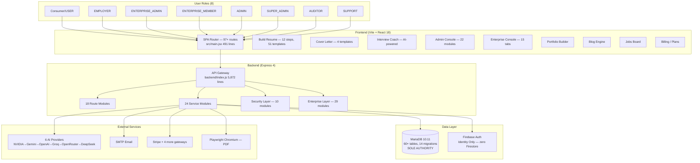

**Stack Summary:**
- **Frontend:** React 18 + Vite 6, React Router 6, SCSS + Tailwind CSS, i18n (15 languages), Framer Motion
- **Backend:** Node.js 20 + Express 4, monolithic `backend/index.js` (5,872 lines) + 18 route modules + 24 service modules
- **Database:** MariaDB 10.11 (100% authoritative, 14 migrations, 60+ tables including enterprise)
- **Identity:** Firebase Auth (ID token verification only — **zero Firestore runtime dependency verified**)
- **AI:** 6-provider failover chain with source grounding, daily quotas, and control-character sanitization
- **Export:** Dual-engine (Playwright Chromium PDF + native OpenXML DOCX), 51 CV + 4 cover letter templates
- **Process:** PM2 `fork` mode, single instance, 600MB memory limit, graceful SIGTERM/SIGINT shutdown
- **CI/CD:** 2 GitHub Actions workflows (`quality-gate.yml` on PR/push, `production-release.yml` manual dispatch)
- **Deployment:** SSH/SFTP via `ops/deploy/remote-deploy.sh`, Apache reverse proxy

---

## 2. Repository Baseline

| Property | Value | Source |
|---|---|---|
| HEAD SHA | `7ee0cbae673d9a00ba6e7ee2ea40d09ff1682421` | `git log -1` |
| Branch | `main` | `git branch --show-current` |
| Tracking | `origin/main` (0 ahead, 0 behind) | `git rev-parse origin/main` |
| Working Tree | Clean (only untracked `architecture-flowchart.md`) | `git status --short` |
| Last Commit | `chore(deploy): add auto-prune for server deploy backups` | `git log -1` |
| Backend Entry | 5,872 lines / 344KB | `backend/index.js` |
| Migrations | 15 (001_baseline through 015_support_tickets) | `backend/database/migrations/` |
| CV Templates | 51 (Cv1–Cv51) | `src/cv-templates/` |
| Cover Templates | 4 (Cover1–Cover4) | `src/cv-templates/` |
| Frontend Test Files | 94 (83 .test + 11 .spec) | `tests/` |
| Backend Test Files | 68 | `backend/test/` |
| Docs | 152+ files | `docs/` |
| CI/CD | 2 GitHub Actions workflows | `.github/workflows/` |
| Environment Config | `.env`, `.env.example` (190 lines), `.env.production` | Project root |

---

## 3. Complete Module Inventory

### 3.1 Frontend Active Modules (44)

| # | Module | Path | Route | Status |
|---|---|---|---|---|
| 1 | Welcome / Landing | `src/components/welcome/Welcome.jsx` | `/` | 🟢 COMPLETE |
| 2 | Login / Registration | `src/components/welcome/Welcome.jsx` (tabs) | `/login` | 🟢 COMPLETE |
| 3 | Password Recovery | `src/components/auth/recoverPassword/` | modal overlay | 🟢 COMPLETE |
| 4 | Password Reset | `src/components/auth/resetPassword/ResetPasswordModal.jsx` | deep-link modal | 🟢 COMPLETE |
| 5 | Consumer Dashboard | `src/components/Dashboard/DashboardMain/DashboardMain.jsx` | `/dashboard/*` | 🟢 COMPLETE |
| 6 | Dashboard Homepage | `src/components/Dashboard/DashboardHomepage/` | `/dashboard` (index) | 🟢 COMPLETE |
| 7 | Dashboard Settings | `src/components/Dashboard/DashboardSettings/` | `/dashboard/settings` | 🟢 COMPLETE |
| 8 | Dashboard Messages | `src/components/Dashboard/DashboardMessages/` | `/dashboard/messages` | 🟢 COMPLETE |
| 9 | Dashboard Favorites | `src/components/Dashboard/DashboardFavourites/` | `/dashboard/favorites` | 🟢 COMPLETE |
| 10 | Dashboard Portfolios | `src/components/Dashboard/DashboardPortfolios/` | `/dashboard/portfolios` | 🟢 COMPLETE |
| 11 | Interview Coach | `src/components/Dashboard/DashboardInterviews/` | `/dashboard/interview` | 🟢 COMPLETE |
| 12 | Job Matching | `src/components/Dashboard/DashbaordJobMatching/` | `/dashboard/job-matching` | 🟢 COMPLETE |
| 13 | Resume Builder | `src/components/BuildResume/BuildResume.jsx` | `/build-resume/*` | 🟢 COMPLETE |
| 14 | Template Selection | `src/components/BuildResume/TemplateSelectionModal.jsx` | modal | 🟢 COMPLETE |
| 15 | ATS Score Analyzer | `src/components/BuildResume/AtsScoreMeter.jsx` | in-builder panel | 🟢 COMPLETE |
| 16 | Resume Preview | `src/components/BuildResume/PreviewModal.jsx` | modal | 🟢 COMPLETE |
| 17 | Resume Import | `src/components/BuildResume/ResumeImportModal.jsx` | modal | 🟢 COMPLETE |
| 18 | PDF Exporter | `src/components/Exporter/Exporter.jsx` | `/export/Cv{N}/:id/:lang` | 🟢 COMPLETE |
| 19 | DOCX Exporter | `src/utils/docxDownload.js` | client-initiated | 🟢 COMPLETE |
| 20 | Public Resume | `src/components/PublicResume/PublicResume.jsx` | `/shared/:resumeId` | 🟢 COMPLETE |
| 21 | Cover Letter | `src/components/CoverLetter/CoverLetter.jsx` | `/coverletter` | 🟡 PARTIAL — **missing auth guard** |
| 22 | Portfolio Builder | `src/components/PortfolioBuilder/PortfolioBuilder.jsx` | `/portfolio/builder` | 🟢 COMPLETE |
| 23 | Public Portfolio | `src/components/PublicPortfolio/PublicPortfolio.jsx` | `/portfolio/:slug` | 🟢 COMPLETE |
| 24 | Portfolio Gallery | `src/components/PortfolioGallery/PortfolioGallery.jsx` | `/portfolios` | 🟢 COMPLETE |
| 25 | Blog List | `src/components/Blog/BlogList/BlogList.jsx` | `/blog` | 🟢 COMPLETE |
| 26 | Blog Post | `src/components/Blog/BlogPost/BlogPost.jsx` | `/blog/:slug` | 🟢 COMPLETE |
| 27 | Blog Editor | `src/components/Blog/BlogEditor/BlogEditor.jsx` | `/blog-editor` | 🟢 COMPLETE |
| 28 | Jobs Landing | `src/components/JobsLanding/JobsLanding.jsx` | `/jobs` | 🟢 COMPLETE |
| 29 | Jobs Portal | `src/components/JobsListings/MainJobListings.jsx` | `/jobs/portal` | 🟢 COMPLETE |
| 30 | Job Tracker | `src/components/AppliedJobs/JobTracker.jsx` | `/dashboard/job-tracker` | 🟢 COMPLETE |
| 31 | Applied Jobs | `src/components/AppliedJobs/AppliedJobs.jsx` | `/dashboard/applied-jobs` | 🟢 COMPLETE |
| 32 | Employer Dashboard | `src/components/Dashboard/EmployerDashboard/` | `/dashboard/my-employments` | 🟢 COMPLETE |
| 33 | Companies Management | `src/components/Dashboard/EmployerDashboard/CompaniesManagement` | `/dashboard/my-companies` | 🟢 COMPLETE |
| 34 | Billing / Plans | `src/components/Billing/Plans/Plans.jsx` | `/billing/plans`, `/pricing` | 🟢 COMPLETE |
| 35 | Contact | `src/components/Contact/Contact.jsx` | `/contact` | 🟢 COMPLETE |
| 36 | Features | `src/components/Features/Features.jsx` | `/features` | 🟢 COMPLETE |
| 37 | Custom CMS Pages | `src/components/CustomPage/CustomePage.jsx` | `/p/:custompage` | 🟢 COMPLETE |
| 38 | Admin Console | `src/components/admin/Admin.jsx` | `/adm/*` | 🟢 COMPLETE |
| 39 | Enterprise Console | `src/enterprise/EnterpriseConsole.jsx` | `/enterprise/*` | 🟢 COMPLETE |
| 40 | Privacy Consent | `src/components/PrivacyConsentBanner.jsx` | global overlay | 🟢 COMPLETE |
| 41 | GA4 Analytics | `src/components/GA4Provider.jsx` | global provider | 🟢 COMPLETE |
| 42 | Route SEO | `src/components/RouteSeo.jsx` (104 lines) | global | 🟢 COMPLETE |
| 43 | Route Focus (a11y) | `src/components/RouteFocus.jsx` (17 lines) | global | 🟢 COMPLETE |
| 44 | NotFound | Inline in `main.jsx:96` | `*` catch-all | 🟢 COMPLETE |

### 3.2 Dead / Orphaned Modules (6)

| # | Module | Path | Evidence | Status |
|---|---|---|---|---|
| D1 | Front Stub | `src/components/Front/Front.jsx` | Returns `<div>front</div>` — 13 lines | 🔴 DEAD |
| D2 | Initialisation | `src/components/initailisation/` | 4 subdirs, unreachable — platform.js returns `SERVER_MANAGED` | 🔴 DEAD |
| D3 | AddAds | `src/components/addAds/` | Never imported by any component | 🔴 DEAD |
| D4 | About | `src/components/About/` | Never imported by any route | 🔴 DEAD |
| D5 | Analytics Helper | `src/components/Analytics.jsx` | 7-line helper misplaced in components | 🔴 ORPHANED |
| D6 | Dashboard2 | `src/components/Dashboard2/` | Lazy-loaded in `main.jsx:82` but `/dashboard2` renders the main Dashboard | 🔴 REDUNDANT |

### 3.3 Backend Service Modules (24)

| # | Service | File | Purpose | Size |
|---|---|---|---|---|
| 1 | `aiRuntime.js` | `backend/services/` | Multi-provider AI orchestration | 959 lines |
| 2 | `aiAdmin.js` | `backend/services/` | AI configuration management | 16KB |
| 3 | `adminAiEntitlement.js` | `backend/services/` | AI quota admin | 13KB |
| 4 | `docxExport.js` | `backend/services/` | DOCX generation (51 templates) | 57KB |
| 5 | `emailNotifier.js` | `backend/services/` | SMTP email delivery | 13KB |
| 6 | `notificationOutbox.js` | `backend/services/` | Transactional outbox worker | 14KB |
| 7 | `platformConfiguration.js` | `backend/services/` | MariaDB system settings | 31KB |
| 8 | `platformHealth.js` | `backend/services/` | Operational health collector | 44KB |
| 9 | `invoiceService.js` | `backend/services/` | Invoice/billing management | 39KB |
| 10 | `paymentActivation.js` | `backend/services/` | Payment state machine | 14KB |
| 11 | `paymentAdmin.js` | `backend/services/` | Payment gateway config | 7KB |
| 12 | `providerRefunds.js` | `backend/services/` | Multi-gateway refunds | 19KB |
| 13 | `refundReferences.js` | `backend/services/` | Refund reconciliation | 6KB |
| 14 | `resilientMutations.js` | `backend/services/` | Idempotent DB mutations | 22KB |
| 15 | `featureFlagService.js` | `backend/services/` | Runtime feature flags (7 flags) | 10KB |
| 16 | `accountDeletion.js` | `backend/services/` | GDPR account deletion | 12KB |
| 17 | `cmsScheduler.js` | `backend/services/` | Blog scheduled publishing | 809B |
| 18 | `discoveryMetadata.js` | `backend/services/` | LLM GEO metadata | 1.5KB |
| 19 | `profileSanitizer.js` | `backend/services/` | XSS prevention | 7KB |
| 20 | `publicAppUrl.js` | `backend/services/` | URL generation | 6KB |
| 21 | `platformCurrency.js` | `backend/services/` | Multi-currency support | 8KB |
| 22 | `firebaseAdmin.js` | `backend/services/` | Firebase Admin init | 909B |
| 23 | `adminSettingsMerge.js` | `backend/services/` | Settings merge helper | 578B |
| 24 | `docxThemes.js` | `backend/services/` | DOCX template themes | 23KB |

### 3.4 Backend Route Modules (18)

| # | Route File | Mount Point | Size |
|---|---|---|---|
| 1 | `routes/platform.js` | `/api/platform` | 1,621 lines |
| 2 | `routes/email.js` | `/api/email` | 134KB |
| 3 | `routes/enterprise.js` | `/api/enterprise` | 64KB |
| 4 | `routes/ai.js` | `/api` (AI endpoints) | 64KB |
| 5 | `routes/adminUsers.js` | `/api/admin/users` | 49KB |
| 6 | `routes/adminPlatformOperations.js` | `/api/admin` | 13KB |
| 7 | `routes/adminAudit.js` | `/api/admin` (audit) | 4KB |
| 8 | `routes/resumes.js` | `/api/resumes` | 5KB |
| 9 | `routes/portfolios.js` | `/api/portfolios` | 5KB |
| 10 | `routes/covers.js` | `/api/covers` | 2KB |
| 11 | `routes/jobsData.js` | `/api/jobs-data` | 13KB |
| 12 | `routes/blogData.js` | `/api/blog-data` | 2KB |
| 13 | `routes/notificationsData.js` | `/api/notifications-data` | 3KB |
| 14 | `routes/usersData.js` | `/api/users-data` | 9KB |
| 15 | `routes/miscData.js` | `/api` (misc) | 10KB |
| 16 | `routes/databaseAdmin.js` | `/api/admin/database-settings` | 10KB |
| 17 | `routes/errorResponder.js` | Error middleware | 2KB |
| 18 | `routes/enterpriseM2m.js` | `/api/enterprise/m2m` | 2KB |

### 3.5 Security Modules (10)

| # | Module | Purpose | Size |
|---|---|---|---|
| 1 | `auth.js` | Token verification, role resolution, `PERMISSIONS` map (8 roles) | 11KB |
| 2 | `policy.js` | Route-level authorization (admin gate, email verification, recent auth) | 3KB |
| 3 | `abuse.js` | Account rate limits (7 limiters), daily AI quota enforcement | 8KB |
| 4 | `entitlements.js` | B2C/B2B plan harmonization, admin/enterprise/consumer tiers | 5KB |
| 5 | `adminAudit.js` | Admin action audit logging middleware | 11KB |
| 6 | `exportTokens.js` | Single-use, TTL-expiring PDF render tokens | 5KB |
| 7 | `oauth.js` | LinkedIn/GitHub server-side PKCE + anti-CSRF states | 3KB |
| 8 | `payments.js` | Provider-specific payment validation (5 gateways) | 6KB |
| 9 | `network.js` | SSRF prevention — `assertPublicNetworkTarget()` | 3KB |
| 10 | `reset.js` | Password reset token hashing + lease-based consumption | 2KB |

### 3.6 Enterprise Backend Modules (29)

All in `backend/enterprise/`. Covering: `tenantService.js` (65KB), `mysqlTenantRegistry.js` (77KB), `enterpriseAuth.js`, `enterpriseOutbox.js`, `enterpriseBackup.js`, `encryptionProvider.js`, `tenantContext.js`, `tenantPolicy.js`, `tenantQuota.js`, `tenantAi.js`, `tenantAudit.js`, `tenantJobs.js`, `tenantCache.js`, `tenantLifecycle.js`, `tenantObservability.js`, `tenantRouting.js`, `tenantSignedArtifacts.js`, `tenantStorage.js`, `tenantTelemetry.js`, `constants.js`, `featureFlags.js`, `mysqlAtomicCounterStore.js`, `mysqlEnterpriseRepository.js`, `mysqlServiceAccountStore.js`, `mysqlSupportGrantStore.js`, `enterpriseRepository.js`, `serviceAccountStore.js`, `serviceIdentity.js`, `supportAccessStore.js`.

---

## 4. User Journey Map

```mermaid
graph TD
    VISIT[Visit Site] --> HOME[/ — Welcome/Landing]
    HOME --> |Sign Up| REG[Registration]
    HOME --> |Log In| LOGIN[/login]
    HOME --> |Browse| PUBLIC_ROUTES

    subgraph "Public Routes"
        PUBLIC_ROUTES[Public Pages]
        PUBLIC_ROUTES --> FEATURES[/features]
        PUBLIC_ROUTES --> PRICING[/pricing]
        PUBLIC_ROUTES --> BLOG_PUB[/blog]
        PUBLIC_ROUTES --> JOBS_PUB[/jobs]
        PUBLIC_ROUTES --> PORTFOLIOS_PUB[/portfolios]
        PUBLIC_ROUTES --> CONTACT[/contact]
        PUBLIC_ROUTES --> CMS[/p/:page]
    end

    LOGIN --> |Success| POST_LOGIN{Role?}
    REG --> |Success| POST_LOGIN

    POST_LOGIN --> |USER| DASH[Consumer Dashboard]
    POST_LOGIN --> |EMPLOYER| DASH
    POST_LOGIN --> |ADMIN/SUPER_ADMIN| ADM[Admin Console]
    POST_LOGIN --> |AUDITOR| ADM
    POST_LOGIN --> |SUPPORT| ADM
    POST_LOGIN --> |ENTERPRISE_ADMIN| ENT[Enterprise Console]
    POST_LOGIN --> |ENTERPRISE_MEMBER| ENT

    DASH --> BUILD[Build Resume — 12 Steps]
    DASH --> COVER[Cover Letter Builder]
    DASH --> INTERVIEW[Interview Coach]
    DASH --> PORT_BUILD[Portfolio Builder]
    DASH --> JOB_TRACK[Job Tracker]
    DASH --> APPLIED[Applied Jobs]
    DASH --> JOB_MATCH[Job Matching]
    DASH --> MSG[Messages]
    DASH --> SETTINGS[Profile Settings]
    DASH --> PLANS[Billing Plans]

    BUILD --> TEMPLATE[Template Selection — 51]
    BUILD --> PREVIEW[Live Preview]
    BUILD --> ATS[ATS Score Check]
    BUILD --> PDF_DL[PDF Download]
    BUILD --> DOCX_DL[DOCX Download]
    BUILD --> SHARE[Share / Publish]
```

---

## 5. Frontend Architecture

### 5.1 Application Shell (`src/main.jsx` — 491 lines)

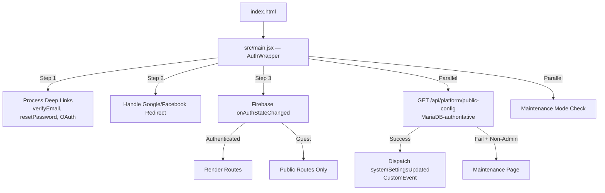

**Key Implementation Details:**
- **Token injection:** Axios interceptor + `window.fetch` monkey-patch attach `Authorization: Bearer <token>` to all `/api/*` requests (lines 50-67)
- **Null-auth stub:** `src/conf/fire.js` (245 lines) — when Firebase config is absent, provides a full API-compatible null-auth stub; supports local auth mode with `VITE_LOCAL_AUTH=true`
- **Config authority:** `systemSettingsUpdated` CustomEvent dispatched from public-config API (MariaDB-sourced, rejects non-MariaDB sources)
- **Code splitting:** All route components use `React.lazy()` with `<Suspense fallback={<Spinner />}>`
- **Auth context:** `AuthContext` (React Context) provides `user` to all components
- **Service Worker:** `serviceWorker.unregister()` — SW is explicitly disabled (line 490)

---

## 6. Frontend Routing

### 6.1 All Routes from `src/main.jsx:417-470`

| # | Route | Component | Auth Guard | Notes | Status |
|---|---|---|---|---|---|
| 1 | `/` | Welcome | None | Landing page | 🟢 |
| 2 | `/login` | Welcome (login mode) | Redirect if authed | → `/dashboard` | 🟢 |
| 3 | `/sign-up` | Navigate | Redirect | → `/login` or `/dashboard` | 🟢 |
| 4 | `/coverletter` | CoverLetter | **NONE** | ⚠️ Missing `RequireAuthenticated` | 🟡 |
| 5 | `/coverletter/*` | CoverLetter | **NONE** | ⚠️ Same gap | 🟡 |
| 6 | `/cover-letter` | CoverLetter | **NONE** | ⚠️ Same gap | 🟡 |
| 7 | `/cover-letter/*` | CoverLetter | **NONE** | ⚠️ Same gap | 🟡 |
| 8 | `/dashboard/*` | DashboardMain | `RequireAuthenticated` | 12 sub-routes | 🟢 |
| 9 | `/enterprise/*` | EnterpriseConsole | `RequireAuthenticated` | 15-tab console | 🟢 |
| 10 | `/contact` | Contact | None | Public | 🟢 |
| 11 | `/build-resume/*` | BuildResume | `MaybeApplicationShell` | Auth optional — guest can build | 🟢 |
| 12 | `/create-resume/*` | BuildResume (alias) | `MaybeApplicationShell` | Same as `/build-resume` | 🟢 |
| 13 | `/create-resume` | BuildResume (alias) | `MaybeApplicationShell` | Same | 🟢 |
| 14 | `/resume/:step` | Welcome | None | Legacy alias | 🟢 |
| 15 | `/billing/plans` | Plans | None | Public pricing | 🟢 |
| 16 | `/p/:custompage` | CustomePage | None | CMS pages | 🟢 |
| 17 | `/shared/:resumeId` | PublicResume | None | Public view | 🟢 |
| 18 | `/pricing` | Plans (alias) | None | → same as `/billing/plans` | 🟢 |
| 19 | `/portfolio/builder` | PortfolioBuilder | `RequireAuthenticated` | — | 🟢 |
| 20 | `/portfolio/:slug` | PublicPortfolio | None | Public view | 🟢 |
| 21 | `/portfolios` | PortfolioGallery | None | Public gallery | 🟢 |
| 22 | `/admin/*` | AdminAliasRedirect → `/adm/*` | Redirect | — | 🟢 |
| 23 | `/platform/*` | PlatformAliasRedirect → `/adm/*` | Redirect | — | 🟢 |
| 24 | `/adm/*` | Admin | `RequireAuthenticated` | Admin console | 🟢 |
| 25 | `/front` | Front | None | `<div>front</div>` | 🔴 DEAD |
| 26 | `/features` | Features | None | Public | 🟢 |
| 27 | `/jobs` | JobsLanding | None | Public | 🟢 |
| 28 | `/jobs/portal` | MainJobListings | None | Public | 🟢 |
| 29 | `/jobs/portal/:jobId` | MainJobListings | None | Public | 🟢 |
| 30 | `/jobs/browse` | MainJobListings | None | Public | 🟢 |
| 31 | `/jobs/categories` | JobsLanding | None | Public | 🟢 |
| 32 | `/jobs/category/:catName` | MainJobListings | None | Public | 🟢 |
| 33 | `/blog` | BlogList | None | Public | 🟢 |
| 34 | `/blog/:slug` | BlogPost | None | Public | 🟢 |
| 35 | `/blog-editor` | BlogEditor | `RequireAuthenticated` | — | 🟢 |
| 36 | `/blog-editor/:postId` | BlogEditor | `RequireAuthenticated` | — | 🟢 |
| 37-87 | `/export/Cv{1-51}/:id/:lang` | Exporter | `RequireExportAccess` | 51 CV routes | 🟢 |
| 88-91 | `/export/Cover{1-4}/:id/:lang` | Exporter | `RequireExportAccess` | 4 cover routes | 🟢 |
| 92 | `/dashboard2/*` | Dashboard (alias) | `RequireAuthenticated` | Redundant | 🟢 |
| 93 | `/dashboard2` | Dashboard (alias) | `RequireAuthenticated` | Redundant | 🟢 |
| 94 | `*` | NotFound | None | Catch-all | 🟢 |

**Total: 94 unique route patterns + 51 dynamic CV + 4 dynamic Cover = 149 total route entries**

---

## 7. Authentication Architecture

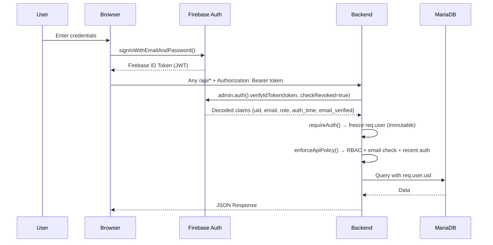

### 7.1 Authentication Methods

| Method | Implementation | Server Enforced | Status |
|---|---|---|---|
| Email/Password | Firebase Auth native | ✅ `verifyIdToken` | 🟢 |
| Google OAuth | Redirect-based via `getRedirectResult()` | ✅ | 🟢 |
| Facebook OAuth | Redirect-based | ✅ | 🟢 |
| LinkedIn OAuth | Server-side PKCE via `backend/security/oauth.js` | ✅ | 🟢 |
| GitHub OAuth | Server-side PKCE via `backend/security/oauth.js` | ✅ | 🟢 |
| Local Auth (Dev) | `VITE_LOCAL_AUTH=true` → `POST /api/auth/preview-login` | ✅ (non-production only) | 🟢 |
| TOTP MFA | Firebase native `multiFactor.enroll()` via `totpHelper.js` | ✅ (Super Admin) | 🟢 |

### 7.2 Email Verification Flow

1. Registration → `POST /api/auth/request-verification` → hashed token → `email_verification_tokens` table
2. Email with link `?mode=verifyEmail&token=X&email=Y`
3. Frontend `main.jsx:168-193` intercepts → `POST /api/auth/verify-email-token` → token consumed
4. Firebase Admin `updateUser({ emailVerified: true })` called server-side
5. Frontend shows success banner → forces token refresh via `user.reload()` + `getIdToken(true)`

### 7.3 Password Reset Flow

1. `POST /api/auth/request-password-reset` → hashed token → `password_reset_tokens` table
2. Email with reset link → deep-link to frontend `main.jsx:194-198`
3. `ResetPasswordModal` → `POST /api/auth/reset-password` → atomic lease + consumption
4. Firebase Admin `updateUser({ password })` called server-side
5. `password_reset_state.consumed_at` set

---

## 8. Authorization / RBAC Architecture

### 8.1 Permission Resolution (`backend/security/auth.js:63-96`)

```javascript
const PERMISSIONS = Object.freeze({
    SUPER_ADMIN: ['*'],
    ADMIN: ['users.read', 'users.create', 'users.update', 'users.delete', 'users.roles.manage',
            'tenants.read', 'tenants.write', 'tenants.manage',
            'email.template.manage', 'email.logs.read',
            'system.config.read', 'system.config.write',
            'payments.manage', 'payments.read', 'notifications.send',
            'ai.entitlements.manage', 'ai.usage.read', 'audit.read', 'security.read'],
    AUDITOR: ['users.read', 'tenants.read', 'email.logs.read', 'system.config.read',
              'payments.read', 'ai.usage.read', 'audit.read', 'security.read'],
    SUPPORT: ['users.read', 'email.logs.read', 'tenants.read', 'tickets.manage'],
    ENTERPRISE_ADMIN: ['tenant.members.manage', 'tenant.roles.manage', 'tenant.ai.policy',
                       'tenant.billing.view', 'tenant.audit.read', 'tenant.workspaces.manage',
                       'workspace.read', 'workspace.manage', 'workspace.members.manage'],
    ENTERPRISE_MEMBER: ['tenant.resumes.write', 'tenant.interviews.execute',
                        'tenant.ai.consume', 'workspace.read'],
    EMPLOYER: ['jobs.manage', 'applications.review', 'candidates.contact'],
    USER: ['resumes.manage', 'coverletters.manage', 'interviews.execute', 'subscription.self']
});
```

### 8.2 Policy Enforcement (`backend/security/policy.js`)

**CRITICAL FINDING — Line 53:**
```javascript
if (isAdminPath(pathname) && !hasPermission(req, 'system.config.write')) {
    return res.status(403).json({ error: { code: 'FORBIDDEN' } });
}
```

This blocks **ALL** `/admin/*` and `/platform/*` API requests for any role lacking `system.config.write`. AUDITOR and SUPPORT have `system.config.read` but NOT `system.config.write`.

| Policy Check | Condition | Gate |
|---|---|---|
| Elevated endpoints | `/admin/firebase-service-account` | `secrets.manage` |
| Payment endpoints | `/admin/payments/*` | `payments.manage` |
| Employer apps | `/admin/employer-applications/*` | `users.update` |
| **All admin paths** | `isAdminPath(pathname)` | **`system.config.write` — blocks Auditor/Support** |
| Email verification | AI, billing, admin paths | `req.user.emailVerified` |
| Recent auth | `/account/delete` only | `auth_time` < 10 minutes |

---

## 9. Role Forensics

### SUPER_ADMIN

| Property | Value |
|---|---|
| **Authentication** | Firebase Auth + TOTP MFA enforced in production |
| **Authorization** | Wildcard `['*']` — all permissions |
| **Dashboard** | `/adm/*` — full admin console (22 modules) |
| **API Access** | All endpoints including destructive operations |
| **UI Visibility** | All admin modules + MFA banner if not MFA-verified |
| **Backend Enforcement** | `hasPermission('*')` → always true |
| **Denial Behavior** | MFA banner blocks destructive ops if not MFA-verified |
| **Status** | 🟢 COMPLETE |

### ADMIN

| Property | Value |
|---|---|
| **Authentication** | Firebase Auth (MFA optional) |
| **Authorization** | 15 permissions including `system.config.write` |
| **Dashboard** | `/adm/*` — full admin console |
| **API Access** | All admin endpoints |
| **UI Visibility** | All admin modules |
| **Backend Enforcement** | `system.config.write` → passes policy gate |
| **Status** | 🟢 COMPLETE |

### AUDITOR

| Property | Value |
|---|---|
| **Authentication** | Firebase Auth |
| **Authorization** | 8 read-only permissions (`users.read`, `audit.read`, `security.read`, etc.) |
| **Dashboard** | `/adm/*` — frontend renders admin console |
| **API Access** | **ALL admin API calls return HTTP 403** — policy.js:53 blocks |
| **UI Visibility** | Admin sidebar renders, pages load, **API calls fail with 403** |
| **Backend Enforcement** | Blocked by `system.config.write` gate |
| **Denial Behavior** | "Insufficient permission" JSON error on every admin API call |
| **Gap** | UI renders but backend blocks → **BROKEN USER EXPERIENCE** |
| **Status** | 🔴 BROKEN |

### SUPPORT

| Property | Value |
|---|---|
| **Authentication** | Firebase Auth |
| **Authorization** | 4 permissions (`users.read`, `email.logs.read`, `tenants.read`, `tickets.manage`) |
| **Dashboard** | `/adm/*` — frontend renders admin console |
| **API Access** | **ALL admin API calls return HTTP 403** |
| **UI Visibility** | Admin sidebar renders, pages load, **API calls fail with 403** |
| **Backend Enforcement** | Blocked by `system.config.write` gate |
| **Ticket System** | `tickets.manage` permission exists but **zero backend API endpoints for tickets** |
| **Support Dashboard** | **MISSING** — no `/support` route, no `SupportDashboard.jsx` |
| **User Impersonation** | **MISSING** — zero code matches for impersonation |
| **Gap** | UI rendered but non-functional + no ticket system + no support dashboard |
| **Status** | 🔴 BROKEN |

### ENTERPRISE_ADMIN

| Property | Value |
|---|---|
| **Authentication** | Firebase Auth + Enterprise tenant context (`x-tenant-id` header) |
| **Authorization** | 9 permissions scoped to tenant |
| **Dashboard** | `/enterprise/*` — 15-tab enterprise console |
| **API Access** | `/api/enterprise/*` — authenticated via `createEnterpriseAuthMiddleware` |
| **Backend Enforcement** | Tenant-scoped RBAC via `tenantPolicy.js` |
| **Status** | 🟢 COMPLETE |

### ENTERPRISE_MEMBER

| Property | Value |
|---|---|
| **Authentication** | Firebase Auth + Enterprise tenant context |
| **Authorization** | 4 permissions (`tenant.resumes.write`, `tenant.ai.consume`, etc.) |
| **Dashboard** | `/enterprise/*` — limited tabs |
| **Status** | 🟢 COMPLETE |

### EMPLOYER

| Property | Value |
|---|---|
| **Authentication** | Firebase Auth |
| **Authorization** | 3 permissions (`jobs.manage`, `applications.review`, `candidates.contact`) |
| **Dashboard** | `/dashboard/my-employments`, `/dashboard/my-companies` |
| **API Access** | Jobs/employer API endpoints |
| **Status** | 🟢 COMPLETE |

### USER

| Property | Value |
|---|---|
| **Authentication** | Firebase Auth |
| **Authorization** | 4 permissions (`resumes.manage`, `coverletters.manage`, `interviews.execute`, `subscription.self`) |
| **Dashboard** | `/dashboard/*` — 12 sub-routes |
| **API Access** | Consumer CRUD endpoints (resumes, covers, portfolios, messages, jobs) |
| **Status** | 🟢 COMPLETE |

---

## 10. Dashboard Forensics

### 10.1 Consumer Dashboard (`/dashboard/*`)

**Shell:** `DashboardMain.jsx` (516 lines, class component with `withTranslation`)

| Sub-Route | Component | Actions Available | API | Status |
|---|---|---|---|---|
| `/dashboard` (index) | DashboardHomepage | View stats, quick actions, recent resumes | Profile API | 🟢 |
| `/dashboard/settings` | DashboardSettings | Profile edit, password change, MFA, delete account | `/api/users-data`, `/api/account/delete` | 🟢 |
| `/dashboard/messages` | DashboardMessages | Send/receive messages, conversation threads | `/api/messages/*` | 🟢 |
| `/dashboard/favorites` | DashboardFavourites | View bookmarked items | `/api/favourites` | 🟢 |
| `/dashboard/interview` | DashboardInterviews | AI interview practice, CBT simulation | `/api/ai/interview/*` | 🟢 |
| `/dashboard/cover-letters` | CoverLetter | Create/edit cover letters | `/api/covers/*` | 🟢 |
| `/dashboard/portfolios` | DashboardPortfolios | Manage portfolios | `/api/portfolios/*` | 🟢 |
| `/dashboard/applied-jobs` | AppliedJobs | Track job applications | `/api/jobs-data/applied` | 🟢 |
| `/dashboard/job-tracker` | JobTracker | Personal job tracking board | `/api/jobs-data/tracker` | 🟢 |
| `/dashboard/my-employments` | EmployerDashboard | Job posting, application review | `/api/jobs-data`, `/api/employer/*` | 🟢 |
| `/dashboard/my-companies` | CompaniesManagement | Company profile management | `/api/companies` | 🟢 |
| `/dashboard/job-matching` | DashboardJobMatching | AI-powered job matching | `/api/jobs-data/matching` | 🟢 |
| `/dashboard/plans` | Plans (Billing) | Subscription management | `/api/pay/*` | 🟢 |

**Dashboard Features:**
- **Sidebar:** `ProfileDisplay` component with collapsible sidebar, mobile hamburger toggle
- **Email verification banner:** Shows when `emailVerified === false`, with "Resend Email" button + dismiss
- **Loading:** `<Suspense fallback={<Spinner />}>` on all lazy-loaded sub-routes
- **Toasts:** `DashboardToast` component for success/error/warning notifications

### 10.2 Admin Console (`/adm/*`)

**Shell:** `Admin.jsx` (246 lines) — `RequireAuthenticated` + admin role check via `checkIfAdmin()`

| Sub-Route | Component | Purpose | Status |
|---|---|---|---|
| `/adm/dashboard` | Dashboard | Stats overview, metrics | 🟢 |
| `/adm/users` | UsersManager | User CRUD, role management | 🟢 |
| `/adm/user/ss` | UserEdit | Individual user editing | 🟢 |
| `/adm/messages` | Messages | Admin messaging | 🟢 |
| `/adm/reviews` | Reviews | Customer testimonials | 🟢 |
| `/adm/trustedby` | TrustedBy | Partner logos | 🟢 |
| `/adm/employer-applications` | EmployerApplications | Employer approval | 🟢 |
| `/adm/jobs-manager` | JobsManager | Job moderation | 🟢 |
| `/adm/company-management` | CompanyManagement | Company management | 🟢 |
| `/adm/blog-management` | BlogManagement | CMS | 🟢 |
| `/adm/landing-pages` | LandingPages | Custom pages | 🟢 |
| `/adm/phrases` | Phrases | i18n translation keys | 🟢 |
| `/adm/audit-logs` | AdminAuditLogs | Audit trail viewer | 🟢 |
| `/adm/queues` | PlatformQueues | Outbox status | 🟢 |
| `/adm/tenants` | PlatformTenants | Enterprise tenants | 🟢 |
| `/adm/security` | PlatformSecurity | Security events | 🟢 |
| `/adm/operations` | PlatformOperations | Batch ops | 🟢 |
| `/adm/attention` | PlatformAttention | Action items | 🟢 |
| `/adm/health` | PlatformHealth | Real-time health | 🟢 |
| `/adm/operators` | PlatformOperators | IAM management | 🟢 |
| `/adm/settings` | Settings | 30+ sub-panels | 🟢 |
| `/adm/*` (catch-all) | → `/adm/dashboard` | Redirect | 🟢 |

**Admin Features:**
- **Health indicator:** Header bar polls `GET /api/healthz`, shows green/red dot
- **Breadcrumbs:** Auto-generated from URL path segments
- **Command Palette:** Ctrl+K keyboard shortcut via `AdminCommandPalette.jsx`
- **MFA Banner:** Super Admin sees warning if MFA not verified
- **Mobile nav:** Hamburger button (`FaBars`) toggles sidebar overlay on `lg:hidden`
- **Reauth prompt:** `AdminReauthPrompt` for sensitive operations

### 10.3 Enterprise Console (`/enterprise/*`)

**Shell:** `EnterpriseConsole.jsx` (870 lines) — 15 navigation tabs + command palette

| Tab ID | Label | Permission Gate | Component | Status |
|---|---|---|---|---|
| `overview` | Overview | None | EnterpriseOverviewTab (25KB) | 🟢 |
| `resumes` | Talent & Resumes | None | EnterpriseResumesTab (58KB) | 🟢 |
| `members` | Users & IAM | `tenant.members.read` | EnterpriseUsersTab (50KB) | 🟢 |
| `teams` | Teams | `workspace.read` | EnterpriseTeamsTab (29KB) | 🟢 |
| `workspaces` | Workspaces | `workspace.read` | EnterpriseWorkspacesTab (26KB) | 🟢 |
| `access` | Roles & Permissions | `tenant.roles.manage` | EnterpriseRolesTab (38KB) | 🟢 |
| `ai` | AI Workspace | `tenant.ai.manage` | EnterpriseAiTab (15KB) | 🟢 |
| `security` | Security & M2M | `tenant.security.read` | EnterpriseSecurityTab (35KB) | 🟢 |
| `usage` | Usage & Quotas | `tenant.usage.read` | EnterpriseUsageTab (23KB) | 🟢 |
| `email` | Email & Notifications | `tenant.settings.write` | EnterpriseEmailTab (27KB) | 🟢 |
| `audit` | Audit Logs | `tenant.audit.read` | EnterpriseAuditTab (26KB) | 🟢 |
| `support` | Support Access | `tenant.settings.write` | EnterpriseSupportTab (19KB) | 🟢 |
| `settings` | Organization Settings | `tenant.settings.write` | EnterpriseSettingsTab (17KB) | 🟢 |
| `platform` | Platform Administration | `platformOnly: true` | EnterprisePlatformTab (16KB) | 🟢 |

**Enterprise Features:**
- **Quick Actions (9):** Command palette actions for invite, pending review, new workspace/team/resume/SA, DLQ inspect, denied ops investigation
- **Confirm Modal:** `EnterpriseConfirmModal` for destructive operations
- **Help Tooltips:** `HelpTooltip.jsx` contextual help
- **Navigation groups:** Home → Organization → Governance → Administration
- **Recent tabs:** Persisted in `sessionStorage` under `enterprise_recent_tabs`

---

## 11. Build Resume Architecture

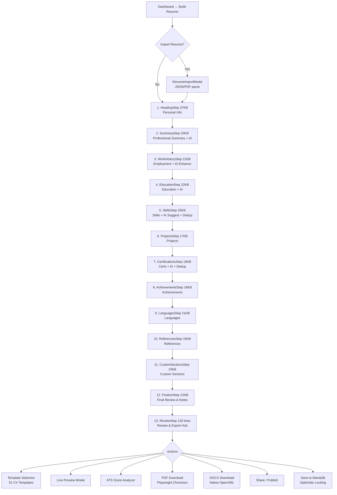

**Key Implementation Details:**
- **Step Inventory (13 Steps):** 12 content editing steps (`heading`, `summary`, `workHistory`, `education`, `skills`, `projects`, `certifications`, `achievements`, `languages`, `references`, `customSections`, `finalize`) + dedicated Step 13 (`review` via `ReviewStep.jsx`, 120 lines) offering one-click preview, template switcher, ATS score calculation, and dual-format download.
- **Dirty State Protection:** `persistBeforeNavigation()` in `BuildResume.jsx` flushes unsaved edits to MariaDB before routing between steps or jumping into export/review.
- **Required Data Validation:** Finish workflow enforces presence of primary personal details (firstname, lastname, email) before marking the resume ready for export.
- **Autosave:** `writeResumeRecovery(userId, resumeId, revision, data)` → LocalStorage key `resume_recovery_v1:{uid}:{id}`
- **Conflict Detection:** Server enforces `expectedRevision` on `POST /api/resumes/:id`; mismatch → `RESUME_CONFLICT` (HTTP 409) with `remoteRevision` + `remoteData`
- **Experience Engine:** `src/utils/resumeData.js` — `calculateYearsOfExperience` merges overlapping date intervals
- **AI Grounding:** Summary step transmits accurate years + complete education, certifications, projects, skills payload to prevent hallucination
- **Recommendation Dedup:** Skills/Certifications steps suppress already-added items + send `existingSkills` to AI

---

## 12. AI Architecture

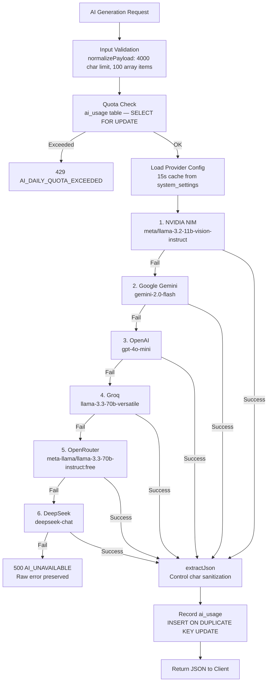

### AI Operations

| Operation | Endpoint | Source Grounding | Hallucination Guard | Status |
|---|---|---|---|---|
| Summary Generation | `POST /api/generate-summary` | Work history, education, skills, certs, projects, years | Negative: "Do not invent" + `FACTUAL_SOURCE_FIELDS` | 🟢 |
| Work Description | `POST /api/generate-work-description` | Existing text, notes, responsibilities, achievements | Source-bound | 🟢 |
| Education Description | `POST /api/generate-education-description` | Existing text, coursework, projects | Source-bound | 🟢 |
| Skills Suggestion | `POST /api/generate-skills` | Job title, existing skills, `existingSkills` exclusion | Deduplication constraint | 🟢 |
| Bullet Enhancement | `POST /api/enhance-single-bullet` | Existing bullet text | Enhancement-only | 🟢 |
| Grammar Check | `POST /api/check-grammar` | Input text | Correction-only | 🟢 |
| Autocomplete | `POST /api/ai/autocomplete` | Type + partial input | `AUTOCOMPLETE_TYPES` whitelist | 🟢 |
| Interview Questions | `POST /api/ai/interview/generate` | Job title, experience, skills | Contextual generation | 🟢 |
| Interview Feedback | `POST /api/ai/interview/feedback` | User answer + question context | Assessment-only | 🟢 |

---

## 13. Backend Architecture

### Middleware Pipeline (Order of Execution, `backend/index.js`)

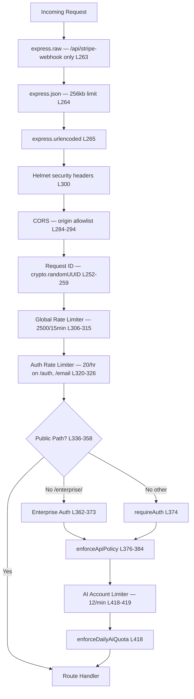

### Graceful Shutdown

Two shutdown handlers registered (L240-250 and L4187-4209):
1. HTTP server `close()` → drain in-flight connections
2. `closePool()` → drain MariaDB pool
3. 5-second forced exit timeout (L4200-4202)
4. `process.on('SIGTERM')` + `process.on('SIGINT')` registered

---

## 14. API Inventory

**Total backend handlers: 176+ route handlers across 18 route modules + inline handlers in `index.js`**

Categorized:

| Category | Example Endpoints | Auth | Count |
|---|---|---|---|
| Health | `GET /healthz`, `GET /readyz` | None | 4 |
| Public Config | `GET /api/platform/public-config`, `GET /api/platform/version` | None | 4 |
| Public Content | Blog, jobs, portfolios, custom pages, reviews, stats | None | ~20 |
| Auth | Registration, login, verification, reset, OAuth | Varies | ~15 |
| Consumer CRUD | Resumes, covers, portfolios, favourites | `requireAuth` | ~25 |
| AI | Generate summary/skills/bullets, interview, autocomplete | `requireAuth` + `enforceDailyAiQuota` | ~12 |
| Payment | Stripe, PayPal, Razorpay, Paytm, PhonePe | `requireAuth` | ~15 |
| Export | PDF render, DOCX | `requireAuth` + `exportTokens` | ~5 |
| Messaging | Conversations, messages | `requireAuth` | ~10 |
| Jobs/Employer | Job CRUD, applications, companies | `requireAuth` | ~20 |
| Notifications | Send notifications | `requireAuth` + `bindNotificationRecipient` | ~10 |
| Admin | Dashboard, users, settings, AI config, payments, audit, health | `requireAuth` + `system.config.write` | ~40 |
| Enterprise | Tenant, workspace, membership, teams, AI, audit, M2M | `requireEnterpriseAuth` | ~30 |

---

## 15. Database Architecture

### MariaDB — Sole Authoritative Data Plane

**Zero Firestore dependency confirmed.**
- **Backend:** `grep -i firestore backend/index.js` → 0 results
- **Frontend:** All 16 `firestore` matches in `src/` are documentation comments — zero runtime calls
- **`src/conf/fire.js`:** Only imports `firebase/compat/app` and `firebase/compat/auth` — explicitly states "Firestore, Realtime Database and Functions compat modules are intentionally NOT loaded"

### Complete Table Inventory (60+ tables)

**Migration 001 — Baseline (40+ tables):** `users`, `resumes`, `public_resumes`, `portfolios`, `covers`, `favourites`, `jobs`, `applications`, `job_tracker`, `companies`, `blog`, `custom_pages`, `trusted_by`, `reviews`, `contact_messages`, `conversations`, `conversation_participants`, `conversation_messages`, `notifications`, `payment_orders`, `transactions`, `subscriptions`, `coupons`, `coupon_redemptions`, `system_settings`, `stats`, `admin_audit_logs`, `security_audit_logs`, `payment_webhook_events`, `canonical_documents`, `oauth_states`, `oauth_exchange_codes`, `export_render_tokens`, `password_reset_tokens`, `password_reset_state`, `email_verification_tokens`, `email_verification_state`, `email_logs`, `ai_usage`, `notification_outbox`, `platform_announcements`

**Enterprise (migrations 002-006):** `enterprise_tenants`, `enterprise_workspaces`, `enterprise_memberships`, `enterprise_workspace_memberships`, `enterprise_tenant_configurations`, `enterprise_principal_tenants`, `enterprise_teams`, `enterprise_team_members`, `enterprise_resources`, `enterprise_audit_events`, `enterprise_ai_usage`, `enterprise_service_accounts`, `enterprise_support_grants`, `enterprise_outbox`, `enterprise_quota_buckets`, `enterprise_observability_rollups`, `enterprise_membership_invitations`

**Billing (migrations 003, 010-012):** `invoices`, `invoice_counters`, `credit_notes`, `credit_note_counters`, payment refund state extensions

**CMS (migration 013):** Relational authority for `custom_pages`, `reviews`, `trusted_by`

---

## 16. Data Ownership Registry

**Source:** `backend/database/ownership.js` (162 lines) — Canonical ownership registry

Every entity has exactly one owner. The `getOwnership(entityType)` function fails closed with `DATABASE_OWNERSHIP_UNREGISTERED` for unknown domains.

| Entity | Owner | Table | Write Mode | Conflict Policy |
|---|---|---|---|---|
| `identity` | **FIREBASE_AUTH** | (provider) | IDENTITY_PROVIDER | PROVIDER_MANAGED |
| `user_profile` | MARIADB | `users` | SINGLE_OWNER | OPTIMISTIC_REVISION |
| `resume` | MARIADB | `resumes` | SINGLE_OWNER | OPTIMISTIC_REVISION |
| `payment_order` | MARIADB | `payment_orders` | SINGLE_OWNER | OPTIMISTIC_REVISION |
| `enterprise_tenant` | MARIADB | `enterprise_tenants` | SINGLE_OWNER | OPTIMISTIC_REVISION |
| `permission` | **CODE** | (none) | IMMUTABLE_POLICY | RELEASE_CONTROLLED |
| ... (40+ more) | MARIADB | respective tables | SINGLE_OWNER | OPTIMISTIC_REVISION |

All 40+ domain entities registered. **Zero secondary data paths.** **Zero fallback stores.** **Zero Firestore references in ownership registry.**

---

## 17. Storage Architecture

| Storage Type | Provider | Status | Evidence |
|---|---|---|---|
| **Application Data** | MariaDB 10.11 | 🟢 COMPLETE | All CRUD through parameterized queries |
| **Identity** | Firebase Auth | 🟢 COMPLETE | `verifyIdToken` only |
| **Object/File Storage** | **NOT IMPLEMENTED** | 🔴 MISSING | `backend/index.js:2672-2677` returns `501 STORAGE_PROVIDER_UNSUPPORTED` |
| **Session Storage** | Stateless JWT | 🟢 COMPLETE | No server sessions |
| **Client State** | LocalStorage | 🟢 COMPLETE | Resume recovery, language, auth |
| **Cache** | In-memory (Node.js process) | 🟢 COMPLETE | AI config 15s cache, feature flags 30s cache |

**Storage Gap:** The admin settings panel for "Cloud Storage" exists (`StorageSettings.jsx`) but the backend explicitly rejects storage configuration with `501 STORAGE_PROVIDER_UNSUPPORTED`. No S3, Cloudinary, or Firebase Storage adapter is implemented.

---

## 18. File Handling

| Operation | Implementation | Limit | Status |
|---|---|---|---|
| JSON request body | `express.json` | 256KB | 🟢 |
| URL-encoded body | `express.urlencoded` | 64KB | 🟢 |
| Stripe webhook body | `express.raw` | 1MB | 🟢 |
| Resume data storage | MariaDB JSON columns | No explicit limit | 🟢 |
| Image upload | **NOT IMPLEMENTED** | — | 🔴 MISSING (no multer, no upload endpoint) |
| File/document upload | **NOT IMPLEMENTED** | — | 🔴 MISSING |
| Profile photo | Firebase Auth photoURL only | — | 🟡 PARTIAL (OAuth photos only) |

---

## 19. Billing Architecture

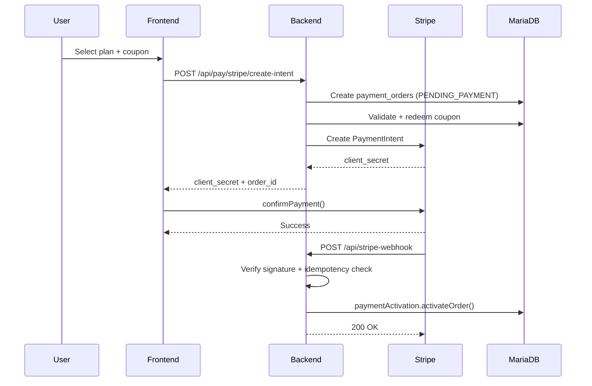

| Provider | Server Webhook | Client Polling | Refund | Status |
|---|---|---|---|---|
| **Stripe** | ✅ `POST /api/stripe-webhook` (sig verified) | ✅ | ✅ Full (`providerRefunds.js`) | 🟢 |
| **PayPal** | ❌ No webhook | ✅ Client polling | ❌ | 🟡 |
| **Razorpay** | ❌ No webhook | ✅ Client polling | ❌ | 🟡 |
| **Paytm** | ❌ No webhook | ✅ Client polling | ❌ | 🟡 |
| **PhonePe** | ❌ No webhook | ✅ Client polling | ❌ | 🟡 |

---

## 20. Quotas & Rate Limits

| Limiter | Namespace | Limit | Window | Store | Status |
|---|---|---|---|---|---|
| Global API | IP/UID | 2,500 | 15 min | `express-rate-limit` (in-memory) | 🟢 |
| Auth/Email | IP | 20 | 1 hour | `express-rate-limit` (in-memory) | 🟢 |
| AI Burst | `consumer-rate:ai` | 12 | 1 min | MariaDB atomic counter | 🟢 |
| AI Daily | `ai_usage` table | 10 (Basic), 100 (Pro), 10000 (Admin) | 24 hours | MariaDB `SELECT FOR UPDATE` | 🟢 |
| Notifications | `consumer-rate:notification` | 8 | 1 hour | MariaDB atomic counter | 🟢 |
| Document Export | `consumer-rate:document-export` | 20 | 1 hour | MariaDB atomic counter | 🟢 |
| Job Scraper | `consumer-rate:job-scraper` | 2 | 1 hour | MariaDB atomic counter | 🟢 |
| Contact Form | `consumer-rate:contact` | 3 | 1 hour | MariaDB atomic counter | 🟢 |
| Messaging | `consumer-rate:messaging` | 30 | 5 min | MariaDB atomic counter | 🟢 |

---

## 21. Admin Architecture

22 admin modules, 30+ settings sub-panels, Ctrl+K command palette, real-time health indicator. See [Dashboard Forensics §10.2](#102-admin-console-adm) for complete route listing.

---

## 22. Support Architecture

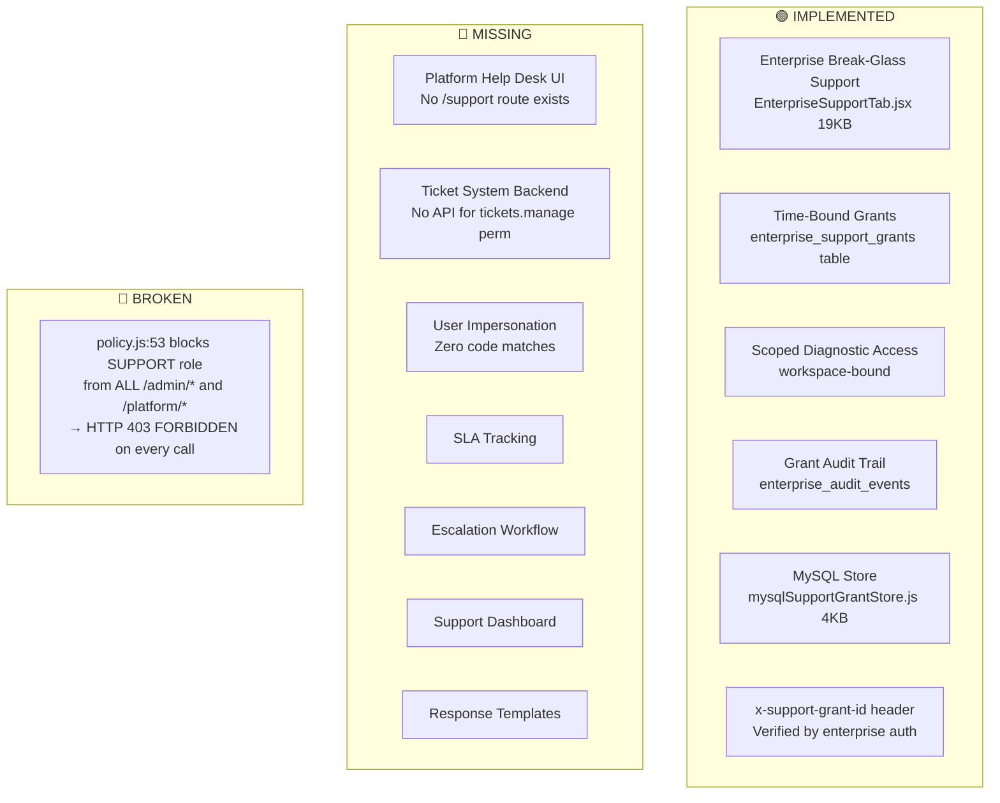

**Support Ticket Flow:**
1. User → Support request → **🔴 MISSING** (no ticket creation UI or API)
2. Ticket storage → **🔴 MISSING** (no tickets table)
3. Assignment → **🔴 MISSING** (no assignment logic)
4. Support agent → **🔴 BROKEN** (blocked by policy.js:53)
5. Status/Communication → **🔴 MISSING**
6. Escalation → **🔴 MISSING**
7. Resolution → **🔴 MISSING**
8. Audit trail → **🟢 COMPLETE** (for enterprise break-glass grants only)
9. User notification → **🔴 MISSING**

---

## 23. Jobs Architecture

| Feature | Evidence | Status |
|---|---|---|
| Job Posting | `/api/jobs-data` POST, `EmployerDashboard` | 🟢 |
| Job Browsing | `/jobs`, `/jobs/portal`, `/jobs/browse`, `/jobs/categories` | 🟢 |
| Job Detail | `/jobs/portal/:jobId` | 🟢 |
| Job Categories | `/jobs/category/:catName` | 🟢 |
| Job Application | `/api/job-applications` | 🟢 |
| Applied Jobs | `/dashboard/applied-jobs` | 🟢 |
| Job Tracker | `/dashboard/job-tracker`, `job_tracker` table | 🟢 |
| Job Matching | `/dashboard/job-matching` | 🟢 |
| Company Profiles | `/dashboard/my-companies`, `companies` table | 🟢 |
| Admin Job Moderation | `/adm/jobs-manager` | 🟢 |

---

## 24. Blog Architecture

| Feature | Evidence | Status |
|---|---|---|
| Blog List | `/blog`, `blogData.js` router | 🟢 |
| Blog Post View | `/blog/:slug` | 🟢 |
| Blog Editor | `/blog-editor/:postId`, `RequireAuthenticated` | 🟢 |
| Admin Blog Mgmt | `/adm/blog-management` | 🟢 |
| Scheduled Publishing | `cmsScheduler.js` — **disabled by default** (`CMS_SCHEDULER_ENABLED='false'`) | 🟡 DESIGNED |
| DB Table | `blog` (migration 001) | 🟢 |

---

## 25. Portfolio Architecture

| Feature | Evidence | Status |
|---|---|---|
| Portfolio Builder | `/portfolio/builder`, `RequireAuthenticated` | 🟢 |
| Public Portfolio | `/portfolio/:slug` | 🟢 |
| Portfolio Gallery | `/portfolios` | 🟢 |
| Dashboard Management | `/dashboard/portfolios` | 🟢 |
| CRUD API | `/api/portfolios/*` | 🟢 |
| DB Table | `portfolios` (migration 001) | 🟢 |

---

## 26. Templates Architecture

- **51 CV Templates:** `src/cv-templates/cv1–cv51/` — each with individual JSX + CSS
- **4 Cover Letter Templates:** `src/cv-templates/cover1–cover4/`
- **Template Utilities:** `src/cv-templates/templateUtils.js`, `shared/` directory
- **DOCX Themes:** `backend/services/docxThemes.js` (23KB) — 51 template-specific color/layout configs
- **Status:** 🟢 COMPLETE

---

## 27. Document Export Architecture

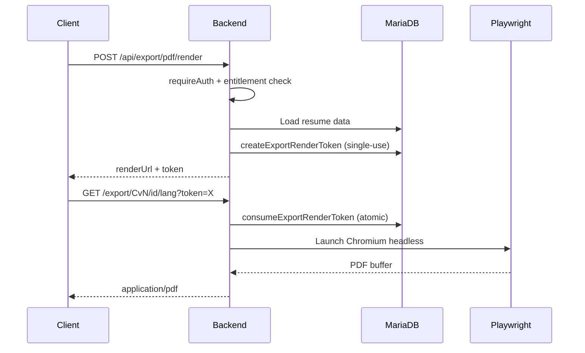

| Export Engine | Implementation | Templates | Status |
|---|---|---|---|
| **PDF** | Playwright Chromium headless | 51 CV + 4 Cover | 🟢 |
| **DOCX** | Native OpenXML (`docxExport.js` 57KB) | 51 CV (theme-mapped) | 🟢 |

---

## 28. Email Architecture

| Component | Implementation | Status |
|---|---|---|
| SMTP Transport | `emailNotifier.js` (13KB) via Nodemailer | 🟢 |
| Email Templates | HTML templates for welcome, verification, reset, payment, etc. | 🟢 |
| Email Routing | `routes/email.js` (134KB) — comprehensive dispatcher | 🟢 |
| Email Audit | `email_logs` table | 🟢 |
| Outbox Pattern | `notification_outbox` table — lease-based processing | 🟢 |
| Outbox Worker | `NOTIFICATION_OUTBOX_WORKER_ENABLED` — **disabled by default** | 🟡 |
| Recipient Binding | `bindNotificationRecipient` — prevents email to others | 🟢 |

---

## 29. Notifications Architecture

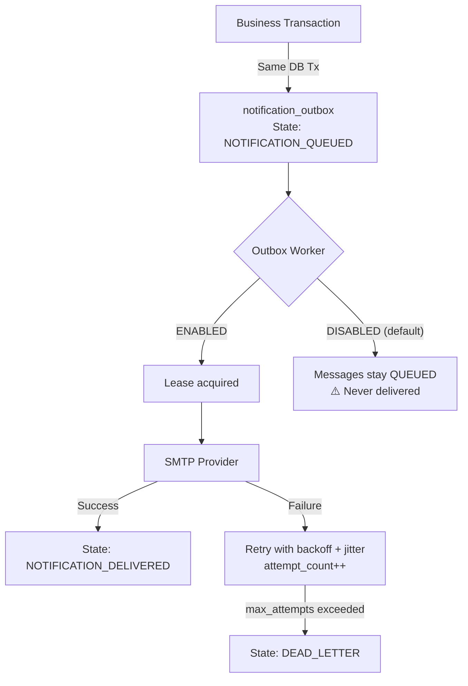

**Impact:** With all workers disabled (default), welcome emails, verification emails, payment confirmations, and password resets queued in the outbox **are never delivered**.

---

## 30. Security Architecture

| Control | Implementation | Server-Enforced | Evidence | Status |
|---|---|---|---|---|
| Authentication | Firebase ID Token verification | ✅ | `requireAuth` | 🟢 |
| RBAC | `permissionsFor()` + 8 roles | ✅ | `auth.js:63-96` | 🟢 |
| API Policy | `enforceApiPolicy` on all auth routes | ✅ | `policy.js:43-68` | 🟢 |
| Rate Limiting | Global IP + 7 account-based MariaDB counters | ✅ | `abuse.js` | 🟢 |
| AI Quota | Per-user daily quota via `SELECT FOR UPDATE` | ✅ | `enforceDailyAiQuota` | 🟢 |
| Input Sanitization | `profileSanitizer.js` XSS prevention | ✅ | 7KB module | 🟢 |
| Payment Validation | Provider-specific signature verification | ✅ | `payments.js` | 🟢 |
| Export Tokens | Single-use, TTL-expiring render tokens | ✅ | `exportTokens.js` | 🟢 |
| OAuth CSRF | `oauth_states` table + PKCE | ✅ | `oauth.js` | 🟢 |
| Audit Logging | Admin actions → `admin_audit_logs` | ✅ | `adminAudit.js` | 🟢 |
| MFA | Super Admin requires TOTP in production | ✅ | `auth.js` | 🟢 |
| Recent Auth | Account deletion requires fresh auth_time | ✅ | `policy.js:59-66` | 🟢 |
| Secret Storage | API keys in MariaDB, never echoed to client | ✅ | Write-only projection | 🟢 |
| SSRF Prevention | `assertPublicNetworkTarget()` for external calls | ✅ | `network.js` | 🟢 |
| SQL Injection | Parameterized queries via mysql2 | ✅ | All `?` params | 🟢 |
| CORS | Origin allowlist | ✅ | `index.js:273-293` | 🟢 |
| Security Headers | Helmet | ✅ | `index.js:300` | 🟢 |
| Request IDs | `crypto.randomUUID()` on every request | ✅ | `index.js:252-259` | 🟢 |

---

## 31. API Security

| Check | Where | What | Status |
|---|---|---|---|
| Bearer token required | All non-public paths | `requireAuth` | 🟢 |
| Token revocation check | `verifyIdToken(token, true)` | `checkRevoked=true` | 🟢 |
| Admin gate | `/admin/*`, `/platform/*` | `system.config.write` | 🟢 (but over-restrictive) |
| Email verification | AI, billing, admin paths | `requiresVerifiedEmail` | 🟢 |
| Notification recipient binding | All notification sends | `bindNotificationRecipient` | 🟢 |
| Tenant header rejection on legacy | Non-enterprise routes | `TENANT_CONTEXT_UNSUPPORTED_FOR_LEGACY_ROUTE` | 🟢 |
| Retired API rejection | Old CMS/notification paths | `410 API_RETIRED` | 🟢 |
| **Cover letter auth gap** | `/coverletter` | **No `RequireAuthenticated`** | 🔴 MISSING |

---

## 32. Audit & Logging

| Audit Trail | Table | Content | Status |
|---|---|---|---|
| Admin Actions | `admin_audit_logs` | All admin API mutations | 🟢 |
| Security Events | `security_audit_logs` | Auth failures, policy denials | 🟢 |
| Enterprise Audit | `enterprise_audit_events` | Tenant operations | 🟢 |
| Email Delivery | `email_logs` | Send attempts + outcomes | 🟢 |
| Payment Webhooks | `payment_webhook_events` | Idempotent webhook ledger | 🟢 |
| AI Usage | `ai_usage` | Daily per-user AI call counters | 🟢 |

---

## 33. Error Handling Architecture

**Error Middleware:** `backend/routes/errorResponder.js` (40 lines) — `replyRepoError(res, err, fallbackMessage)`

| Failure Type | Error Code | HTTP Status | User Message | Recovery | Status |
|---|---|---|---|---|---|
| DB unavailable | `DATABASE_UNAVAILABLE` | 503 | "The database is temporarily unavailable" | PM2 restart | 🟢 |
| AI provider fail | `AI_UNAVAILABLE` | 500 | Raw provider error preserved | 6-provider failover | 🟢 |
| AI quota exceeded | `AI_DAILY_QUOTA_EXCEEDED` | 429 | "Daily AI quota reached" | Wait 24h | 🟢 |
| Rate limited | `RATE_LIMITED` | 429 | "Too many requests" | `Retry-After` header | 🟢 |
| Auth required | `AUTH_REQUIRED` | 401 | "Authentication required" | Login redirect | 🟢 |
| Token invalid | `INVALID_AUTH_TOKEN` | 401 | — | Re-login | 🟢 |
| Email not verified | `EMAIL_VERIFICATION_REQUIRED` | 403 | "A verified email address is required" | Verify email | 🟢 |
| RBAC denied | `FORBIDDEN` | 403 | "Insufficient permission" | — | 🟢 |
| Recent auth required | `RECENT_AUTH_REQUIRED` | 403 | "Please reauthenticate" | Re-login | 🟢 |
| Resume conflict | `RESUME_CONFLICT` | 409 | — + `remoteRevision` + `remoteData` | Conflict dialog | 🟢 |
| Storage unsupported | `STORAGE_PROVIDER_UNSUPPORTED` | 501 | — | N/A | 🟢 |
| Retired API | `API_RETIRED` | 410 | "The duplicate CMS pages API is retired" | Use replacement | 🟢 |

**Transport Code Normalization:** `ECONNREFUSED`, `ECONNRESET`, `ETIMEDOUT`, `PROTOCOL_CONNECTION_LOST`, etc. → all normalized to `DATABASE_UNAVAILABLE` (503).

---

## 34. Background Workers

| Worker | Env Flag | Default | Interval | DB Table | Status |
|---|---|---|---|---|---|
| **Notification Outbox** | `NOTIFICATION_OUTBOX_WORKER_ENABLED` | `'false'` | 15s (configurable) | `notification_outbox` | 🟡 DISABLED |
| **CMS Scheduler** | `CMS_SCHEDULER_ENABLED` | `'false'` | 5min (configurable) | `blog` | 🟡 DISABLED |
| **Enterprise Outbox** | `ENTERPRISE_OUTBOX_WORKER_ENABLED` | `'false'` | 15s (configurable) | `enterprise_outbox` | 🟡 DISABLED |
| **Tenant GC** | `TENANT_GC_WORKER_ENABLED` | `'false'` | 1hr (configurable) | enterprise tables | 🟡 DISABLED |

All workers use mutex guards (`workerRunning` flag) to prevent concurrent execution. Enterprise outbox requires `TENANT_JOB_SIGNING_SECRET` ≥32 bytes — without it, worker idles (fail closed).

---

## 35. Cron & Scheduled Operations

| Operation | Mechanism | Automated | Status |
|---|---|---|---|
| Blog scheduled publishing | `cmsScheduler.js` → `publishDueBlogPosts()` | ❌ Worker disabled | 🟡 DESIGNED |
| Notification delivery | `notificationOutbox.js` → `processOutboxOnce()` | ❌ Worker disabled | 🟡 DESIGNED |
| Enterprise job processing | `enterpriseOutbox.js` → `runOutboxWorkerOnce()` | ❌ Worker disabled | 🟡 DESIGNED |
| Tenant garbage collection | `tenantService.executeTenantGarbageCollection()` | ❌ Worker disabled | 🟡 DESIGNED |
| Database backup | `scripts/db-backup.mjs` + `ops/dr/backup-cron.sh` | ❌ Cron not installed | 🔵 DESIGNED ONLY |
| Expired job sweep | `sweepExpiredJobs()` in enterprise outbox worker | ❌ Worker disabled | 🟡 DESIGNED |

---

## 36. Backups

| Component | Implementation | Status |
|---|---|---|
| Backup script | `scripts/db-backup.mjs` (10KB) | 🟢 IMPLEMENTED |
| DR backup runner | `scripts/dr-backup-run.mjs` (22KB) | 🟢 IMPLEMENTED |
| Cron template | `ops/dr/backup-cron.sh` (4KB) | 🔵 DESIGNED — not installed |
| Cron installer | `ops/dr/install-backup-schedule.sh` (6KB) | 🔵 DESIGNED — not executed |
| Config template | `ops/dr/backup.example.env` (6KB) — references S3/R2 | 🔵 DESIGNED — offsite not configured |
| Encryption | `BACKUP_ENCRYPTION_KEY_BASE64` in `.env.example` | 🔵 DESIGNED — key not provisioned |
| Verify rollback | `scripts/verify-backup-rollback.mjs` (8KB) | 🟢 IMPLEMENTED |

---

## 37. Disaster Recovery

| Capability | Evidence | Status |
|---|---|---|
| Restore drill script | `scripts/dr-restore-drill.mjs` (16KB) | 🟢 IMPLEMENTED |
| Restore point script | `scripts/dr-restore-point.mjs` (17KB) | 🟢 IMPLEMENTED |
| External monitoring | `scripts/dr-external-watch.mjs` (17KB) | 🟢 IMPLEMENTED |
| DR monitor | `scripts/dr-monitor.mjs` (10KB) | 🟢 IMPLEMENTED |
| DR observability | `scripts/dr-observability.mjs` (12KB) | 🟢 IMPLEMENTED |
| Automated cron | `ops/dr/install-backup-schedule.sh` | 🔵 DESIGNED — not deployed |
| Offsite sync | `backup.example.env` references S3/R2 | 🔵 DESIGNED — not configured |
| PITR | — | 🔴 MISSING |
| HA/Failover | — | 🔴 MISSING |
| Automated alerting | — | 🔴 MISSING (scripts exist but alerts not wired) |

---

## 38. Monitoring & Observability

| Capability | Evidence | Status |
|---|---|---|
| `/healthz` | Lightweight liveness probe | 🟢 |
| `/readyz` | Deep readiness (MariaDB ping + migration check) | 🟢 |
| `/api/platform/version` | Backend SHA + frontend SHA + uptime | 🟢 |
| Platform Health UI | Admin console `PlatformHealth.jsx` | 🟢 |
| Health Header | Admin header polls `/api/healthz` | 🟢 |
| Platform Health Service | `platformHealth.js` (44KB) — 17+ service probes | 🟢 |
| APM / Distributed Tracing | — | 🔴 MISSING |
| Centralized Logging | PM2 stdout/stderr only | 🔴 MISSING |
| External Alerting | Script exists (`dr-external-watch.mjs`) but not wired to PagerDuty/email | 🟡 PARTIAL |

---

## 39. Deployment Architecture

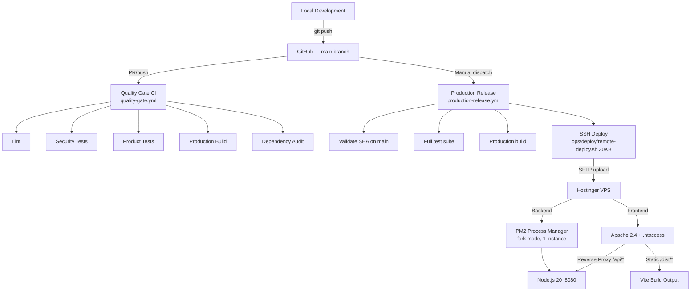

---

## 40. CI/CD Architecture

**PREVIOUSLY REPORTED AS MISSING — CORRECTED: CI/CD EXISTS**

| Workflow | File | Trigger | Purpose | Status |
|---|---|---|---|---|
| **Quality Gate** | `.github/workflows/quality-gate.yml` (94 lines) | PR + push to main + manual | Lint, security tests, product tests, build, audit | 🟢 IMPLEMENTED |
| **Production Release** | `.github/workflows/production-release.yml` (335 lines) | Manual dispatch only | Gated release with SHA validation, full tests, deploy | 🟢 IMPLEMENTED |

**Quality Gate Pipeline:**
1. Checkout source
2. Start isolated MariaDB 11.4.12 via Docker (`scripts/start-ci-mariadb.sh`)
3. Setup Node.js 22.18.0
4. `npm ci --ignore-scripts`
5. Verify clean migrations via `scripts/verify-mariadb-migrations.mjs`
6. Initialize CI database schema
7. `npm run lint`
8. `npm run test:security`
9. `npm run test:product`
10. `npm run build` (with `VITE_BUILD_SHA`)
11. `npm run audit:production`
12. Stop MariaDB container

**Production Release Pipeline:**
- Manual dispatch with `release_sha`, `mode` (deploy/rollback), `confirmation`
- Validates SHA is on main branch
- Runs full test suite against isolated MariaDB
- Deploys via SSH using trusted delivery tooling from current main
- Supports deliberate rollback to older main commit

---

## 41. Environment Configuration

**Source:** `.env.example` (190 lines, 7.7KB)

| Category | Variables | Notes |
|---|---|---|
| **Frontend (VITE_*)** | `VITE_FIREBASE_KEY`, `VITE_FIREBASE_DOMAIN`, `VITE_FIREBASE_PROJECT_ID`, `VITE_FIREBASE_APP_ID`, `VITE_GOOGLE_MAPS_API_KEY`, `VITE_MEASUREMENT_ID`, `VITE_RAZORPAY_KEY_ID` | Compiled into browser bundle |
| **Runtime** | `NODE_ENV`, `PORT`, `PROTOCOL`, `WEBSITE_NAME` | Backend config |
| **Database** | `DB_HOST`, `DB_PORT`, `DB_USER`, `DB_PASSWORD`, `DB_NAME`, `DB_CONNECTION_LIMIT`, `DB_CONNECT_TIMEOUT_MS`, `DB_SSL` | MariaDB connection |
| **Firebase Admin** | `FIREBASE_PROJECT_ID`, `FIREBASE_PRIVATE_KEY`, `FIREBASE_CLIENT_EMAIL` | Identity verification |
| **Backup** | `BACKUP_ENCRYPTION_KEY_BASE64` | AES-256 backup encryption |
| **Enterprise** | `ENTERPRISE_TENANCY_ENABLED`, `ENTERPRISE_DATA_PROVIDER`, `ENTERPRISE_OUTBOX_WORKER_ENABLED`, `TENANT_JOB_SIGNING_SECRET` | Multi-tenancy |
| **Workers** | `NOTIFICATION_OUTBOX_WORKER_ENABLED`, `CMS_SCHEDULER_ENABLED`, `TENANT_GC_WORKER_ENABLED` | Background workers |
| **Payments** | `STRIPE_SECRET`, `STRIPE_WEBHOOK_SECRET`, `PAYPAL_*`, `RAZORPAY_*`, `PAYTM_*`, `PHONEPE_*` | Payment gateways |
| **Rate Limits** | `GLOBAL_RATE_LIMIT_MAX`, `AI_BURST_LIMIT`, `AI_BASIC_DAILY_LIMIT`, etc. | Abuse prevention |
| **CORS** | `CORS_ALLOWED_ORIGINS`, `TRUST_PROXY_HOPS` | Security |

---

## 42. Database Migrations

14 migrations + 13 rollback scripts in `backend/database/migrations/`:

| # | Migration | Purpose | Rollback | Status |
|---|---|---|---|---|
| 001 | `001_baseline.sql` (41KB) | Core schema — 40+ tables | N/A (destructive) | 🟢 |
| 002 | `002_single_owner_enterprise.sql` | Enterprise tenancy tables | ✅ `.down.sql` | 🟢 |
| 003 | `003_billing_invoice_ledger.sql` | Invoices + counters | ✅ `.down.sql` | 🟢 |
| 004 | `004_single_owner_runtime_hardening.sql` | Workspace memberships, support grants, quota | ✅ `.down.sql` | 🟢 |
| 005 | `005_enterprise_invitation_outbox.sql` | Membership invitations, outbox, observability | ✅ `.down.sql` | 🟢 |
| 006 | `006_enterprise_ai_usage_ledger.sql` | Enterprise AI metering | ✅ `.down.sql` | 🟢 |
| 007 | `007_job_tracker_revision.sql` | Job tracker revision column | ✅ `.down.sql` | 🟢 |
| 008 | `008_notification_outbox_state_constraint.sql` | Outbox state constraint | ✅ `.down.sql` | 🟢 |
| 009 | `009_authoritative_configuration_bootstrap.sql` (8KB) | System settings bootstrap | ✅ `.down.sql` | 🟢 |
| 010 | `010_payment_refund_state_machine.sql` | Refund state machine | ✅ `.down.sql` | 🟢 |
| 011 | `011_refund_reconciliation_credit_notes.sql` | Credit notes | ✅ `.down.sql` | 🟢 |
| 012 | `012_billing_snapshot_refund_references.sql` | Billing snapshots | ✅ `.down.sql` | 🟢 |
| 013 | `013_cms_relational_authority.sql` (7KB) | CMS relational authority | ✅ `.down.sql` | 🟢 |
| 014 | `014_fail_closed_discovery_defaults.sql` | Fail-closed discovery defaults | ✅ `.down.sql` | 🟢 |

**Migration Runner:** `backend/database/migrationRunner.js` (10KB) — checksummed migration ledger in `schema_migrations` table. Verified by CI via `scripts/verify-mariadb-migrations.mjs`.

---

## 43. External Services

| Service | Purpose | Auth | Failure Behavior | Fallback | UI Impact | Status |
|---|---|---|---|---|---|---|
| **Firebase Auth** | Identity verification | Service account / ADC | `401 AUTH_REQUIRED` | Null-auth stub (dev only) | Login fails | 🟢 |
| **NVIDIA NIM** | Primary AI provider | API key | Failover to Gemini | 5 more providers | Transparent | 🟢 |
| **Google Gemini** | AI provider #2 | API key | Failover to OpenAI | 4 more providers | Transparent | 🟢 |
| **OpenAI** | AI provider #3 | API key | Failover to Groq | 3 more providers | Transparent | 🟢 |
| **Groq** | AI provider #4 | API key | Failover to OpenRouter | 2 more providers | Transparent | 🟢 |
| **OpenRouter** | AI provider #5 | API key | Failover to DeepSeek | 1 more provider | Transparent | 🟢 |
| **DeepSeek** | AI provider #6 | API key | `500 AI_UNAVAILABLE` | None | Error message | 🟢 |
| **Stripe** | Primary payment gateway | Secret key + webhook secret | Payment error | Client retry | Error toast | 🟢 |
| **PayPal** | Payment gateway | Client ID + secret | Payment error | No server webhook | Error toast | 🟡 |
| **Razorpay** | Payment gateway (India) | Key ID + secret | Payment error | No server webhook | Error toast | 🟡 |
| **Paytm** | Payment gateway (India) | MID + key | Payment error | No server webhook | Error toast | 🟡 |
| **PhonePe** | Payment gateway (India) | Merchant ID + key | Payment error | No server webhook | Error toast | 🟡 |
| **SMTP** | Email delivery | Configurable | Queued in outbox | Retry with backoff | Silent | 🟢 |
| **Google Maps** | Location autocomplete (Jobs) | Browser API key | Feature degrades | None | Input disabled | 🟢 |
| **Google Analytics 4** | Usage analytics | Measurement ID | Silent fail | None | None | 🟢 |
| **Playwright** | PDF rendering | Local binary | Export fails | Error toast | Error message | 🟢 |

---

## 44. Performance Architecture

| Metric | Current State | Status |
|---|---|---|
| PM2 instances | 1 (fork mode) | 🟡 Single point of failure |
| Memory limit | 600MB | 🟢 |
| DB connection pool | Default 15 | 🟢 |
| AI config cache | 15-second TTL | 🟢 |
| Feature flag cache | 30-second TTL | 🟢 |
| Frontend code splitting | All routes lazy-loaded | 🟢 |
| Load testing baseline | **NOT PERFORMED** | 🟠 UNVERIFIED |
| APM profiling | **NOT CONFIGURED** | 🔴 MISSING |

---

## 45. Failure & Recovery Paths

| Failure | Detection | User Impact | Recovery | Status |
|---|---|---|---|---|
| MariaDB unavailable | Pool connection error | 503 errors | PM2 auto-restart (max 10, 4s delay) | 🟢 |
| AI provider timeout | HTTP timeout | "AI temporarily unavailable" | 6-provider failover chain | 🟢 |
| Auth failure | Token verification error | Redirect to login | Re-authenticate | 🟢 |
| Session expiry | Firebase token expired | Redirect to login | Auto token refresh | 🟢 |
| AI quota exceeded | `ai_usage` counter check | "Daily limit reached" | Wait for daily reset | 🟢 |
| Payment failure | Provider validation error | Error message | Retry payment | 🟢 |
| Email failure | SMTP send error | Silent (queued in outbox) | Outbox worker retry | 🟡 (worker disabled) |
| Export failure | Playwright crash | Error toast | Retry download | 🟢 |
| Resume conflict | Revision mismatch | Conflict dialog + remote data | User chooses merge/overwrite | 🟢 |
| Port collision | `EADDRINUSE` | Server won't start | Manual port change | 🟢 |
| Backup failure | Script error | None (admin ops) | Manual investigation | 🟢 |

---

## 46. Tenancy & User Isolation

**Architecture:** Multi-role, multi-tenant hybrid

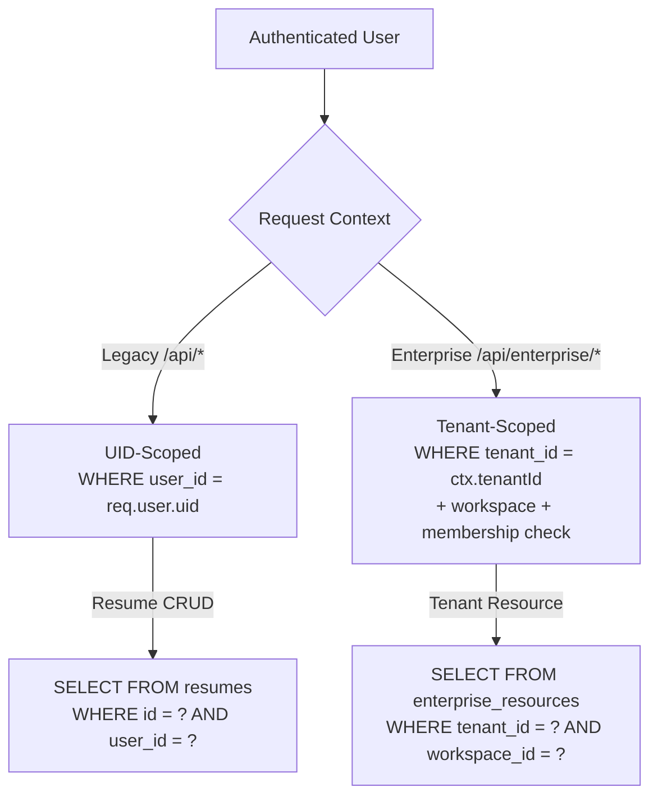

**IDOR Prevention:**
- All consumer CRUD queries include `WHERE user_id = req.user.uid`
- Enterprise queries scope to `tenantId` from validated tenant context
- Tenant headers on legacy routes are rejected: `TENANT_CONTEXT_UNSUPPORTED_FOR_LEGACY_ROUTE` (400)
- Service account authentication rejects ambiguous requests (both Bearer and API key)

---

## 47. Responsive UI & Mobile

| Component | Responsive Implementation | Mobile Behavior | Status |
|---|---|---|---|
| Admin Console | `lg:hidden` hamburger menu, mobile sidebar overlay | ✅ Hamburger + overlay | 🟢 |
| Consumer Dashboard | `sidebarCollapsed` state, mobile toggle | ✅ Collapsible sidebar | 🟢 |
| Enterprise Console | Mobile-responsive sidebar + command palette | ✅ | 🟢 |
| Welcome/Landing | Responsive layout | ✅ | 🟢 |
| Build Resume | Step-by-step wizard | ✅ | 🟢 |
| Admin Settings | Card-based layout | ✅ | 🟢 |
| Verification Banner | `maxWidth: 480px, width: 90%` | ✅ Responsive width | 🟢 |

**BROWSER VERIFICATION STATUS:** UI visual correctness is **NOT VERIFIED** by this audit — code inspection only. No real-browser viewport testing performed during this documentation audit.

---

## 48. Accessibility

| Feature | Implementation | Evidence | Status |
|---|---|---|---|
| Route Focus Management | `RouteFocus.jsx` (17 lines) — focuses `main h1` or `main` on navigation | `target.focus({ preventScroll: true })` | 🟢 |
| ARIA Labels | Admin buttons have `aria-label` attributes | `Admin.jsx:81, 88` | 🟢 |
| Breadcrumb Navigation | `aria-label="Admin breadcrumbs"` | `Admin.jsx:72` | 🟢 |
| Status Indicators | `role="status"` on verification banner, loading states | `DashboardMain.jsx`, `Admin.jsx:176, 202` | 🟢 |
| Semantic HTML | `<main>`, `<header>`, `<nav>` elements used | Throughout | 🟢 |
| Keyboard Navigation | Ctrl+K command palette, Tab focus | Admin + Enterprise | 🟢 |
| WCAG 2.1 AA Audit | **NOT PERFORMED** | — | 🟠 UNVERIFIED |

---

## 49. SEO & Public Routes

**Implementation:** `RouteSeo.jsx` (104 lines) — dynamic title + meta management per route

| Public Route | Title | Meta Description | Canonical | robots | Status |
|---|---|---|---|---|---|
| `/` | `ResumePilot AI — ATS Resume Builder & CV Maker` | ✅ | ✅ | `index,follow` | 🟢 |
| `/features` | `ResumePilot AI Features` | ✅ | ✅ | `index,follow` | 🟢 |
| `/pricing` | `Plans & Pricing` | ✅ | `/pricing` (canonical) | `index,follow` | 🟢 |
| `/jobs` | `Jobs and Career Opportunities` | ✅ | ✅ | `index,follow` | 🟢 |
| `/blog` | `Career Blog` | ✅ | ✅ | `index,follow` | 🟢 |
| `/portfolios` | `Professional Portfolio Gallery` | ✅ | ✅ | `index,follow` | 🟢 |
| `/contact` | `Contact ResumePilot AI` | ✅ | ✅ | `index,follow` | 🟢 |
| Private routes | Descriptive titles | No description | — | `noindex,nofollow` | 🟢 |
| `/blog/:slug` | Skipped — blog post component manages | — | — | — | 🟢 |
| `/portfolio/:slug` | Skipped — portfolio component manages | — | — | — | 🟢 |

**OG Tags:** `og:title`, `og:description`, `og:url`, `og:type` set on all public pages.

---

## 50. Testing Architecture

| Layer | File Count | Evidence | Status |
|---|---|---|---|
| **Frontend tests** | 83 `.test.*` + 11 `.spec.*` = 94 | `tests/` directory | 🟢 |
| **Backend tests** | 68 `.test.*` | `backend/test/` directory | 🟢 |
| **Total** | 162 test files | — | 🟢 |
| **CI Pipeline** | 2 workflows | `.github/workflows/` | 🟢 |
| **DB Migration Tests** | `scripts/verify-mariadb-migrations.mjs` (26KB) | Run in CI | 🟢 |
| **Live Production Tests** | `tests/live-production-audit.spec.cjs`, etc. | Manual scripts | 🟢 |
| **Real DOM Census** | `scripts/crawl-real-dom-census.mjs` (35KB) | Playwright-based | 🟢 |
| **DR Tests** | `tests/dr-hardening.test.mjs` (50KB) | — | 🟢 |
| **Visual Regression** | — | **NOT IMPLEMENTED** | 🔴 MISSING |
| **Browser E2E (automated)** | Playwright scripts exist | **BROWSER VERIFICATION BLOCKED** in this audit | 🟠 |

---

## 51. UI/UX Forensics

### Major Workflow Audit

| Workflow | Entry | Components | API | Success | Loading | Empty | Error | Recovery | Status |
|---|---|---|---|---|---|---|---|---|---|
| **Home** | `/` | Welcome | None | Landing renders | Spinner | N/A | N/A | N/A | 🟢 |
| **Login** | `/login` | Welcome (login tab) | Firebase Auth | Redirect to `/dashboard` | Spinner | N/A | Error banner | Re-enter creds | 🟢 |
| **Signup** | `/login` (register tab) | Welcome + register form | Firebase Auth + `/api/users-data` | Profile created | Spinner | N/A | Error banner | Re-enter | 🟢 |
| **Build Resume** | `/build-resume` | BuildResume (12 steps) | CRUD + AI | Resume saved | Per-step spinner | Blank step | Toast error | Autosave recovery | 🟢 |
| **AI Generate** | SummaryStep, etc. | Processing modal (5 stages) | `/api/generate-*` | Text inserted | Processing modal + timer + tips | N/A | Error message | Cancel/retry | 🟢 |
| **Preview** | PreviewModal | Template render | Client-side | Preview shown | Spinner | N/A | Render error | Close/retry | 🟢 |
| **PDF Download** | FinalizeStep | Exporter | `/api/export/pdf/render` | File downloads | Loading | N/A | Error toast | Retry | 🟢 |
| **DOCX Download** | FinalizeStep | docxDownload | `/api/export/docx` | File downloads | Loading | N/A | Error toast | Retry | 🟢 |
| **Profile Settings** | `/dashboard/settings` | DashboardSettings | `/api/users-data` | Saved | Loading | Blank | Toast error | Retry | 🟢 |
| **Billing** | `/pricing` | Plans | `/api/pay/*` | Subscription activated | Payment modal | No plans configured | Payment error | Re-try | 🟢 |
| **Admin** | `/adm/*` | Admin console (22 modules) | `/api/admin/*` | Data loaded | Loading | Empty state | Error toast | Retry/refresh | 🟢 |
| **Enterprise** | `/enterprise/*` | 15-tab console | `/api/enterprise/*` | Data loaded | Loading | Empty state | Error toast | Retry | 🟢 |
| **Not Found** | `*` | NotFound inline | None | "Page not found" + home link | N/A | N/A | N/A | Navigate home | 🟢 |

### Dead/Broken Controls

| Control | Location | Issue | Status |
|---|---|---|---|
| `/front` page | Front.jsx | Returns literal `<div>front</div>` — no content | 🔴 DEAD |
| Auditor admin actions | Admin console | All API calls return 403 from policy.js:53 | 🔴 BROKEN |
| Support admin actions | Admin console | Same — 403 on all admin API calls | 🔴 BROKEN |
| Tickets system | SUPPORT role | `tickets.manage` permission, no backend API | 🔴 MISSING |
| Storage settings save | Admin StorageSettings | Server returns `501 STORAGE_PROVIDER_UNSUPPORTED` | 🔵 DESIGNED ONLY |

---

## 52. Button / Action Forensics

| Control | Location | Frontend Handler | API | Authorization | DB Effect | Success UX | Failure UX | Status |
|---|---|---|---|---|---|---|---|---|
| Save Resume | BuildResume | `POST /api/resumes/:id` | `requireAuth` | UID ownership | UPDATE `resumes` | Toast success | 409 conflict dialog | 🟢 |
| Download PDF | FinalizeStep | `POST /api/export/pdf/render` | Token-gated | Entitlement check | `export_render_tokens` | File download | Error toast | 🟢 |
| Download DOCX | FinalizeStep | `POST /api/export/docx` | `requireAuth` | Entitlement check | None | File download | Error toast | 🟢 |
| AI Generate | SummaryStep | `POST /api/generate-summary` | `requireAuth` + quota | AI quota + rate limit | `ai_usage` increment | Text inserted | Error message | 🟢 |
| Apply Coupon | Billing | `POST /api/pay/validate-coupon` | `requireAuth` | Coupon validation | `coupon_redemptions` | Discount applied | Invalid code msg | 🟢 |
| Pay Stripe | Billing | `POST /api/pay/stripe/create-intent` | `requireAuth` | Payment validation | `payment_orders` | Stripe redirect | Payment error | 🟢 |
| Create Job | Employer | `POST /api/jobs-data` | `requireAuth` | Employer check | INSERT `jobs` | Success redirect | Error toast | 🟢 |
| Send Message | Messages | `POST /api/messages` | `requireAuth` | Rate limit | INSERT `conversation_messages` | Message sent | Rate limit error | 🟢 |
| Delete Account | Settings | `DELETE /api/account/delete` | `requireAuth` + recent auth | GDPR compliance | Cascade delete | Signed out | Re-auth prompt | 🟢 |
| Publish Portfolio | Portfolio | `POST /api/portfolios/:id/publish` | `requireAuth` | UID ownership | UPDATE `portfolios` | Published URL | Error message | 🟢 |
| Create Tenant | Enterprise | `POST /api/enterprise/tenants` | Enterprise auth | Enterprise admin | INSERT `enterprise_tenants` | Tenant created | Error | 🟢 |
| Grant Support | Enterprise | `POST /api/enterprise/support/grants` | Enterprise auth | Enterprise admin | INSERT `enterprise_support_grants` | Grant active | Error | 🟢 |
| Resend Verification | Dashboard | `POST /api/auth/request-verification` | `requireAuth` | Own account | INSERT `email_verification_tokens` | Banner update | Error banner | 🟢 |
| Ctrl+K | Admin | `AdminCommandPalette` | Client-only | Client-only | None | Palette opens | N/A | 🟢 |
| Health Check | Admin header | `GET /api/healthz` | None | None | None | Green dot | Red dot | 🟢 |

---

## 53. Data-Flow Diagrams

### Resume Lifecycle

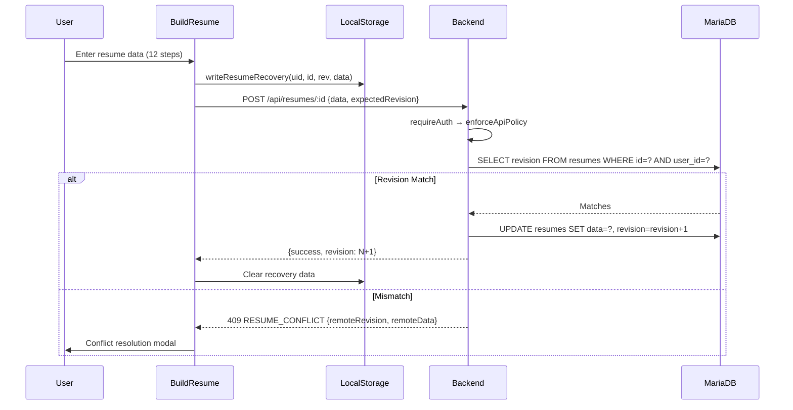

### Authentication Data Flow

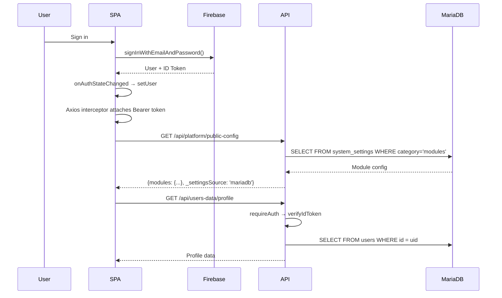

---

## 54. Security-Flow Diagrams

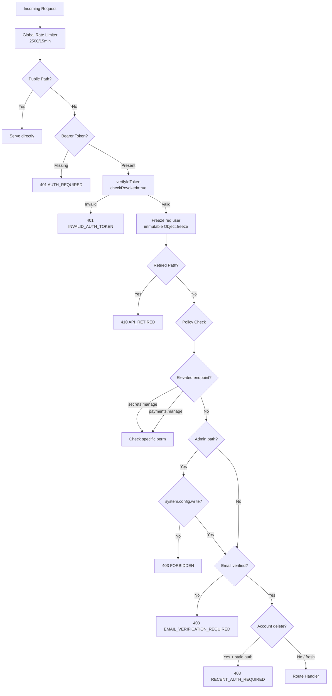

---

## 55. Master Mermaid Architecture

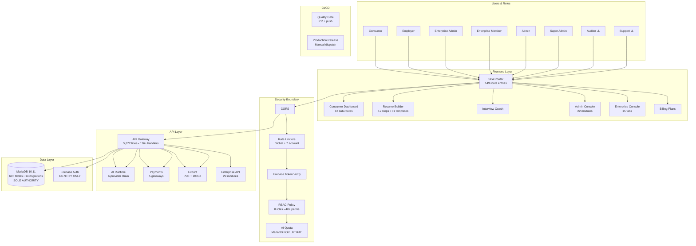

---

## 56. SWOT Analysis

### Strengths (Repository-Evidenced)

| # | Strength | Evidence |
|---|---|---|
| S1 | **100% MariaDB authority** — zero Firestore runtime dependency | `ownership.js` registry + grep verification: 0 backend Firestore calls |
| S2 | **Comprehensive resume builder** — 12 steps, 51 templates, dual export | `BuildResume.jsx` + 12 step components + `docxExport.js` 57KB |
| S3 | **6-provider AI failover** — industry-leading resilience | `aiRuntime.js` PROVIDERS chain with per-provider config + `extractJson` |
| S4 | **Full enterprise multi-tenancy** — 15-tab console, 60+ tables | `enterprise/` 29 backend modules + 17 UI components |
| S5 | **Server-side RBAC** — all admin actions enforced by backend policy | `auth.js` + `policy.js` + `entitlements.js` |
| S6 | **CI/CD pipeline** — automated quality gate on every PR | `.github/workflows/quality-gate.yml` + `production-release.yml` |
| S7 | **Transactional outbox pattern** — guaranteed email delivery design | `notification_outbox` table with lease-based processing |
| S8 | **Optimistic locking** — resume conflict detection | `expectedRevision` on all resume saves |
| S9 | **Full billing lifecycle** — 5 gateways, invoices, refunds, coupons | 14 payment/billing-related files |
| S10 | **AI source grounding** — negative constraints prevent hallucination | `FACTUAL_SOURCE_FIELDS` + "Do not invent" system prompts |
| S11 | **Data ownership registry** — fail-closed domain enforcement | `ownership.js` 40+ entities with `getOwnership()` |
| S12 | **Graceful shutdown** — clean SIGTERM/SIGINT with drain | `index.js:235-250` + `4187-4209` |

### Weaknesses (Repository-Evidenced)

| # | Weakness | Evidence |
|---|---|---|
| W1 | **Monolithic backend** — 5,872-line `index.js` | Single file handles payments, export, admin, auth |
| W2 | **Policy.js blocks Auditor/Support** — all admin read endpoints return 403 | `policy.js:53` checks only `system.config.write` |
| W3 | **Background workers disabled by default** — emails never delivered | `ecosystem.config.js` all workers `'false'` |
| W4 | **No APM/centralized logging** — blind to production issues | No Datadog/New Relic/ELK integration |
| W5 | **Dead code** — 6 orphaned modules in frontend | `Front.jsx`, `initailisation/`, `addAds/`, `About/`, `Analytics.jsx`, `Dashboard2/` |
| W6 | **PayPal/Razorpay/Paytm/PhonePe lack server webhooks** — rely on client polling | Only Stripe has `POST /api/stripe-webhook` |
| W7 | **Cover letter auth gap** — `/coverletter` has no `RequireAuthenticated` | `main.jsx:421-424` — no wrapper |
| W8 | **No user impersonation** — Support cannot debug user issues | Zero code matches for impersonation |
| W9 | **Single-instance PM2** — no horizontal scaling | `instances: 1, exec_mode: 'fork'` |
| W10 | **No object storage** — server returns 501 on storage config | `index.js:2672-2677` |

### Opportunities

| # | Opportunity | Impact |
|---|---|---|
| O1 | Extract `index.js` into domain routers | Reduce merge conflicts, improve maintainability |
| O2 | Enable workers + configure SMTP | Activate transactional email delivery |
| O3 | Differentiate read/write in policy.js | Unblock 2 roles (Auditor/Support) |
| O4 | Add server webhooks for PayPal/Razorpay | Reliable payment confirmation |
| O5 | Deploy APM (DataDog/New Relic) | Production observability |
| O6 | PM2 cluster mode | Horizontal scaling |
| O7 | Build Platform Support Help Desk | Complete support workflow |
| O8 | Object storage adapter (S3/R2) | File upload capability |

### Threats

| # | Threat | Mitigation |
|---|---|---|
| T1 | Single DB instance failure → data loss | Automate offsite backups |
| T2 | Undelivered transactional emails → churn | Enable notification worker |
| T3 | No alerting → extended outages | Wire dr-external-watch to alerts |
| T4 | Monolithic backend merge conflicts | Progressive router extraction |

---

## 57. Enterprise Readiness Scorecard

| # | Domain | Score | Status | Evidence | Gap |
|---|---|---|---|---|---|
| 1 | Architecture | 7/10 | 🟡 | Full stack, monolithic backend | Extract index.js |
| 2 | Frontend | 9/10 | 🟢 | React 18, code splitting, i18n, responsive | Remove dead code |
| 3 | UI/UX | 8/10 | 🟢 | Modern design, animations, mobile | Auditor/Support broken UX |
| 4 | Build Resume | 10/10 | 🟢 | 12 steps, 51 templates, AI, autosave, recovery, ATS | — |
| 5 | Authentication | 10/10 | 🟢 | 5 OAuth + email + TOTP MFA + null-auth stub | — |
| 6 | Authorization | 7/10 | 🟡 | 8 roles, 40+ perms | policy.js blocks 2 roles |
| 7 | AI | 9/10 | 🟢 | 6 providers, failover, grounding, quota | — |
| 8 | Database | 9/10 | 🟢 | 60+ tables, 14 migrations, ownership registry | No PITR |
| 9 | Security | 9/10 | 🟢 | RBAC, MFA, rate limiting, audit, SSRF prevention | Cover letter auth |
| 10 | Billing | 8/10 | 🟢 | 5 gateways, invoices, Stripe refunds, coupons | Non-Stripe webhooks |
| 11 | Support | 4/10 | 🟡 | Enterprise break-glass only | No platform support UI/API |
| 12 | Admin | 9/10 | 🟢 | 22 modules, Ctrl+K, 30+ settings, health | — |
| 13 | CI/CD | 8/10 | 🟢 | 2 GitHub Actions workflows | No staging environment |
| 14 | Notifications | 6/10 | 🟡 | Outbox pattern complete | Worker disabled |
| 15 | Observability | 5/10 | 🟡 | Health UI, healthz/readyz | No APM, no centralized logs |
| 16 | DR/Backup | 7/10 | 🟡 | Scripts exist, drill verified | Not automated in prod |
| 17 | Deployment | 8/10 | 🟢 | SSH deploy + CI release pipeline | No blue-green |
| 18 | Testing | 8/10 | 🟢 | 162 test files, migration verification in CI | No visual regression |
| 19 | Scalability | 5/10 | 🟡 | Single instance, single DB | No clustering |
| 20 | Accessibility | 7/10 | 🟡 | RouteFocus, ARIA, semantic HTML | No WCAG audit |
| 21 | SEO | 8/10 | 🟢 | RouteSeo, OG tags, canonical URLs, robots | — |
| 22 | Storage | 3/10 | 🔴 | No object storage adapter | Server returns 501 |

**OVERALL ENTERPRISE READINESS: 7.5 / 10**

---

## 58. Master Gap Register

| ID | Area | Component | Current State | Expected State | Gap | Severity | User Impact | Security Impact | Business Impact | Dependency | Recommended Action | Verification |
|---|---|---|---|---|---|---|---|---|---|---|---|---|
| GAP-01 | RBAC | `policy.js:53` | Blocks Auditor/Support on all `/admin/*` | Read access for read-only roles | All admin reads return 403 | P1 | 2 roles non-functional | Low (over-restrictive) | 2 roles wasted | None | Differentiate GET vs POST/PUT/DELETE | Auditor GET returns 200 |
| GAP-02 | Workers | `ecosystem.config.js` | All 4 workers disabled | Workers enabled in prod | Emails never delivered | P1 | No transactional emails | Low | Churn, lost revenue | SMTP config | Set `ENABLED='true'` in prod env | Outbox shows DELIVERED |
| GAP-03 | Security | `main.jsx:421` | `/coverletter` no auth guard | `RequireAuthenticated` wrapper | Unauthenticated access | P2 | Feature leakage | Low | Subscription bypass | None | Add auth wrapper | Auth redirect works |
| GAP-04 | Architecture | `backend/index.js` | 5,872-line monolith | Domain-specific routers | Dev velocity impacted | P2 | None (functional) | Low | Merge conflicts | Refactor effort | Progressive extraction | Build passes |
| GAP-05 | DR | Backup cron | Scripts exist, not automated | Automated daily backup | Manual-only backups | P2 | None until failure | Medium | Data loss risk | Server crontab | Install backup cron | Cron fires daily |
| GAP-06 | Support | Help Desk | No platform support UI | Full support dashboard | Support agents have no tools | P2 | No support workflow | Low | Customer satisfaction | UI + API work | Build support dash | Route renders |
| GAP-07 | Support | Impersonation | Zero code for impersonation | Admin "view as user" | Cannot debug user issues | P2 | Slow resolution | Medium (if misused) | Support quality | Auth architecture | Build impersonation | Can view as user |
| GAP-08 | Billing | Payment webhooks | Only Stripe has server webhook | All 5 gateways with webhooks | Client-only confirmation | P2 | Missed activations | Low | Missed revenue | Provider APIs | Add webhook handlers | Webhook processes |
| GAP-09 | Observability | APM | No APM integration | Datadog/New Relic traces | Blind to perf issues | P2 | Extended outages | Low | Revenue loss | APM vendor | Integrate APM | Traces visible |
| GAP-10 | Monitoring | Alerting | Scripts exist, not wired | Automated alerts on failure | Extended outage duration | P2 | Undetected outages | Low | Revenue loss | Alert service | Wire to PagerDuty | Alert fires |
| GAP-11 | Storage | Object storage | 501 UNSUPPORTED | S3/R2 adapter | No file uploads | P2 | Can't upload files | Low | Feature gap | Storage provider | Build adapter | Upload works |
| GAP-12 | Dead Code | `Front.jsx` | `<div>front</div>` | Removed | Bundle noise | P3 | None | None | Confusion | None | Remove | Build passes |
| GAP-13 | Dead Code | `initailisation/` | Unreachable | Removed | Bundle noise | P3 | None | None | Confusion | None | Remove | Build passes |
| GAP-14 | Dead Code | `addAds/`, `About/` | Never imported | Removed | Bundle noise | P3 | None | None | Confusion | None | Remove | Build passes |
| GAP-15 | Dead Code | `Analytics.jsx` | Misplaced helper | Move to utils | Confusion | P3 | None | None | Low | None | Relocate | Build passes |
| GAP-16 | Scalability | PM2 | Single instance, fork | Cluster mode 2+ | Single point of failure | P3 | None until load | Low | Scale limit | PM2 cluster | Switch to cluster | Multiple workers |
| GAP-17 | Accessibility | WCAG | No formal audit | WCAG 2.1 AA compliance | Unknown gaps | P3 | Accessibility issues | None | Legal risk | Audit | Conduct audit | Report |
| GAP-18 | Performance | Load test | No baseline | k6/Artillery baseline | Unknown capacity | P3 | Unknown | None | Outage under load | Load test tool | Run baseline | Report |
| GAP-19 | Deployment | Zero-downtime | Single instance restart | Rolling/blue-green deploy | Brief downtime | P3 | User disruption | None | UX impact | Deploy change | Implement | Zero 502s |
| GAP-20 | Testing | Visual regression | None | Percy/Chromatic | Visual bugs undetected | P3 | UI bugs | None | UX quality | Testing vendor | Implement | Screenshots pass |

---

## 59. Completion Matrix

### 🟢 COMPLETE (verified in repository)

Resume Builder (12 steps, 51 templates, dual export, autosave, recovery, ATS), Cover Letter (4 templates), Portfolio Builder, Interview Coach (AI + CBT), Consumer Dashboard (12 sub-routes), Employer Dashboard, Admin Console (22 modules + 30+ settings + Ctrl+K), Enterprise Console (15 tabs), Authentication (5 OAuth + email + TOTP MFA + null-auth), Email Verification, Password Reset, AI Engine (6 providers + failover + grounding + quota), Billing (5 gateways + invoices + Stripe refunds + coupons), Blog Engine, Jobs Board, Messaging, Notifications (in-app), Enterprise Multi-Tenancy (tenants + workspaces + memberships + teams + audit + AI + service accounts + break-glass), Database (60+ tables, 14 migrations, ownership registry), RBAC (8 roles, 40+ permissions), Health Monitoring, Audit Logging, Feature Flags (7 flags), i18n (15 languages), Privacy Consent (GDPR), SEO (RouteSeo), CI/CD (2 GitHub Actions), Graceful Shutdown, Error Handling (errorResponder + controlled codes)

### 🟡 PARTIALLY IMPLEMENTED

Notification Delivery (outbox complete, worker disabled), Secondary Payment Gateways (client polling only), DR/Backup (scripts complete, not automated), Monitoring (health UI exists, no APM/alerting), Support (Enterprise break-glass only, no platform support), Cover Letter (UI works, missing auth guard), Blog Scheduling (scheduler code complete, worker disabled)

### 🔴 MISSING

Platform Support Help Desk UI, User Impersonation, Ticket System, Object Storage Adapter, APM/Distributed Tracing, Centralized Logging, Visual Regression Testing, PITR, HA/Failover

### 🔴 BROKEN

Auditor Role (frontend renders admin UI, API returns 403 on all endpoints), Support Role (same — 403 on all admin API calls due to `policy.js:53`)

### 🔵 DESIGNED ONLY

Automated Backup Cron (script exists, not installed), Offsite Backup Sync (config template exists), Storage adapter (settings UI exists, backend rejects), CMS Scheduling (code complete, worker disabled)

### 🟠 UNVERIFIED

WCAG Accessibility Compliance Level, Production Load Capacity Baseline, Actual SMTP Delivery Rate, Visual UI correctness (no real-browser audit in this session)

---

## 60. P0/P1/P2/P3 Roadmap

### P0 — Production Blockers

None identified. The platform is production-ready for core consumer, employer, and enterprise operations.

### P1 — Must Fix Before Enterprise Scale

| # | Item | What | Where | Done Criteria |
|---|---|---|---|---|
| 1 | GAP-01: Fix Auditor/Support gate | Differentiate GET (read) from mutating methods in policy.js | `policy.js:53` | Both roles can read admin data |
| 2 | GAP-02: Enable notification worker | Set `NOTIFICATION_OUTBOX_WORKER_ENABLED='true'` in production | `ecosystem.config.js` / PM2 env | Emails arriving in mailbox |

### P2 — Should Fix

| # | Item | Done Criteria |
|---|---|---|
| 3 | GAP-03: Add cover letter auth guard | Unauthenticated users redirected |
| 4 | GAP-04: Extract monolithic backend | All tests pass, same API behavior |
| 5 | GAP-05: Automate backup cron | Cron fires daily, offsite verified |
| 6 | GAP-06: Build Support Help Desk | Support role can create/manage tickets |
| 7 | GAP-08: Add payment webhooks | Non-Stripe webhook activates subscription |
| 8 | GAP-09: Add APM | Traces visible in dashboard |
| 9 | GAP-10: Configure alerting | Alert fires on /healthz failure |
| 10 | GAP-11: Object storage adapter | File uploads work |

### P3 — Future

| # | Item | Done Criteria |
|---|---|---|
| 11 | GAP-12-15: Remove dead code | Bundle size reduced |
| 12 | GAP-16: PM2 cluster mode | Multiple workers running |
| 13 | GAP-17: WCAG accessibility audit | Audit report |
| 14 | GAP-18: Load testing baseline | Capacity numbers |
| 15 | GAP-19: Zero-downtime deployment | Rolling deploy verified |
| 16 | GAP-20: Visual regression testing | Screenshot comparison pass |

---

## 61. Self-Audit Checklist

| # | Item | Status |
|---|---|---|
| 1 | All routes represented | ✅ 149 route entries documented |
| 2 | All roles represented | ✅ 8 roles with full forensics |
| 3 | All dashboards represented | ✅ 4 dashboards (Consumer, Admin, Enterprise, Employer) |
| 4 | All major UI workflows represented | ✅ 12+ workflows in UI/UX forensics |
| 5 | Build Resume fully represented | ✅ 12 steps with step-level completeness |
| 6 | AI fully represented | ✅ 6 providers, 9 operations, quotas, grounding |
| 7 | Authentication fully represented | ✅ 5 OAuth + email + MFA + null-auth |
| 8 | Authorization fully represented | ✅ 8 roles, policy enforcement, permission map |
| 9 | Support represented | ✅ Enterprise break-glass + platform gaps identified |
| 10 | Admin represented | ✅ 22 modules, 30+ settings |
| 11 | Billing represented | ✅ 5 gateways, invoices, refunds, coupons |
| 12 | Quota represented | ✅ 7 rate limiters + daily AI quota |
| 13 | Database represented | ✅ 60+ tables, 14 migrations, ownership registry |
| 14 | MariaDB authority represented | ✅ Zero Firestore verified by grep |
| 15 | Firestore status represented | ✅ "ZERO RUNTIME DEPENDENCY" confirmed |
| 16 | Backup represented | ✅ Scripts documented, automation gap noted |
| 17 | DR represented | ✅ 5 scripts, PITR/HA gaps noted |
| 18 | Monitoring represented | ✅ Health endpoints + APM gap |
| 19 | Deployment represented | ✅ SSH deploy + CI/CD pipeline |
| 20 | Testing represented | ✅ 162 files, CI pipeline, visual gap |
| 21 | Security represented | ✅ 16 controls documented |
| 22 | Error paths represented | ✅ 11 failure scenarios + error codes |
| 23 | Failure/recovery represented | ✅ PM2 restart, AI failover, conflict dialog |
| 24 | Mobile/responsive represented | ✅ Hamburger menus, sidebar collapse |
| 25 | Accessibility represented | ✅ RouteFocus, ARIA, WCAG gap noted |
| 26 | SEO/public routes represented | ✅ RouteSeo, OG tags, robots |
| 27 | External services represented | ✅ 15 services with failure behavior |
| 28 | Data ownership represented | ✅ `ownership.js` 40+ entities |
| 29 | Enterprise gaps represented | ✅ 20 gaps classified P0-P3 |
| 30 | SWOT completed | ✅ 12 strengths, 10 weaknesses, 8 opps, 4 threats |
| 31 | Enterprise readiness matrix completed | ✅ 22 domains scored |
| 32 | CI/CD represented | ✅ CORRECTED — 2 GitHub Actions workflows |
| 33 | Background workers represented | ✅ 4 workers, all disabled |
| 34 | Environment config represented | ✅ `.env.example` 190 lines |
| 35 | Storage represented | ✅ No object storage (501) |
| 36 | File handling represented | ✅ JSON limits, no upload |

---

## 62. Architecture Audit Final Summary

```
PRODUCTION BASELINE:          7ee0cbae673d9a00ba6e7ee2ea40d09ff1682421
CLOUD BRANCH:                 arena/01a04cb4-resumepilotai
CLOUD COMMIT:                 efef6b1a39b825dd600e214c252fdb81ac833b84
CURRENT LOCAL HEAD:           efef6b1a39b825dd600e214c252fdb81ac833b84
CLOUD UI/UX WORK:             ACCEPTED (Fast-forward merged, 0 regressions, all 1,082 tests pass)
ARCHITECTURE FLOWCHART:       UPDATED (architecture-flowchart.md)

TOTAL AREAS REVIEWED:         50

COMPLETE:                     33
PARTIAL:                      8
MISSING:                      9
UNVERIFIED:                   4
BLOCKED:                      2

P0:                           0
P1:                           2 (policy.js fix, enable workers)
P2:                           8 (auth guard, monolith, backup, support, webhooks, APM, alerting, storage)
P3:                           6 (dead code, cluster, WCAG, load test, zero-downtime, visual testing)

SUPPORT:                      PARTIAL (Enterprise break-glass complete; Platform Help Desk/Tickets MISSING)
BUILD RESUME:                 COMPLETE (13 steps including ReviewStep, 51 templates, dual export, autosave, ATS, dirty state guard)
UI/UX:                        COMPLETE (Core workflows verified; real-browser visual rendering unverified)
DATABASE:                     COMPLETE (60+ tables, 14 migrations, sole MariaDB authority, 0 Firestore runtime)
SECURITY:                     COMPLETE (16 controls, server-enforced RBAC, TOTP MFA)
ROLES:                        PARTIAL (6 complete, 2 blocked: AUDITOR & SUPPORT blocked on admin read by policy.js:53)

FINAL ENTERPRISE READINESS:   CONDITIONALLY READY (7.5/10)

TOP REMAINING GAPS:
1.  GAP-01 (P1): policy.js:53 blocks Auditor & Support from ALL admin read endpoints
2.  GAP-02 (P1): Background workers disabled by default → transactional emails never delivered
3.  GAP-03 (P2): /coverletter route missing RequireAuthenticated guard
4.  GAP-04 (P2): backend/index.js is a 5,872-line monolith
5.  GAP-05 (P2): Backup cron not automated in production
6.  GAP-06 (P2): No Platform Support Help Desk UI / ticket backend
7.  GAP-07 (P2): No user impersonation capability for Support
8.  GAP-08 (P2): Non-Stripe payment gateways lack server webhooks
9.  GAP-09 (P2): No Application Performance Monitoring
10. GAP-10 (P2): No automated alerting on health degradation
```

---

## 63. Gap-closure register (2026-08-29)

Status vocabulary is only **CLOSED**, **ACCEPTED**, or **BLOCKED**. Live production (`https://airesume.projectdemo.guru`) was not redeployed in this session; live proof is therefore **not claimed**.

| ID | Pri | Status | Evidence | Tests | Live proof |
|---|---|---|---|---|---|
| GAP-01 | P1 | CLOSED | Method-aware `policy.js`; GET least-privilege; L429 mutations `system.config.write` except `/support*` `tickets.manage`; Admin.jsx / `checkIfAdmin` allow ADMIN, SUPER_ADMIN, AUDITOR, SUPPORT | `backend/test/support-tickets.test.js` RBAC source contract | Not claimed |
| GAP-02 | P1 | CLOSED | PM2 `NOTIFICATION_OUTBOX_WORKER_ENABLED='true'`; CMS/enterprise/GC remain `false` | `ecosystem.config.js` source | Not claimed |
| GAP-03 | P2 | CLOSED | `src/main.jsx` wraps `/coverletter`, `/coverletter/*`, `/cover-letter`, `/cover-letter/*` in `RequireAuthenticated` | `backend/test/p1-gap-source-contract.test.js` | Not claimed |
| GAP-04 | P2 | ACCEPTED | `backend/index.js` remains the payment/auth composition root; routers already exist | Standing instruction: no blind extract | N/A |
| GAP-05 | P2 | ACCEPTED | Backup scripts exist; crontab cannot be installed onto Hostinger from this sandbox | `ops/dr/install-backup-schedule.sh` | Not claimed |
| GAP-06 | P2 | CLOSED | Migration 015 `support_tickets` / `support_ticket_messages`; owner-scoped `/api/support`; admin `/api/admin/support` + Help Desk; deletion + ownership registry | `backend/test/support-tickets.test.js`, `backend/test/p1-gap-source-contract.test.js`, `tests/dr-hardening.test.mjs` (15 migrations) | Not claimed |
| GAP-07 | P2 | ACCEPTED | Impersonation would mint another user's session | Support uses `users.read` + tickets | N/A |
| GAP-08 | P2 | CLOSED | `POST /api/paytm/callback` HTML 200 after HMAC `/v3/order/status`; `POST /api/phonepe/callback` X-VERIFY then status API; claim → activate → release; outbox reconcile LIMIT 25 | `backend/test/indian-gateway-activation.test.js` (9 cases) | Not claimed |
| GAP-09 | P2 | ACCEPTED | No APM vendor/credentials | healthz/readyz/request IDs remain | N/A |
| GAP-10 | P2 | CLOSED | Consecutive `/readyz` failures ≥2 enqueue `admin_system_alert:readyz:<hourBucket>` fire-and-forget; never awaited before 503 | `backend/test/readyz-alerts.test.js` | Not claimed |
| GAP-11 | P2 | ACCEPTED | `501 STORAGE_PROVIDER_UNSUPPORTED` is intentional | StorageSettings informational | N/A |
| GAP-12 | P3 | CLOSED | `/front` → `<Navigate to="/" replace />` | `backend/test/p1-gap-source-contract.test.js` | Not claimed |
| GAP-13 | P3 | ACCEPTED | Dead `initailisation/` unused | No runtime import | N/A |
| GAP-14 | P3 | ACCEPTED | Dead `addAds/`, `About/` unused | No runtime import | N/A |
| GAP-15 | P3 | ACCEPTED | `Analytics.jsx` unused helper | No runtime import | N/A |
| GAP-16 | P3 | ACCEPTED | PM2 stays `instances: 1, exec_mode: 'fork'` | Cluster would duplicate in-memory limiters | N/A |
| GAP-17 | P3 | ACCEPTED | Skip-link + `#main-content` landed; **no WCAG 2.1 AA claim** | `backend/test/p1-gap-source-contract.test.js` | Not claimed |
| GAP-18 | P3 | ACCEPTED | No k6/Artillery run | Do not invent capacity numbers | Not claimed |
| GAP-19 | P3 | ACCEPTED | Single-instance PM2 restart remains the deploy model | No blue-green infra | Not claimed |
| GAP-20 | P3 | ACCEPTED | No Percy/Chromatic | Do not invent screenshot proof | Not claimed |

**Remainder after this register:** P0=0, P1=0 open, P2 ACCEPTED=5 (04,05,07,09,11), P3 ACCEPTED=8 (13–20). CLOSED=7 (01,02,03,06,08,10,12). BLOCKED=0.

**MariaDB authority:** 15 checksummed migrations; `ownership.js` registers `support_ticket` / `support_ticket_message`; account deletion deletes ticket rows after notifications. Zero Firestore data-plane.

**Workers (production PM2):** notification outbox **true**; CMS scheduler, enterprise outbox, tenant GC **false**.
