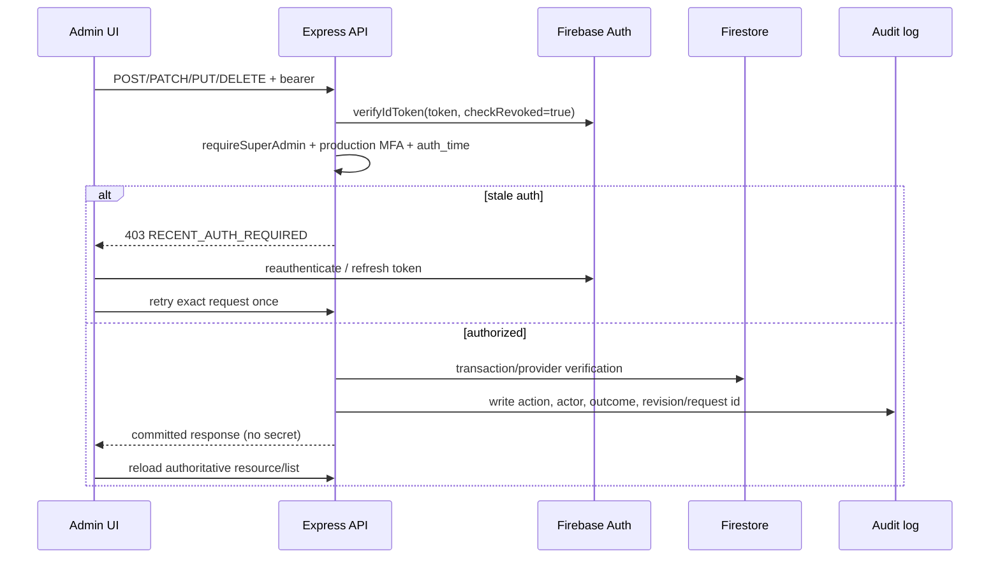
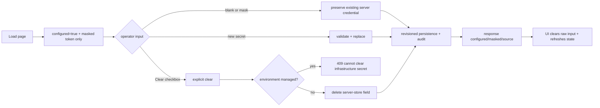
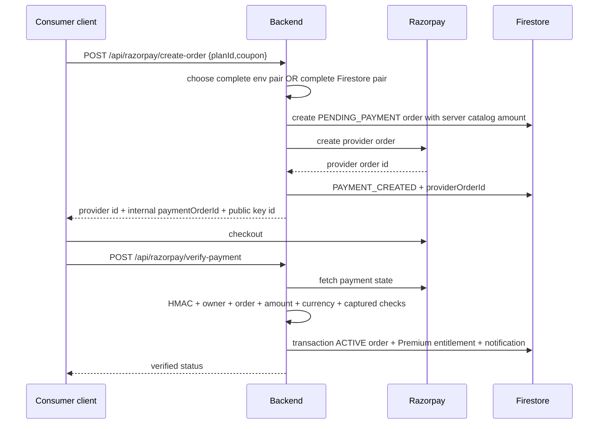
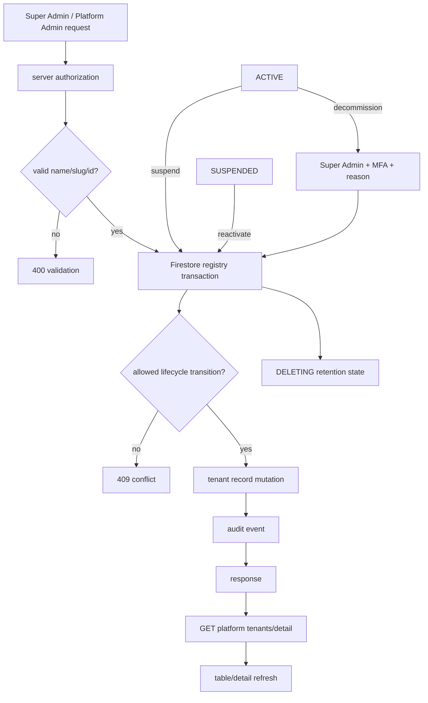
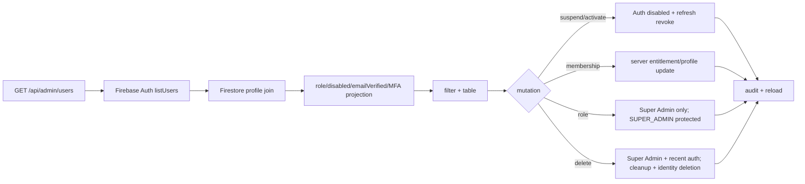
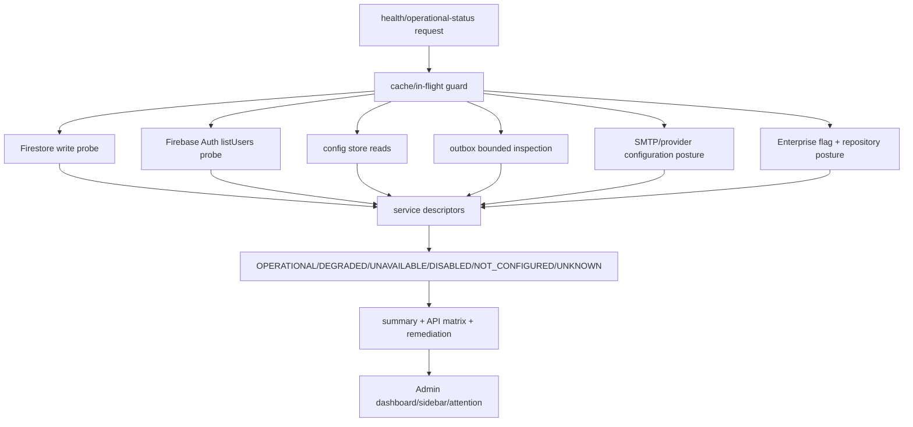

# Admin + Super Admin flowcharts

These diagrams describe implemented server contracts. A green UI state is not evidence of a committed mutation; every mutation ends with a read-back or an explicit failure.

## Admin shell and authentication

```mermaid
flowchart TD
  A[Browser /adm or /admin] --> B[RequireAuthenticated]
  B -->|no Firebase user| L[/login with safe next path]
  B -->|user| C[Firebase ID token claims]
  C --> D[checkIfAdmin client hint]
  D -->|not admin| H[redirect home]
  D -->|admin candidate| E[Admin shell]
  E --> F[Server bearer verification checkRevoked]
  F --> G[Permission + verified email policy]
  G -->|403| X[Explicit forbidden state]
  G -->|200| M[Module API]
```

## Super Admin mutation



## Write-only secret lifecycle



## Razorpay checkout



## Tenant lifecycle



## User management



## Platform health


