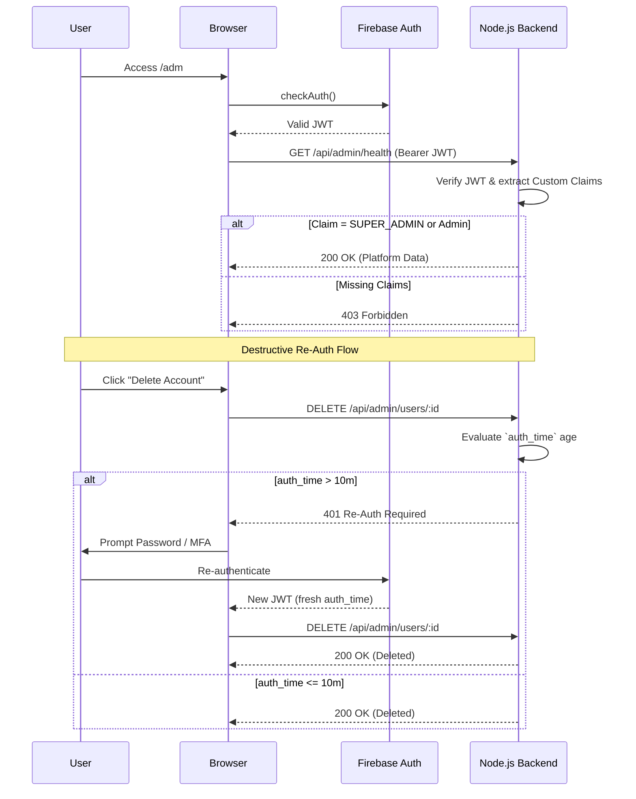
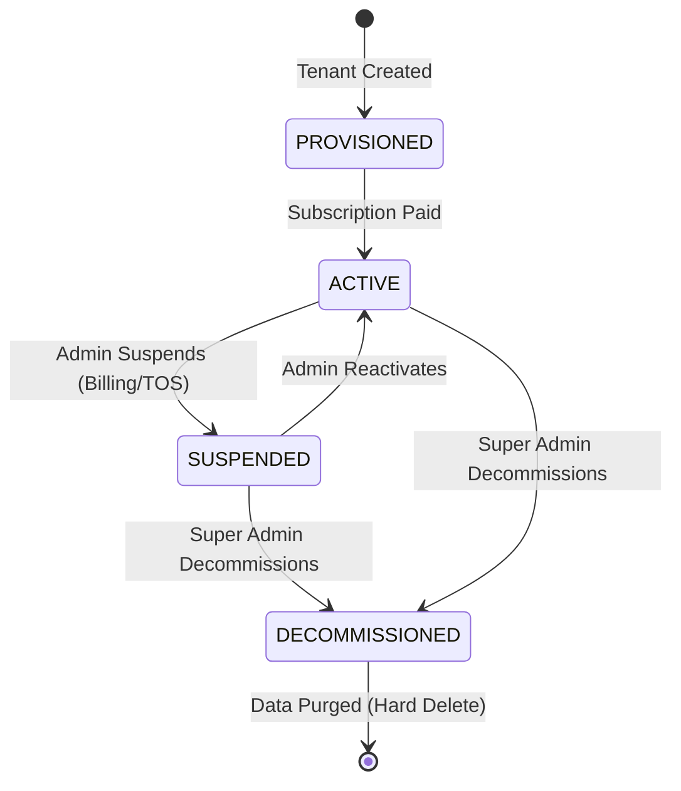
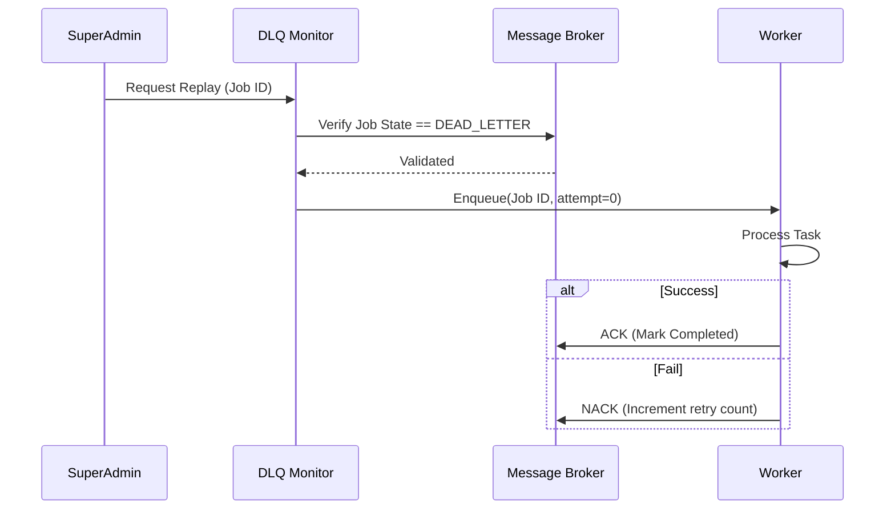

# Admin & Super Admin Flowcharts

## 1. Global Authentication & Session Elevation Flow

```mermaid
sequenceDiagram
    participant User
    participant Browser
    participant Firebase Auth
    participant Node.js Backend

    User->>Browser: Access /adm
    Browser->>Firebase Auth: checkAuth()
    Firebase Auth-->>Browser: Valid JWT
    Browser->>Node.js Backend: GET /api/admin/health (Bearer JWT)
    Node.js Backend->>Node.js Backend: Verify JWT & extract Custom Claims
    alt Claim = SUPER_ADMIN or Admin
        Node.js Backend-->>Browser: 200 OK (Platform Data)
    else Missing Claims
        Node.js Backend-->>Browser: 403 Forbidden
    end

    Note over User,Node.js Backend: Destructive Re-Auth Flow
    User->>Browser: Click "Delete Account"
    Browser->>Node.js Backend: DELETE /api/admin/users/:id
    Node.js Backend->>Node.js Backend: Evaluate `auth_time` age
    alt auth_time > 10m
        Node.js Backend-->>Browser: 401 Re-Auth Required
        Browser->>User: Prompt Password / MFA
        User->>Firebase Auth: Re-authenticate
        Firebase Auth-->>Browser: New JWT (fresh auth_time)
        Browser->>Node.js Backend: DELETE /api/admin/users/:id
        Node.js Backend-->>Browser: 200 OK (Deleted)
    else auth_time <= 10m
        Node.js Backend-->>Browser: 200 OK (Deleted)
    end
```

## 2. Tenant Lifecycle Management

```mermaid
stateDiagram-v2
    [*] --> PROVISIONED: Tenant Created
    PROVISIONED --> ACTIVE: Subscription Paid
    ACTIVE --> SUSPENDED: Admin Suspends (Billing/TOS)
    SUSPENDED --> ACTIVE: Admin Reactivates
    SUSPENDED --> DECOMMISSIONED: Super Admin Decommissions
    ACTIVE --> DECOMMISSIONED: Super Admin Decommissions
    DECOMMISSIONED --> [*]: Data Purged (Hard Delete)
```

## 3. Global DLQ Playback Flow

```mermaid
sequenceDiagram
    participant SuperAdmin
    participant DLQ Monitor
    participant Message Broker
    participant Worker

    SuperAdmin->>DLQ Monitor: Request Replay (Job ID)
    DLQ Monitor->>Message Broker: Verify Job State == DEAD_LETTER
    Message Broker-->>DLQ Monitor: Validated
    DLQ Monitor->>Worker: Enqueue(Job ID, attempt=0)
    Worker->>Worker: Process Task
    alt Success
        Worker->>Message Broker: ACK (Mark Completed)
    else Fail
        Worker->>Message Broker: NACK (Increment retry count)
    end
```
