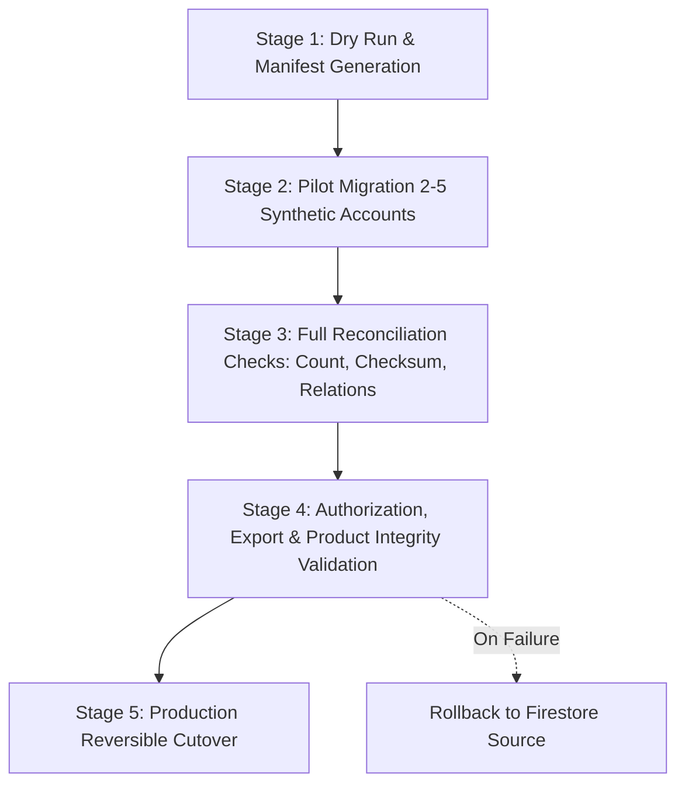

# Enterprise Data Migration Manifest & Governance Policy

**Repository:** `bhaskarbeyond-creator/ResumePilotAi`  
**Branch:** `arena/01a01c9e-resumepilotai`  
**Date:** 2026-08-20  

> **Migration Policy Invariant:** No production data is migrated silently, implicitly, or without verified deterministic ownership. Ambiguous ownership records are automatically **QUARANTINED**. Legacy Firebase collections remain authoritative until explicit, reconciled cutover is certified.

---

## 1. Comprehensive Collection Migration Matrix

| Source Category | Source Path / Query | Current Owner Path | Target Table / Aggregate | Tenant Assignment Rule | Workspace Assignment Rule | Transformation Logic | Checksum Algorithm | Dependencies | Ambiguity / Quarantine Policy | Rollback Plan | Pilot Status |
|---|---|---|---|---|---|---|---|---|---|---|---|
| **Resumes** | `users/{uid}/resumes/{resumeId}` | Path parameter `{uid}` | `tenant_data.resources` (`resource_type='RESUME'`) | Personal Tenant of `{uid}` | Default Personal Workspace | Normalized JSON payload with `legacyDocumentId`, version, and metadata | SHA-256 over normalized JSON string | None | Unmatched UID -> **QUARANTINE** | Disable target route, restore read/write to Firestore source | **PILOT READY** (Adapter tested) |
| **CV Documents** | `users/{uid}/cvs/{cvId}` / `users/{uid}/cv` | Path parameter `{uid}` | `tenant_data.resources` (`resource_type='CV'`) | Personal Tenant of `{uid}` | Default Personal Workspace | Normalized 4-template structure + `legacyDocumentId` | SHA-256 over normalized JSON | None | Non-standard shape -> **QUARANTINE** | Revert to Firestore collection | **PILOT READY** |
| **Cover Letters** | `users/{uid}/covers/{coverId}` | Path parameter `{uid}` | `tenant_data.resources` (`resource_type='COVER_LETTER'`) | Personal Tenant of `{uid}` | Default Personal Workspace | Normalized cover letter sections + metadata | SHA-256 over normalized JSON | None | Missing owner -> **QUARANTINE** | Revert to Firestore collection | **PILOT READY** |
| **Portfolios** | `users/{uid}/portfolios/{portfolioId}` | Path parameter `{uid}` | `tenant_data.resources` (`resource_type='PORTFOLIO'`) | Personal Tenant of `{uid}` | Default Personal Workspace | Structured portfolio JSON + theme configs | SHA-256 over normalized JSON | Linked Resumes | Disputed owner -> **QUARANTINE** | Revert to Firestore collection | **PILOT READY** |
| **Favorites** | `users/{uid}/favorites` | Path parameter `{uid}` | `tenant_data.resources` (`resource_type='FAVORITE'`) | Personal Tenant of `{uid}` | Default Personal Workspace | Array of favorite template IDs & notes | SHA-256 over normalized JSON | None | Invalid IDs ignored | Revert to Firestore collection | **PILOT READY** |
| **Job Tracker** | `users/{uid}/jobTracker` | Path parameter `{uid}` | `tenant_data.resources` (`resource_type='JOB_TRACKER'`) | Personal Tenant of `{uid}` | Default Personal Workspace | Job tracking boards, applications, stages | SHA-256 over normalized JSON | None | Ambiguous schema -> **QUARANTINE** | Revert to Firestore collection | **PILOT READY** |
| **Public Projections** | `pb/{resumeId}` | Document field `ownerUid` | `platform.public_projections` | Verified Personal Tenant of `ownerUid` | Default Workspace | Public resume view tokens + metadata | SHA-256 over projection payload | Source Resume | `ownerUid` mismatch -> **QUARANTINE** | Revoke public token, re-point to Firestore | **PILOT READY** |
| **Employer Companies** | `companies/{companyId}` | Document field `employerId` (individual) | `platform.tenants` / `tenant_data.organizations` | **QUARANTINE** until explicit organization binding | New Organization Workspace | Requires owner identity confirmation to convert to Business Tenant | SHA-256 over company profile | Owner User | Multi-admin ambiguity -> **QUARANTINED** | Maintain legacy Firestore | **QUARANTINED** |
| **Job Postings** | `jobs/{jobId}` | Document field `employerId` | `tenant_data.resources` (`resource_type='JOB_POSTING'`) | Bound to Company Tenant | Company Workspace | Re-anchored to parent Company Tenant ID | SHA-256 over job posting | Company Record | Orphan jobs -> **QUARANTINED** | Maintain legacy Firestore | **QUARANTINED** |
| **Job Applications** | `applications/{appId}` | `applicantUid` + `jobId` | `tenant_data.resources` (`resource_type='APPLICATION'`) | Applicant Personal Tenant + Employer Tenant view | Cross-tenant reference | Dual-linked relationship record | SHA-256 over application | Job + Applicant | Deleted job or applicant -> **QUARANTINED** | Maintain legacy Firestore | **QUARANTINED** |
| **Messaging / Chats** | `messages/{chatId}` (RTDB) | Array of participant UIDs | Archived / `tenant_data.messages` | **QUARANTINE** (Legacy Personal Archive) | Personal Workspace | Preserved as historical read-only conversation log | SHA-256 over message history | Participants | Mismatched participants -> **QUARANTINED** | Keep in RTDB | **QUARANTINED** |
| **AI Generation History** | Browser LocalStorage / IndexedDB | Client Device / UID | Remains Local / Optional Personal Sync | Personal Tenant only | Default Workspace | Local cache stays on client; never bulk-uploaded to org | SHA-256 over prompt session | None | Cross-device conflicts ignored | Local storage remains intact | **LOCAL ONLY** |
| **Payment Orders & Invoices** | `orders/{orderId}`, `invoices/{id}` | `userId` / `uid` | `platform.billing_records` | Platform Control Plane / Personal Tenant | Billing Audit Workspace | Financial ledger with immutable transaction IDs | SHA-256 over order receipt | Payment Gateway ID | Tax ID / Billing mismatches flagged | Keep legal Firestore audit records | **AUDIT ONLY** |

---

## 2. Five-Stage Safe Migration Execution Pipeline

### Stage 1: Dry Run
- Inspect source collections in read-only mode.
- Calculate total record counts, identify unassigned or ambiguous records, and generate `manifest.json`.
- Block all ambiguous or multi-owner records into a Quarantine log.

### Stage 2: Pilot Migration
- Execute migration on 2–5 pilot personal accounts.
- Apply `backend/enterprise/firebaseMigrationAdapter.js` transformation routines.
- Populate target relational rows with explicit `legacyDocumentId` foreign keys.

### Stage 3: Reconciliation Engine
- Run `reconcileCollection()` comparing:
  - `sourceCount` vs `targetCount` (must match exactly)
  - `duplicateSource` (must be 0)
  - `missingTarget` (must be 0)
  - `checksumMismatches` (must be 0)

### Stage 4: Product Integrity Verification
- Verify that migrated resumes render accurately in all 51 templates.
- Verify PDF download and high-fidelity DOCX export match source documents.
- Confirm that cross-tenant access to migrated resources is rejected with `404` / `403`.

### Stage 5: Rollback & Recovery Assurance
- If any stage fails, the cutover feature flag remains `false`.
- Source Firestore documents are untouched and remain 100% authoritative throughout the entire process.
