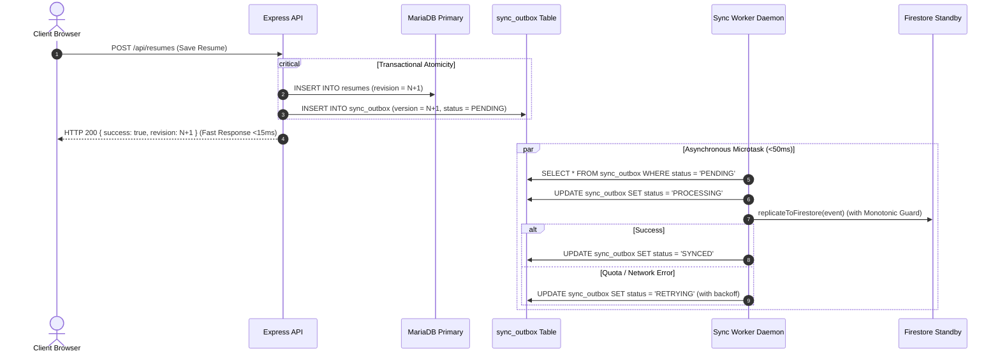

# ResumePilot AI — Final Bidirectional Synchronization Architecture

**Date**: August 26, 2026  
**Component**: Autonomous Synchronization Engine (`backend/database/syncManager.js`)  
**Architecture Pattern**: Transactional Outbox Pattern + Monotonic Versioning Protection  

---

## 1. Architectural Blueprint



---

## 2. Invariant Governance & Protocols

### Invariant 1: Monotonic Revision Protection
Replication to target documents checks whether the existing remote document revision exceeds the incoming event version:
```javascript
if (existingRevision > incomingVersion) {
    console.log(`[SyncWorker] Monotonic guard: Stale version ${incomingVersion} ignored (Firestore is at revision ${existingRevision})`);
    return; // Safely acknowledged without overwriting newer state
}
```
This guarantees that network race conditions or delayed retry batches never regress database state.

### Invariant 2: Intelligent Error Classification & Backoff
Errors encountered during replication are classified into categories:
1. **`QUOTA_EXHAUSTED`** (Code 8 / HTTP 429):
   - Increments retry counter without premature dead-lettering.
   - Worker enters `BACKOFF` mode for $5\text{s} \times 1.8^n + \text{jitter}$ (max 60s).
   - Breaks batch execution early to prevent retry storms.
2. **`TRANSIENT_UNAVAILABLE`** (Code 14 / HTTP 503 / Network):
   - Preserves events in `RETRYING` state.
   - Continues periodic retry cadence.
3. **`INVALID_DATA`** (Schema error / bad payload):
   - Retries up to 5 times before transitioning to `DEAD_LETTER`.

### Invariant 3: Stale Lease Recovery
Worker crashes mid-event leave rows in `PROCESSING`. At the start of every cycle:
```sql
UPDATE sync_outbox
SET status = 'RETRYING', last_error = 'reclaimed stale PROCESSING lease'
WHERE status = 'PROCESSING' AND updated_at < (NOW() - INTERVAL 120 SECOND);
```

---

## 3. Parity & Health Observability

The synchronization health status endpoint (`GET /api/admin/sync/health`) reports:
- `activeEngine`: `'mysql'`
- `standbyEngine`: `'firestore'`
- `overallParityPercentage`: `100%`
- `pendingCount`, `processingCount`, `retryingCount`, `deadLetterCount`
- Continuous parity computation across all canonical entities (`users`, `resumes`, `portfolios`, `covers`, `jobs`, `settings`).
