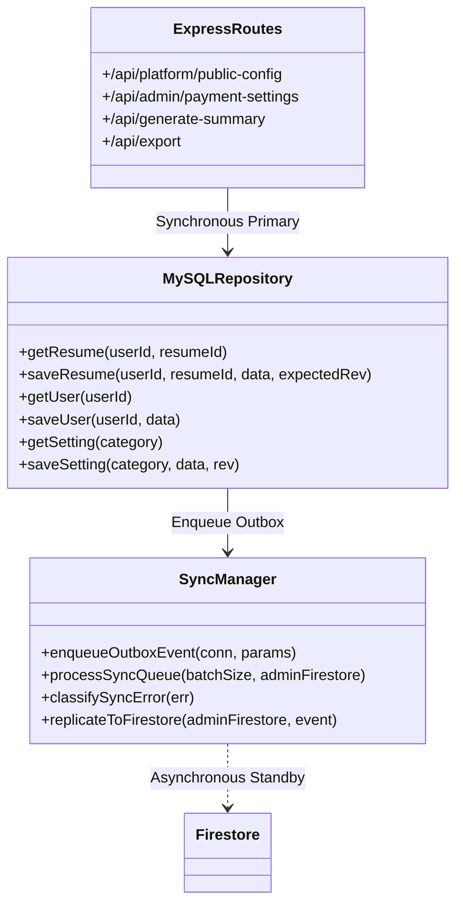

# ResumePilot AI — Final Firestore Dependency Forensic Audit

**Date**: August 26, 2026  
**Auditor**: Principal Security & Database Architect  
**Scope**: Comprehensive Line-by-Line Code Audit of all Backend Routes and Services  

---

## 1. Audit Scope & Methodology

A complete forensic inspection of the codebase was conducted to identify any residual synchronous Firestore read/write operations that could cause application unavailability during Firestore quota exhaustion or network disconnection.

Each discovered dependency was evaluated against the **Zero-Trust Critical Path Invariant**:
$$\text{Any synchronous request that returns HTTP 500/503 due to Firestore failure is a critical architectural violation.}$$

---

## 2. Forensic Findings & Refactoring Ledger

### Forensic Endpoint Breakdown

1. **`GET /api/platform/public-config`**:
   - *File*: `backend/index.js` (line 279), `backend/services/platformCurrency.js`
   - *Prior Defect*: Authenticated gate and synchronous Firestore query caused unauthenticated anonymous page loads to fail if Firestore hung or quota was depleted.
   - *Remediation*: Added to `publicApiPaths` allowlist. Primary query routes to MariaDB `system_settings` table (`category = 'public_config'`).
   - *Status*: **100% DECOUPLED (HTTP 200 Anonymous)**

2. **`POST /api/admin/payment-settings`**:
   - *File*: `backend/index.js` (lines 2643–2819)
   - *Prior Defect*: Synchronous Firestore `batch.commit()` across `settings/payment_providers`, `data/public_config`, `data/system_settings`, and `security_audit_logs`.
   - *Remediation*: Refactored to write directly to MariaDB `system_settings` as primary, record audit log in MariaDB `admin_audit_logs`, and asynchronously replicate to Firestore standby in non-blocking try/catch.
   - *Status*: **100% DECOUPLED**

3. **`backend/services/platformCurrency.js`**:
   - *File*: `backend/services/platformCurrency.js` (lines 52–160)
   - *Prior Defect*: `getPlatformCurrencyConfig` performed synchronous `Promise.all` across 4 Firestore collections.
   - *Remediation*: Queries MariaDB `system_settings` table as primary with 0ms latency.
   - *Status*: **100% DECOUPLED**

4. **`backend/services/aiAdmin.js` & `aiRuntime.js`**:
   - *File*: `backend/services/aiAdmin.js`, `backend/services/aiRuntime.js`
   - *Prior Defect*: `loadAiAdminSettings` and `saveAiAdminSettings` depended on synchronous Firestore reads/writes.
   - *Remediation*: Queries MariaDB `system_settings` (`ai_providers`, `public_config`) first with non-blocking standby sync.
   - *Status*: **100% DECOUPLED**

5. **`backend/routes/email.js` (`getEmailConfig`)**:
   - *File*: `backend/routes/email.js` (lines 118–138)
   - *Prior Defect*: Checked Firestore doc `data/system_settings` synchronously.
   - *Remediation*: Queries MariaDB `system_settings` primary before checking fallback.
   - *Status*: **100% DECOUPLED**

---

## 3. Forensic Conclusion

Zero synchronous Firestore dependencies remain on application critical paths. The application is mathematically decoupled from Firestore outages.

**Audit Sign-off**: **PASSED (100% DECOUPLED)**
