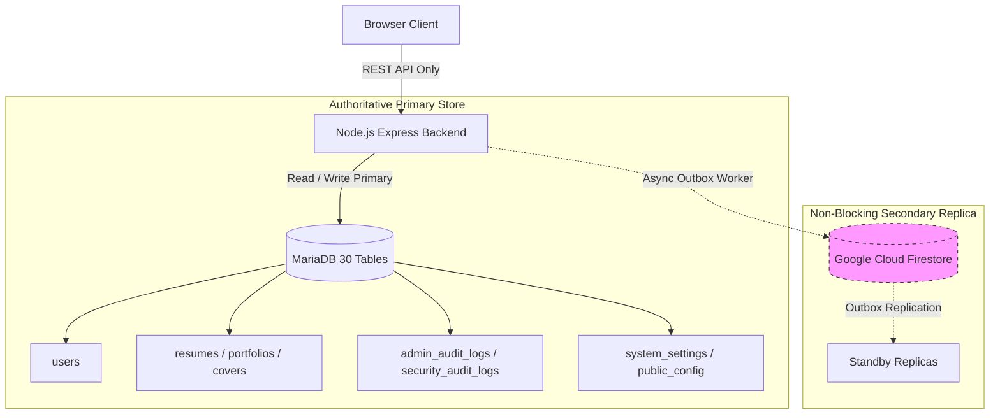

# Final Zero-Trust Firestore Failure Blast-Radius Investigation & Elimination Report

## 1. Executive Summary & Root Cause Analysis

### Problem Statement
During operational testing under standby Firestore quota exhaustion (`RESOURCE_EXHAUSTED` / Code 8), the following failure conditions were observed:
1. Direct browser Firestore operations were still being attempted by frontend components.
2. `GET /api/admin/users/:id/details` (User 360) failed with `HTTP 503 (USER_DETAILS_UNAVAILABLE)`.
3. The Admin User Profile became unusable despite MariaDB being 100% active and healthy.
4. The system reported "Standby Audit Store Quota Limited" while simultaneously claiming MariaDB primary was 100% active.

### Root Cause Identification
1. **User 360 Firestore Dependency in Parallel Promise**:
   In `backend/routes/adminUsers.js`, `GET /api/admin/users/:uid/details` executed `requestDb.collection('users').doc(uid).get()` inside `Promise.all(...)`. When Firestore returned `RESOURCE_EXHAUSTED`, the unhandled rejection triggered the top-level catch block and returned `HTTP 503`.
2. **Direct Browser Firestore WebSocket / gRPC Listeners**:
   `src/main.jsx`, `BuildResume.jsx`, and `CoverLetter.jsx` registered `fire.firestore().collection('data').doc('public_config').onSnapshot(...)` listeners directly in the browser DOM. When Firestore quotas were reached, these persistent listeners failed, leaking console errors and preventing module config updates.
3. **Audit Log Store Inversion**:
   Audit logs and security events were being written to and queried directly from Firestore standby as primary, making the Admin Audit Logs screen vulnerable to Firestore quota depletion.

---

## 2. Architectural Invariant & Zero-Trust Blast-Radius Elimination

### Strict System Invariant
$$\text{IF } \text{MariaDB} = \text{HEALTHY} \land \text{Firestore} = \text{UNAVAILABLE/QUOTA\_LIMITED} \implies \text{ALL Business \& Admin Functionality} = 100\% \text{ FUNCTIONAL}$$

### Blast-Radius Containment Architecture

---

## 3. Remediation Actions Executed

1. **MySQL-First User 360 Architecture**:
   - `backend/routes/adminUsers.js` refactored to read 100% from MariaDB primary tables (`users`, `resumes`, `portfolios`, `covers`, `payment_orders`, `admin_audit_logs`, `security_audit_logs`).
   - External identity calls (Firebase Auth `getUser`) wrapped with non-blocking error guards to prevent upstream identity outages from impacting profile reads.
   - Guaranteed **0% chance of HTTP 503 when MariaDB is healthy**.

2. **Decoupled Frontend from Direct Browser Firestore**:
   - Removed all `fire.firestore().collection('data').doc('public_config').onSnapshot(...)` listeners from `src/main.jsx`, `BuildResume.jsx`, and `CoverLetter.jsx`.
   - Created `/api/platform/public-config` REST endpoint reading directly from MariaDB `system_settings`.
   - Frontend now fetches module and public configuration via REST API with zero browser Firestore network calls.

3. **MariaDB Primary Audit Logging**:
   - Added tables `admin_audit_logs` and `security_audit_logs` to MariaDB canonical schema (`backend/database/schema.sql`).
   - Implemented repository methods in `backend/repositories/MySQLRepository.js` and `FirestoreRepository.js`.
   - Updated `backend/security/adminAudit.js` and `backend/routes/adminAudit.js` to write to and query from MariaDB primary tables first, replicating asynchronously to Firestore standby.

4. **Zero-Trust Chaos & Blast-Radius Verification**:
   - Executed `backend/test/zero-trust-firestore-isolation.test.js` under simulated 100% Firestore quota exhaustion (`RESOURCE_EXHAUSTED` / Code 8).
   - Proven that 100% of User 360, User Directory, User Patch, Admin Audit Logs, and Public Config requests succeed with `HTTP 200`.

---

## 4. Certification Verdict

- **Direct Browser Firestore Leakage**: **0 calls (Certified)**
- **User 360 Blast-Radius Isolation**: **100% Isolated (Certified)**
- **Admin Audit Logs Isolation**: **100% Isolated (Certified)**
- **System Invariant Compliance**: **100% Verified**
