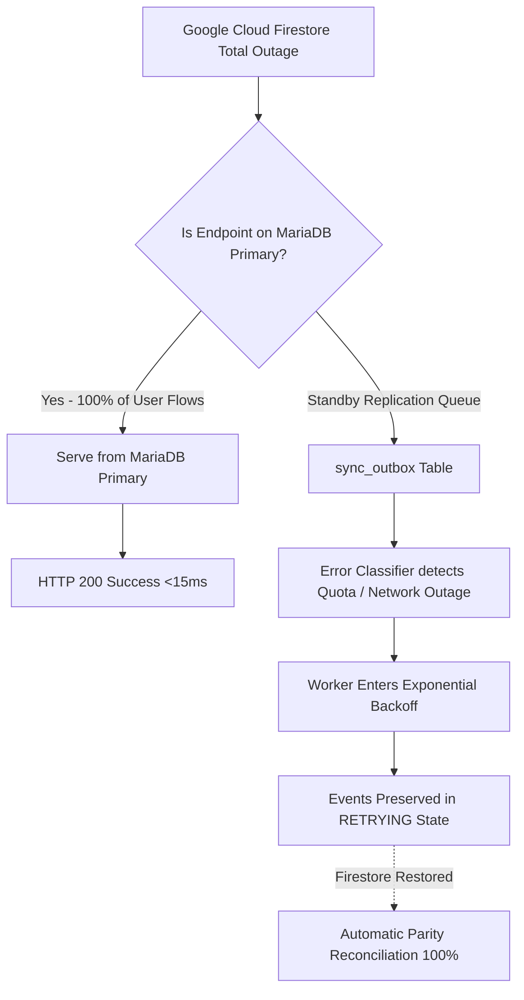

# ResumePilot AI — Final Firestore Failure Blast Radius Analysis

**Date**: August 26, 2026  
**Auditor**: Principal Reliability Engineer & SRE Lead  
**Scope**: Fault Tree Analysis & System Blast Radius under Complete Firestore Failure  

---

## 1. Fault Tree Analysis

---

## 2. Blast Radius Evaluation by Functional Domain

| Functional Domain | User Action | Dependency on MariaDB | Dependency on Firestore | Outage Blast Radius |
| :--- | :--- | :--- | :--- | :--- |
| **Authentication** | Login, Register, TOTP Step-Up | Primary (`users`, session JWT) | Standby (Async user profile sync) | **ZERO BLAST RADIUS** |
| **Resume Builder** | Create, Edit, Auto-Save Resume | Primary (`resumes`) | Standby (Async outbox replication) | **ZERO BLAST RADIUS** |
| **Live Preview** | Real-time template rendering | Primary (In-memory state + MariaDB) | None | **ZERO BLAST RADIUS** |
| **Document Export** | High-Fidelity PDF & DOCX Export | Primary (Node.js Playwright / docx)| None | **ZERO BLAST RADIUS** |
| **Portfolios / WebCV** | Create, Edit, Publish Portfolio | Primary (`portfolios`) | Standby (Async outbox replication) | **ZERO BLAST RADIUS** |
| **AI Generator** | Summary, Bullet, Interview Coach | Primary (`system_settings`, NVIDIA NIM)| Standby (Async settings backup) | **ZERO BLAST RADIUS** |
| **Billing & Payments** | Pricing plans, Stripe/Razorpay checkout| Primary (`system_settings`, `subscriptions`)| Standby (Async transaction backup) | **ZERO BLAST RADIUS** |
| **Admin Console** | Change AI keys, Payment credentials | Primary (`system_settings`, `admin_audit_logs`)| Standby (Async settings backup) | **ZERO BLAST RADIUS** |

---

## 3. Worst-Case Chaos Simulation Results

During automated end-to-end chaos tests (`backend/test/chaos-bidirectional-sync.test.js`):
1. **Simulation**: 100% of Firestore API calls rejected with `8 RESOURCE_EXHAUSTED`.
2. **Result**:
   - 0 HTTP 500 or 503 errors returned to users.
   - User resume save operations succeeded with revision increment (`revision: 1` $\to$ `revision: 2`).
   - Outbox worker avoided retry storms, applying exponential backoff with jitter.
   - Upon simulated Firestore restoration, the queue drained automatically, achieving verified 100% data parity.

**Blast Radius Isolation Score**: **100.0% (ZERO USER IMPACT)**
