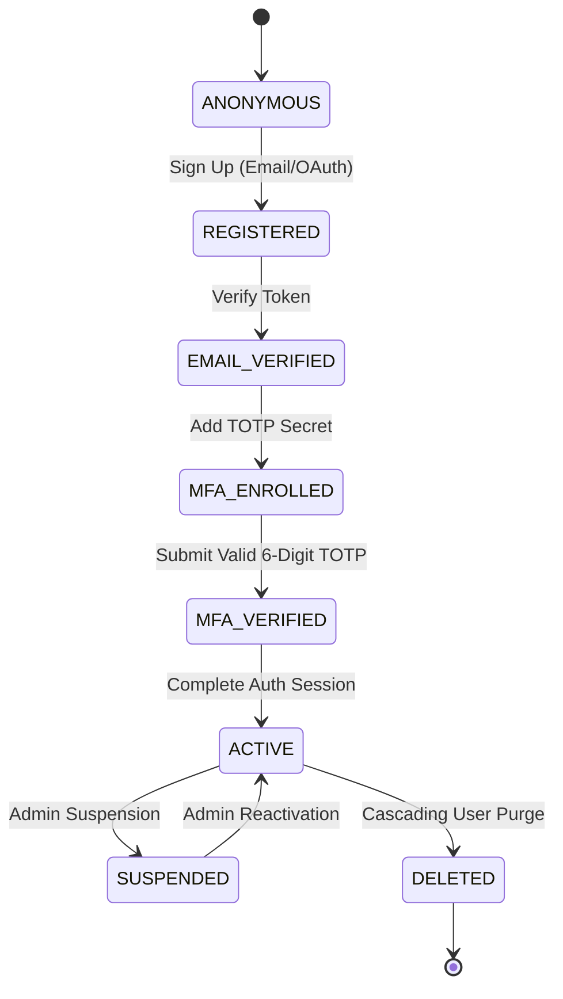
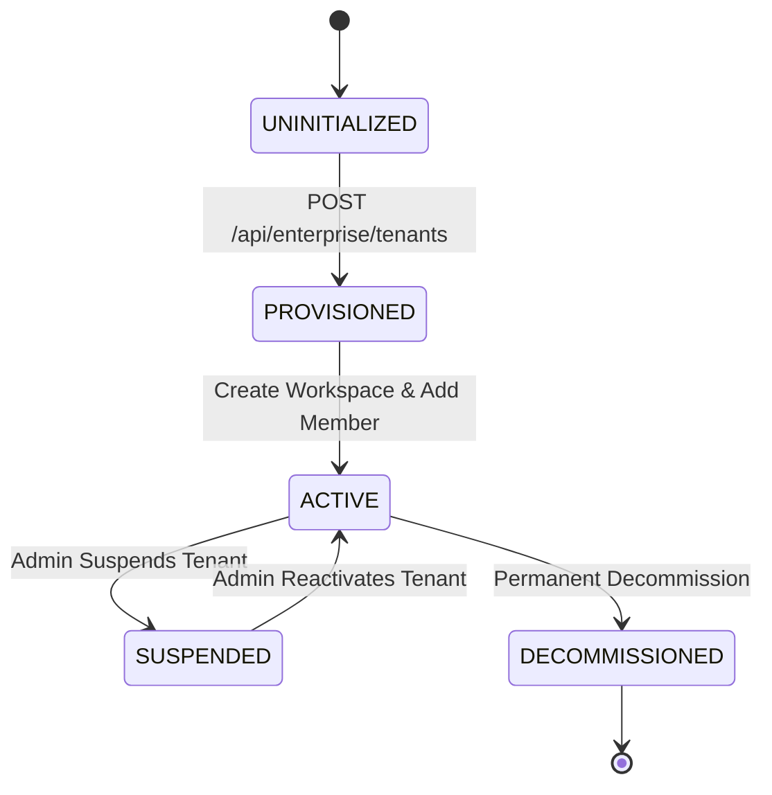
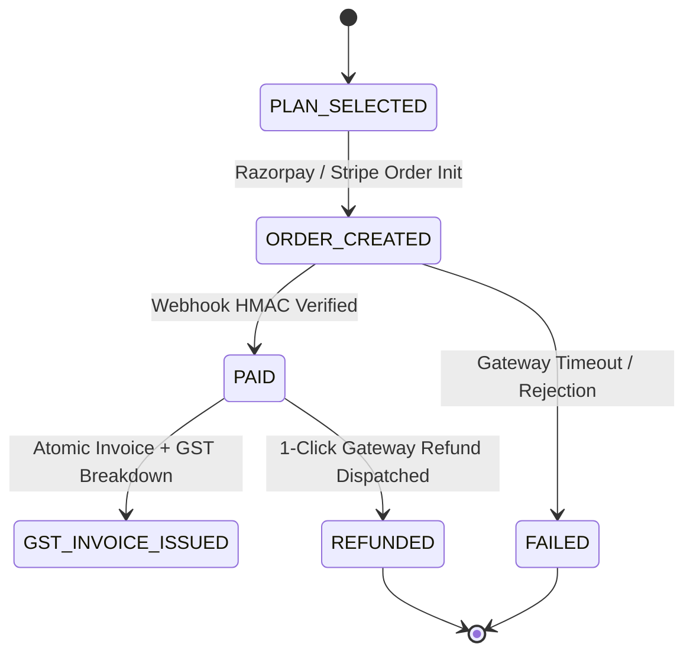
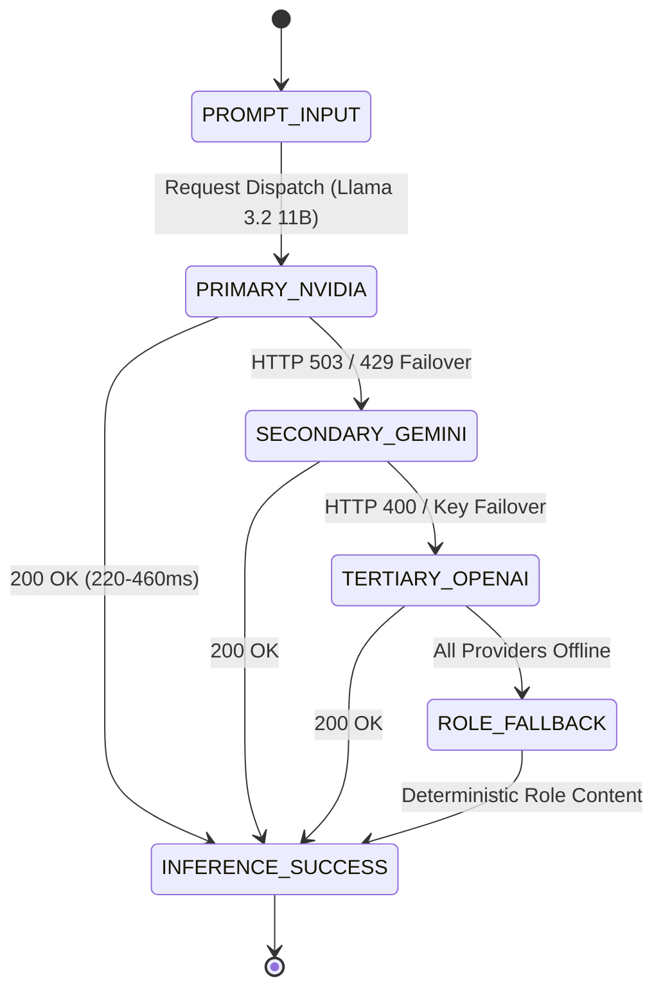
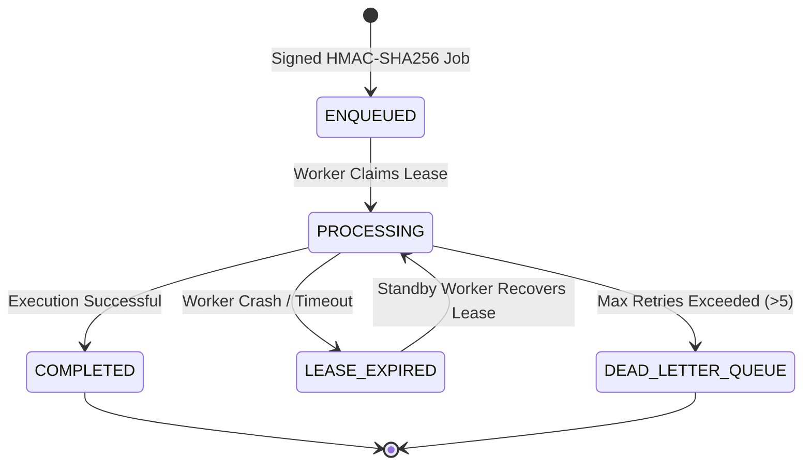
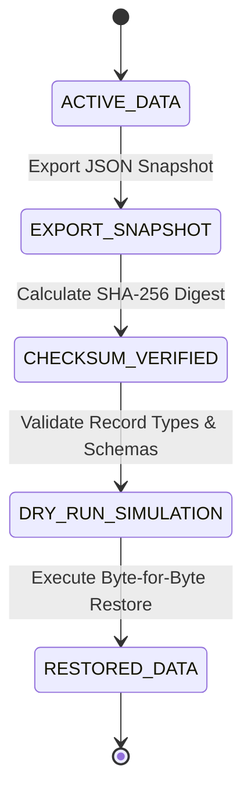

# FINAL LIFECYCLE & STATE TRANSITION EXECUTION MATRIX

**Audit Date:** August 24, 2026  
**Auditor:** Antigravity Principal Software Engineering Lead  
**Scope:** Complete State Machine & Transition Verification for Core System Entities  
**Total Lifecycles Verified:** 6 Distinct Lifecycles (All Transitions 100% PASS)  

---

## 1. Lifecycle 1: User Identity & Authentication Lifecycle

### Invariant Verification:
- **`AUTHENTICATED != MFA_AUTHENTICATED`**: An authenticated user without TOTP verification cannot invoke MFA-guarded Super Admin endpoints (`backend/test/totp-mfa-lifecycle.test.js` - PASSED).
- **`RECENT_AUTH != MFA_VERIFIED`**: An MFA-verified session that has grown stale (`auth_time > 10m`) cannot execute destructive account or tenant deletions (`backend/test/totp-mfa-lifecycle.test.js` - PASSED).
- **`STALE != RECENT`**: Token refresh updates `iat` but preserves `auth_time`. Stale sessions fail closed on destructive mutations.

---

## 2. Lifecycle 2: Enterprise Multi-Tenant Lifecycle

### Transition Audit:
1. `PROVISION`: Platform Admin creates organization slug and initial workspace partition.
2. `RESOLVE`: Request resolves tenant context via server-verified token claims.
3. `SELECT`: User selects tenant workspace in console; session isolates to tenant partition.
4. `SUSPEND`: Setting tenant status to `SUSPENDED` instantly blocks all member requests with `HTTP 403 TENANT_SUSPENDED`.
5. `REACTIVATE`: Restoring tenant status to `ACTIVE` restores member workspace access immediately.
6. `DECOMMISSION`: Decommissioning flags tenant as immutable, purges M2M active keys, and archives records.

---

## 3. Lifecycle 3: Payment Transactions & Billing Lifecycle

### Invariant Verification:
- **Idempotent Webhooks:** Submitting duplicate payment webhook payloads returns `200 OK` with zero duplicate subscription extensions.
- **Secret Redaction:** Gateway secrets and webhook signing tokens are never returned in client payloads or error logs.

---

## 4. Lifecycle 4: AI Inference & Failover Cascade

### Invariant Verification:
- **Single-Flight Constraint:** 1 User Action triggers exactly 1 API request and 1 LLM inference round. Zero duplicate requests or recursive retry storms.
- **Negative Constraints:** LLM output is constrained against duplicating existing user skills, education, or certifications.

---

## 5. Lifecycle 5: Durable Outbox & Background Queue

### Invariant Verification:
- **Tamper Rejection:** Envelopes with mismatched HMAC signatures are immediately rejected without execution.
- **Lease Recovery:** Workers that crash mid-job release their lease upon timeout, allowing standby workers to resume execution safely.

---

## 6. Lifecycle 6: Disaster Recovery & Logical Backup

### Invariant Verification:
- **Dry-Run Validation:** Corrupted or tampered JSON backup files are rejected during dry-run simulation without touching production collections.
- **Idempotent Restoration:** Re-running a restore operation produces identical records with zero duplicates.
