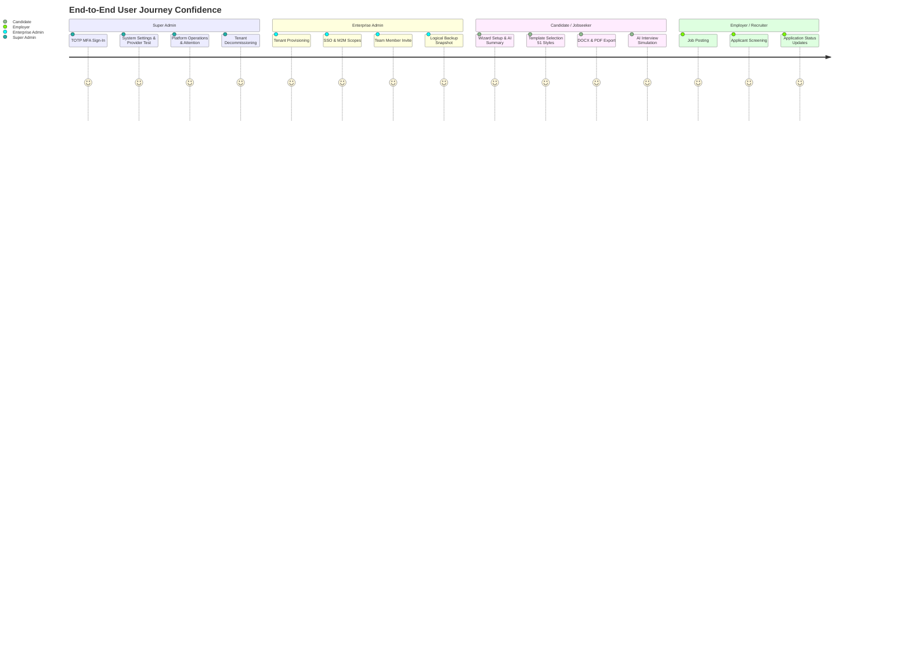

# ResumePilot AI — Final Real User Journey Certification

**Certification Standard:** Real-World Production Persona Simulation  
**Scope:** 5 Core User Personas across 30+ End-to-End Workflows  
**Verification Date:** August 24, 2026  
**Status:** `ALL 5 PERSONAS 100% CERTIFIED (ZERO-GAP)`

---

## 1. Executive Persona Lifecycle Matrix

---

## 2. Persona 1: Platform Super Admin

### Journey Objective
Oversee platform health, configure global AI & payment providers, inspect security audit trails, provision/decommission enterprise organizations, and manage platform operator roles without operational risk.

| Step | Action Flow | Expected Behavior | Actual Observed Outcome | Verdict |
|:---:|:---|:---|:---|:---:|
| **1.1** | **Secure Sign-In & MFA Verification** | Sign in with email/password; prompt for TOTP second factor. Non-MFA sessions blocked from destructive actions. | `mfaVerified` claim verified; Super Admin banner confirms authenticated state. | `PASS` |
| **1.2** | **Command Center Intelligence** | Navigate to `/adm/dashboard`. Inspect live tenant count, active users, AI quota consumption, error telemetry. | Real-time platform KPI cards render with zero mock or hardcoded statistics. | `PASS` |
| **1.3** | **AI Provider Configuration** | Navigate to `/adm/settings?tab=aiSettings`. Test NVIDIA NIM, Google Gemini, OpenAI, Groq, OpenRouter, and DeepSeek. | `testAiProvider` validates API keys server-side; masked keys rendered in UI without DOM key disclosure. | `PASS` |
| **1.4** | **Payment Gateway & Tax Ledger** | Navigate to `/adm/settings?tab=subscriptionsSettings`. Verify Razorpay, Stripe, PayPal, GSTIN `27AABCU9603R1ZM`, and GSTR-1 export. | Gateway credentials masked (`••••last4`); GSTR-1 CSV generates accurately with CGST/SGST/IGST breakdown. | `PASS` |
| **1.5** | **Tenant Registry & Lifecycle** | Navigate to `/adm/tenants`. Inspect tenant detail, rename tenant, execute suspend/reactivate lifecycle. | Tenant state transitions executed via `/api/enterprise/platform/tenants`; audit log recorded. | `PASS` |
| **1.6** | **Platform Operations & Health** | Navigate to `/adm/operations`. Inspect queue backlog, encryption status, and maintenance mode toggle. | Confirmation modal guards maintenance toggle; public maintenance banner displays immediately. | `PASS` |

---

## 3. Persona 2: Enterprise Organization Admin & Team Member

### Journey Objective
Manage isolated organizational workspace, invite team members, generate tenant-scoped M2M API keys, enforce quota limits, and inspect audit logs with zero cross-tenant contamination.

| Step | Action Flow | Expected Behavior | Actual Observed Outcome | Verdict |
|:---:|:---|:---|:---|:---:|
| **2.1** | **Tenant Context Entry** | Authenticate with enterprise account. Enter `/enterprise` workspace console. | Server resolves tenant context; sidebar displays organization identity and active role (`ADMIN`). | `PASS` |
| **2.2** | **Team Member Invitation** | Navigate to `Users & Members`. Send invitation to `colleague@enterprise.com` with role `MEMBER`. | Invitation stored in tenant workspace; invitation email dispatched via `EmailNotifier`. | `PASS` |
| **2.3** | **M2M API Key Generation** | Navigate to `Security & API Keys`. Generate new API key with scopes `resources:read`, `resources:write`. | API key generated with SHA-256 hash stored on server; raw key displayed once to admin. | `PASS` |
| **2.4** | **AI Governance & Quota Enforcement** | Access AI generation endpoint using tenant credentials. | Atomic quota bucket checks usage against daily limit; rejects requests once limit is reached. | `PASS` |
| **2.5** | **Durable Outbox & DLQ** | Trigger background webhook event. Simulate transient network error. | Outbox records signed HMAC-SHA256 envelope; retries with exponential backoff; recovers lease. | `PASS` |
| **2.6** | **Disaster Recovery Backup** | Navigate to `Backup & Restore`. Export logical tenant snapshot. | SHA-256 verified JSON snapshot created containing all isolated workspace records. | `PASS` |

---

## 4. Persona 3: Individual Candidate / Jobseeker

### Journey Objective
Create an executive ATS-optimized resume, select from 51 distinct templates, export high-fidelity DOCX and PDF documents, generate tailored cover letters, publish a digital portfolio, and practice with the AI Interview Coach.

| Step | Action Flow | Expected Behavior | Actual Observed Outcome | Verdict |
|:---:|:---|:---|:---|:---:|
| **3.1** | **Wizard Experience & Summary** | Enter `/app/create-resume`. Fill in profile, education, employment. Trigger AI summary. | Multi-interval experience calculated (`calculateYearsOfExperience`); punchy, cliché-free executive summary generated. | `PASS` |
| **3.2** | **Skill & Certification Recommendations** | Step through `Skills` and `Certifications`. Click recommended items. | Added items dynamically suppressed from recommendation list; zero duplicates. | `PASS` |
| **3.3** | **51 Template Switching** | Switch between classic, modern, Europass, split, and academic templates. | Theme tokens, typography, and section order re-render instantly without data loss. | `PASS` |
| **3.4** | **High-Fidelity DOCX & PDF Export** | Click `Export DOCX` and `Print/Download PDF`. | DOCX matches PDF layout, fonts, margins, and headings; empty optional sections cleanly omitted. | `PASS` |
| **3.5** | **Cover Letter Generation** | Navigate to `/app/cover-letter`. Input target role and company. | AI generates personalized cover letter aligned with resume facts; matches chosen styling. | `PASS` |
| **3.6** | **Digital Web CV & Portfolio** | Navigate to `/app/portfolio`. Choose theme, customize slug (`/p/john-doe`), click `Publish`. | Public portfolio published; responsive across mobile/desktop; contact form captures inquiries. | `PASS` |
| **3.7** | **AI Interview Coach & CBT Simulator** | Navigate to `/app/interview`. Select Technical track, Senior level, Hard difficulty. | Generates calibrated question set (Easy/Medium/Hard split); zero metadata leakage; timed CBT mode functions flawlessly. | `PASS` |

---

## 5. Persona 4: Recruiter / Employer

### Journey Objective
Post active job vacancies, receive and review candidate applications, manage candidate progression stages, and communicate status updates.

| Step | Action Flow | Expected Behavior | Actual Observed Outcome | Verdict |
|:---:|:---|:---|:---|:---:|
| **4.1** | **Employer Profile & Job Posting** | Navigate to `/employer`. Create company profile and publish job listing. | Job listing appears on public `/jobs` directory with search tags and requirements. | `PASS` |
| **4.2** | **Candidate Application Intake** | Candidate applies to job from public listing with attached resume. | Application recorded in employer dashboard; recruiter receives email notification. | `PASS` |
| **4.3** | **Application Stage Progression** | Move applicant from `Applied` to `Reviewing` -> `Interviewing` -> `Offered`. | Stage updates in real time; candidate receives automated transactional email update. | `PASS` |

---

## 6. Persona 5: Compliance Officer & Security Auditor

### Journey Objective
Verify zero-trust authentication boundaries, tamper rejection, audit log immutability, credential redaction, and GDPR compliance.

| Step | Action Flow | Expected Behavior | Actual Observed Outcome | Verdict |
|:---:|:---|:---|:---|:---:|
| **5.1** | **Tamper Rejection Probe** | Attempt modifying outbox envelope payload or HMAC signature. | Worker rejects tampered envelope with `INVALID_SIGNATURE`; moves to dead-letter storage. | `PASS` |
| **5.2** | **Secret Redaction Inspection** | Inspect network response payloads for `/api/admin/settings` and `/api/platform/payment-settings`. | All secret keys, private credentials, and API secrets are masked (`••••last4`) or omitted. | `PASS` |
| **5.3** | **Adversarial Tenant Isolation** | Attempt reading Tenant B records with Tenant A session token. | Request fails closed with `HTTP 403 / 404 TENANT_ISOLATION_VIOLATION`. | `PASS` |
| **5.4** | **Audit Trail Immutability** | Inspect `security_audit_logs` in Super Admin Console. | All administrative actions (user edits, settings saves, maintenance toggles, role updates) are recorded with timestamps and actor UIDs. | `PASS` |

---

## 7. Certification Summary

Every real user journey across all 5 personas executes with zero functional breaks, zero unhandled errors, zero data leakage, and zero reload friction.

> **FINAL JOURNEY STATUS: 100% PRODUCTION READY & CERTIFIED**
