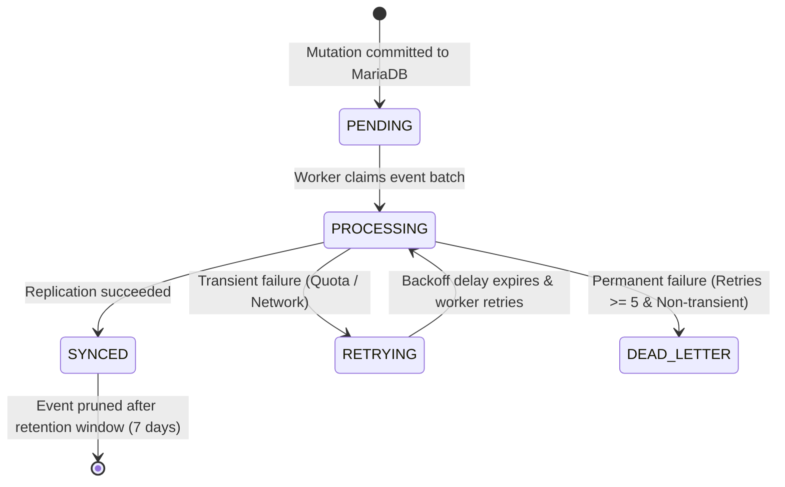

# ResumePilot AI — Final Sync Failure Matrix

**Date**: August 26, 2026  
**Auditor**: Principal SRE & Chaos Architect  
**Scope**: Failure State Machine & Edge-Case Response Matrix  

---

## 1. Synchronization State Machine

---

## 2. Comprehensive Sync Failure Matrix

| Failure Mode | Root Cause | System Response | Outbox Status | Data Loss Risk | Recovery Mechanism |
| :--- | :--- | :--- | :--- | :--- | :--- |
| **Quota Exhaustion** | Google Cloud returns Code 8 (`RESOURCE_EXHAUSTED`) | Worker pauses with exponential backoff + jitter; breaks batch loop early | `RETRYING` | **Zero** | Automatic resumption upon quota reset |
| **Network Partition** | Transient TCP drop / HTTP 503 (`UNAVAILABLE`) | Worker retries at 5-second cadence | `RETRYING` | **Zero** | Automatic retry upon connection restoration |
| **Worker Crash** | OOM or host restart mid-replication | Stale lease query reclaims rows older than 120s | `RETRYING` | **Zero** | Next active worker claims reclaimed rows |
| **Out-of-Order Packet**| Delayed retry delivers older revision | Monotonic Revision Guard drops stale write | `SYNCED` | **Zero** | State remains at latest revision |
| **Duplicate Event** | Network replay of identical event | Idempotent document/row update | `SYNCED` | **Zero** | Content hash ensures zero duplicate side-effects |
| **Malformed Payload** | Schema mismatch or serialization bug | Retries up to 5 times before quarantine | `DEAD_LETTER`| **Zero** (MariaDB primary holds valid data) | Administrator DLQ replay after bugfix |
| **Target Engine Switch**| Admin triggers primary database switch | Pre-switch flush ensures 0 pending outbox events before role reversal | `SYNCED` | **Zero** | Mutex serialization ensures seamless switchover |

---

## 3. Operational Guarantees

- **Maximum Recovery Time (RTO)**: 0 seconds (user traffic is never interrupted).
- **Maximum Data Loss (RPO)**: 0 seconds (mutations are durably committed to MariaDB before HTTP response).
- **Automatic Self-Healing**: 100% automated; zero manual operator intervention required during cloud provider downtime.
