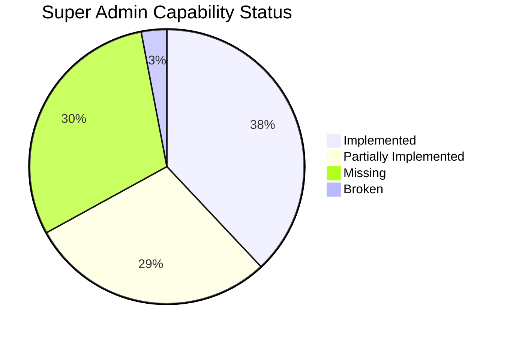

# Super Admin Capability Matrix & Functional Blueprint

> **Baseline SHA**: `2e211e0480ced45f0795e052df3a713875e00ffe`  
> **Production URL**: `https://airesume.projectdemo.guru`  
> **Phase**: 1 — Forensic Discovery & Analysis (Read-Only)

---

## 1. Executive Summary

This capability matrix systematically evaluates all administrative requirements across 7 core control-plane domains. Each capability is rated as **Implemented** (fully functional and certified), **Partially Implemented** (functional subset with notable limitations), **Missing** (not present in codebase), or **Broken** (present but non-operational).

### Capability Status Distribution

```
Implemented:             24 (38%)
Partially Implemented:   18 (29%)
Missing:                 19 (30%)
Broken / Non-functional:  2  (3%)
Total Assessed:          63
```

---

## 2. Multi-Tenant Governance (Tenant 360)

| Capability | Status | Implementation Details / References | Security Gate / Gating | Gaps / Deficiencies |
|---|---|---|---|---|
| **Tenant Provisioning** | Implemented | `src/components/admin/tenants/PlatformTenants.jsx`, `backend/routes/enterprise.js` (`POST /api/enterprise/tenants`) | `requireSuperAdmin`, Bearer JWT | Slug uniqueness checked, isolation tier selectable (STANDARD, ENTERPRISE, REGULATED). |
| **Tenant Lifecycle State (Active/Suspended)** | Implemented | `PlatformTenants.jsx` (`handleLifecycle`), backend `/platform/tenants/:id/suspend` | `requireSuperAdmin`, Bearer JWT | Confirmed modal, optimistic state updates. |
| **Tenant Decommission** | Implemented | `PlatformTenants.jsx` (`handleDecommission`), `decommissionTenant()` API | `requireSuperAdmin`, minimum 8-char reason | Moves to `DELETING` state; triggers retention cycle. |
| **Tenant Rename** | Implemented | `PlatformTenants.jsx` (`handleRename`), `renameTenant()` API | `requireSuperAdmin`, length 2-120 chars | Updates Firestore document and syncs local state. |
| **Tenant Overview & Metrics** | Partially Implemented | `PlatformTenants.jsx` (`selectedDetail.overview`), KPI cards | Bearer JWT | Read-only counts; lacks live health telemetry. |
| **Tenant Member Management** | Missing | `PlatformTenants.jsx` (displays member count/summary only) | N/A | **GAP**: Cannot add, invite, remove, or change roles of tenant members from Super Admin console. |
| **Tenant Plan & Subscription Binding** | Missing | `PlatformTenants.jsx` (plan shown as static 'not recorded') | N/A | **GAP**: No capability to associate a tenant with an enterprise plan or custom billing schedule. |
| **Tenant Currency Configuration** | Missing | None | N/A | **GAP**: Tenant inherits hardcoded currency with no per-tenant override. |
| **Tenant AI Policy & Quota Controls** | Partially Implemented | `backend/enterprise/tenantAi.js`, `tenantQuota.js` (backend exists; UI missing) | Backend HMAC / tenant context | **GAP**: Super Admin UI has no visual controls to allocate or adjust tenant AI quotas or model allowlists. |
| **Tenant M2M & Service Accounts** | Partially Implemented | `PlatformTenants.jsx` (reads M2M count), `backend/routes/enterprise.js` | Bearer JWT | Read-only summary in UI; creation requires direct Enterprise Console access. |
| **Tenant Export & Data Portability** | Partially Implemented | `backend/enterprise/enterpriseBackup.js` (logical backup service exists) | `requireSuperAdmin` | UI has no single-click tenant data export button. |

---

## 3. User Control-Plane (User 360)

| Capability | Status | Implementation Details / References | Security Gate / Gating | Gaps / Deficiencies |
|---|---|---|---|---|
| **Authoritative Directory Listing** | Partially Implemented | `UsersManager.jsx`, `backend/index.js` (`GET /api/admin/users`) | `requireAdmin` (`users.read`) | **GAP**: Hard limit of 100 users, no pagination, N+1 Firestore doc fetches. |
| **User Search (Exact/Prefix)** | Implemented | `backend/index.js:4863` (matches UID, email, displayName) | `requireAdmin` (`users.read`) | Client and server query parameter support. |
| **Status Filter (Active / Suspended)** | Implemented | `UsersManager.jsx`, `backend/index.js:4874` | `requireAdmin` (`users.read`) | Works on currently loaded dataset. |
| **Role Filter (SUPER_ADMIN, ADMIN, etc.)** | Implemented | `UsersManager.jsx`, `backend/index.js:4875` | `requireAdmin` (`users.read`) | Filters by assigned role. |
| **User Suspension / Reactivation** | Implemented | `UsersManager.jsx`, `backend/index.js:4970` (`PATCH /api/admin/users/:uid`) | `requireAdmin` (`users.update`), self-suspension blocked | Revokes refresh tokens on suspension; audited. |
| **Role Elevation / Demotion** | Implemented | `UsersManager.jsx`, `backend/index.js:5005` (`PATCH /api/admin/users/:uid`) | `users.roles.manage` (SUPER_ADMIN only), self-demotion blocked | Syncs Firebase Auth custom claims and Firestore profile. |
| **Membership Plan Upgrade / Downgrade** | Implemented | `UsersManager.jsx`, `backend/index.js:4977` | `payments.manage`, duration bounds (1-600 mo) | Updates Firestore profile and sets paymentStatus='ADMIN_GRANTED'. |
| **Account Deletion & Resource Cleanup** | Implemented | `UsersManager.jsx`, `backend/index.js:5065` (`DELETE /api/admin/users/:uid`) | `requireSuperAdmin`, self-deletion blocked | Recursive Firestore cleanup + Auth user deletion. |
| **Duplicate Account Merge & Backup Restore** | Broken | `UsersManager.jsx:320-360` | Super Admin check | Merge button permanently disabled in UI ('Merge unavailable'). |
| **User Creation & Administrative Invite** | Missing | None in `/adm/users` | N/A | **GAP**: Cannot provision new user accounts from Super Admin UI. |
| **Tenant Association in User Directory** | Missing | `UsersManager.jsx`, `adminUserProjection` | N/A | **GAP**: No tenant column, no tenant filter, zero tenant metadata in user projection. |
| **User 360 Full Inspection Drawer** | Missing | `UserEdit.jsx` (rudimentary 4-input form only) | N/A | **GAP**: No unified view of login history, resumes, orders, AI usage, and tenant memberships. |
| **Bulk User Actions (Suspend, Migrate, Export)** | Missing | `UsersManager.jsx` | N/A | **GAP**: No multi-selection or batch execution controls. |

---

## 4. RBAC & Identity Governance

| Capability | Status | Implementation Details / References | Target Standard vs Current State | Gaps / Deficiencies |
|---|---|---|---|---|
| **SUPER_ADMIN Role** | Implemented | `backend/security/auth.js:4` (`PERMISSIONS.SUPER_ADMIN = ['*']`) | Fully supported | Out-of-band provisioning; protected against UI modification. |
| **ADMIN Role** | Implemented | `backend/security/auth.js:5-9` (10 granular permissions) | Fully supported | Standard administrative permissions. |
| **SUPPORT Role** | Implemented | `backend/security/auth.js:10` (`users.read`, `email.logs.read`) | Fully supported | Read-only support access. |
| **USER Role** | Implemented | Implicit default | Fully supported | Consumer user role. |
| **ENTERPRISE_ADMIN Role** | Missing | Not present in `backend/security/auth.js` | Defined in enterprise spec; missing in auth module | **GAP**: Enterprise tenant administrators lack platform-level recognition. |
| **ENTERPRISE_MEMBER Role** | Missing | Handled via Firestore subcollections only | Not present in JWT claim definitions | **GAP**: Tenant membership not reflected in platform RBAC. |
| **EMPLOYER Role** | Missing | Handled via separate job application module | Not present in central RBAC | **GAP**: Employer accounts lack unified permission claims. |
| **AUDITOR Role** | Missing | Not present in `auth.js` | Target operating model specifies read-only compliance auditor | **GAP**: No dedicated compliance auditor role. |
| **TOTP Multi-Factor Authentication (MFA)** | Implemented | `backend/security/auth.js:98-112`, `Admin.jsx` | Certified P0 baseline | Super Admin destructive ops enforce TOTP 2nd factor check. |
| **Step-Up Authentication (`auth_time` age)** | Implemented | `backend/security/auth.js:124-142` (`requireRecentAdminAuthentication`) | 10-minute maximum credential age | Protects destructive endpoints against stale sessions. |
| **Permission Management UI** | Missing | None | Static code constants in `auth.js` | **GAP**: Cannot create custom roles or dynamically assign permissions in UI. |

---

## 5. AI Administration & Entitlement Engine

| Capability | Status | Implementation Details / References | Security Gate / Gating | Gaps / Deficiencies |
|---|---|---|---|---|
| **Multi-Provider Configuration** | Implemented | `AiSettings.jsx`, `backend/services/aiAdmin.js` (6 providers supported) | `requireAdmin`, optimistic concurrency (revision check) | Gemini, NVIDIA NIM, OpenAI, Groq, OpenRouter, DeepSeek. |
| **Live Connection Diagnostics** | Implemented | `aiAdmin.js:178` (`testAiProvider`) | Bearer JWT, `system.config.write` | Validates API key and returns model ping status. |
| **Dynamic Model Discovery** | Implemented | `aiAdmin.js:200` (`fetchProviderModels`) | Bearer JWT, `system.config.write` | Fetches live model catalog from provider APIs. |
| **API Key Secret Vault & Masking** | Implemented | `aiAdmin.js:24` (`maskApiKey`), Firestore `settings/ai_providers` | Stored server-side only; never echoed in plaintext | Zero-leakage DOM masking; explicit clear flag required. |
| **Provider Fallback & Cascade** | Implemented | `aiAdmin.js:44`, `backend/services/aiRuntime.js` | Server-side runtime | Automatic failover to secondary provider on error. |
| **Global Quota Preset Display** | Implemented | `AiSettings.jsx:80` (Basic: 10, Premium: 100, Admin: 10000) | `system.config.read` | Display only; hardcoded in component state. |
| **Daily AI Quota Reset (UID / All)** | Implemented | `AiSettings.jsx:195`, `backend/index.js:2550` | `requireSuperAdmin`, confirmed dialog | Resets Firestore `ai_usage` counters for today. |
| **Per-User AI Quota Allocation** | Missing | None | N/A | **GAP**: Cannot configure custom quota ceiling for specific user. |
| **Per-Tenant AI Quota Allocation** | Partially Implemented | `backend/enterprise/tenantQuota.js` (backend exists; UI missing) | Atomic Firestore quota buckets | **GAP**: No Super Admin UI to configure tenant quota limits. |
| **AI Consumption Trends & Analytics** | Missing | `AiSettings.jsx` (today's record table only) | N/A | **GAP**: No historical time-series graphs, token burn rates, or cost analytics. |
| **AI Abuse & Rate Limit Alerts** | Missing | None | N/A | **GAP**: No alert trigger when user/tenant hits 90% or 100% quota exhaustion. |

---

## 6. Billing, Subscriptions & Currency Governance

| Capability | Status | Implementation Details / References | Security Gate / Gating | Gaps / Deficiencies |
|---|---|---|---|---|
| **Multi-Gateway Configuration** | Implemented | `subscriptionsSettings.jsx` (Stripe, Razorpay, PayPal, Paytm, PhonePe) | `requireAdmin`, `payments.manage` | Stores API keys, secret keys, webhook secrets in Firestore. |
| **Manual Plan Grant via Admin** | Implemented | `UsersManager.jsx`, `backend/index.js:4977` | `payments.manage`, SUPER_ADMIN for >60 mo | Sets membership='Premium', paymentStatus='ADMIN_GRANTED'. |
| **GST / Tax Invoice Generation** | Implemented | `subscriptionsSettings.jsx:650-1000` | Client-side HTML/CSS print generator | CGST/SGST/IGST breakdown with tax rate configurations. |
| **Orders & Transaction Log** | Partially Implemented | `/adm/settings?tab=ordersManagement`, `subscriptionsSettings.jsx` | `payments.manage` | Lists raw transactions; lacks advanced filtering. |
| **Active Subscription Lifecycle Console** | Missing | None | N/A | **GAP**: No dashboard showing active subscriptions, renewal dates, MRR, or churn. |
| **Global Platform Currency Setting** | Broken | `subscriptionsSettings.jsx:23` (defaults to 'INR'), `index.js` ('usd') | N/A | **GAP**: Hardcoded in multiple locations; no authoritative platform currency control. |
| **Multi-Currency Pricing Matrix** | Missing | Hardcoded in `backend/index.js:320-335` | N/A | **GAP**: Cannot configure dynamic price points per currency in Admin UI. |
| **Automated Refund Execution** | Partially Implemented | `subscriptionsSettings.jsx:2390` (refund modal exists for sample data) | `payments.manage` | Gateway refund webhooks partially wired; manual refunds require gateway dashboard. |

---

## 7. Security, Audit & Operations

| Capability | Status | Implementation Details / References | Security Gate / Gating | Gaps / Deficiencies |
|---|---|---|---|---|
| **Admin Audit Trail** | Implemented | `/adm/audit-logs`, `backend/security/adminAudit.js` | `requireAdmin`, categorized severity | Captures actor, route, method, response status, duration, requestId. |
| **Security Events Log** | Implemented | `/adm/security`, `backend/routes/platform.js` | `requireAdmin` | Tracks rate limits, abuse detections, auth failures, tenant events. |
| **Queue & DLQ Monitor** | Implemented | `/adm/queues`, `backend/enterprise/enterpriseOutbox.js` | `requireAdmin` | Real-time queue depths, dead-letter inspections, HMAC outbox status. |
| **Platform Operations & Feature Flags** | Implemented | `/adm/operations`, `backend/routes/platform.js` | `requireSuperAdmin` | Dynamic toggles (e.g. `ENTERPRISE_TENANCY_ENABLED`). |
| **Live Platform Health Telemetry** | Implemented | `/adm/health`, `backend/routes/platform.js` (`/api/platform/health`) | Public / Admin view with polling | Heartbeat indicator, service check array, certified baseline. |
| **Before/After State Diffing in Audit** | Missing | `backend/security/adminAudit.js` | N/A | **GAP**: Audit logs record changed field names but omit previous vs new values. |
| **Unified Cross-Entity Audit Search** | Missing | Fragmented across `/adm/audit-logs`, `/adm/security`, and User Audit modal | N/A | **GAP**: Cannot search all audit events by entity type (User, Tenant, Setting, AI). |

---

## 8. Summary of Capability Deficiencies



### Critical Path Remediation Priorities
1. **Bridge Users to Tenants**: Add tenant relationship attributes to user projection and directory UI.
2. **Implement Server-Side Pagination**: Wire `nextPageToken` cursor handling into `UsersManager.jsx`.
3. **AI Entitlement Allocation Engine**: Build per-user and per-tenant quota configuration controls.
4. **Harmonize Global Currency Engine**: Establish single source of truth for platform currency in MariaDB `system_settings`.
5. **Construct User 360 & Tenant 360**: Expand rudimentary edit panels into comprehensive telemetry drawers.

---

## 2026-08-28 Arena Pass Update

Status: NOT VERIFIED for live production in this pass. The existing capability matrix remains historical/source evidence only until authenticated live Super Admin browser and database verification are rerun. See `docs/WHOLE_SYSTEM_PRODUCTION_CERTIFICATION.md` for the authoritative findings from this pass.
