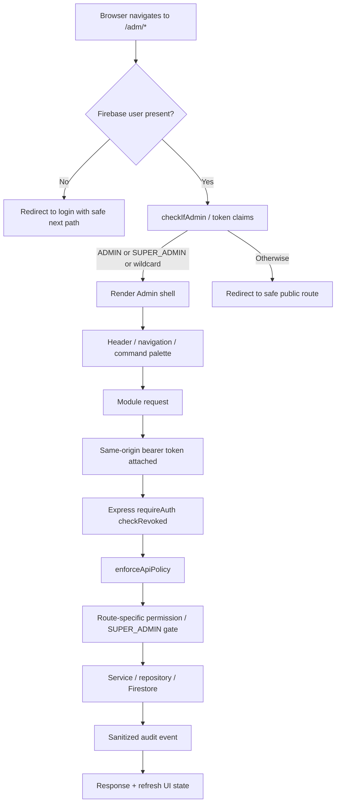
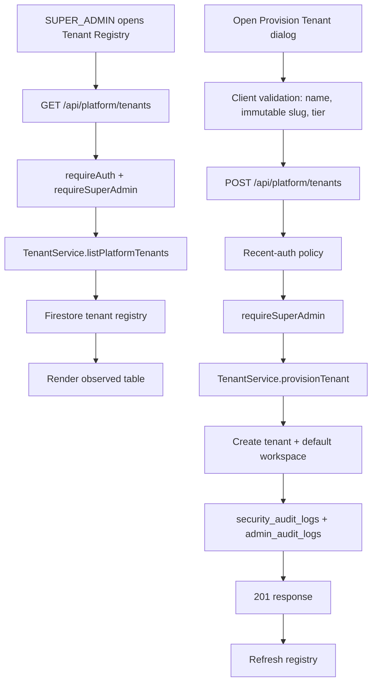
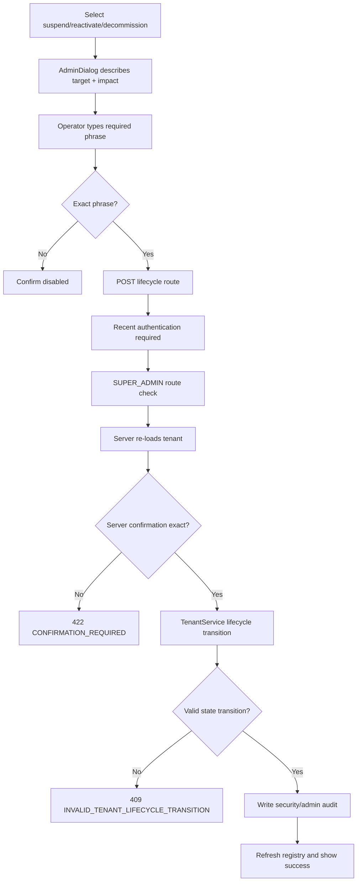
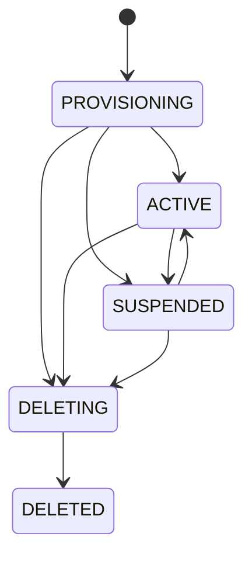
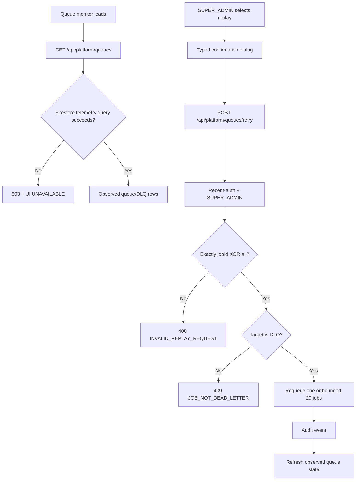
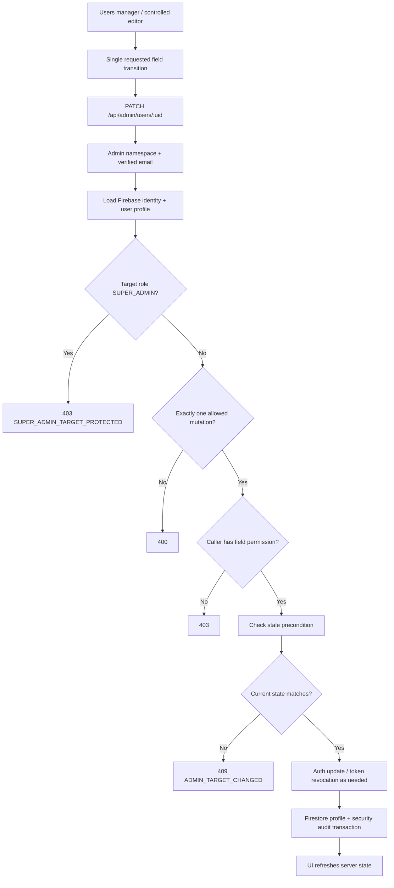
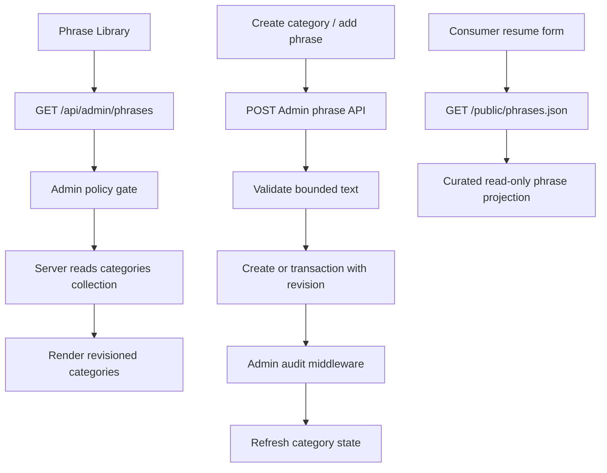
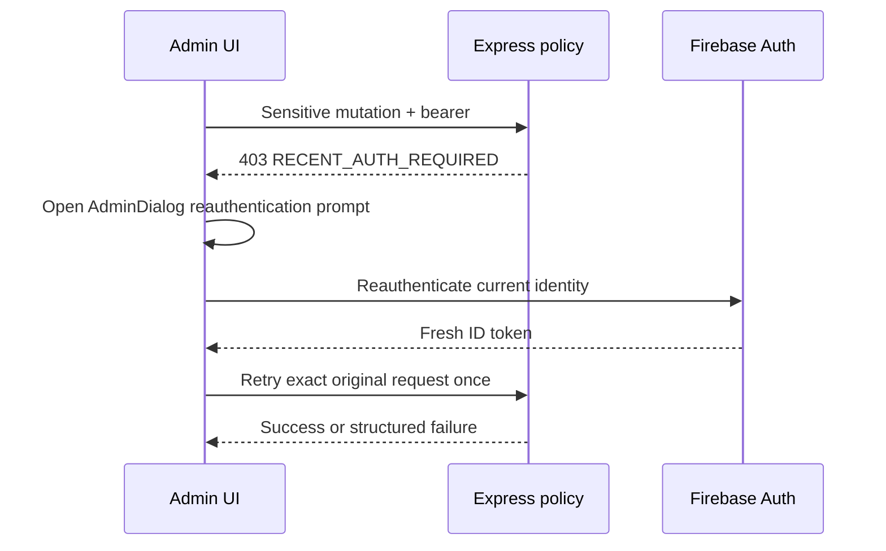
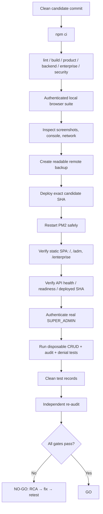

# Super Admin `/adm` Flowcharts

**Status:** implementation flow reference. Production execution remains **UNVERIFIED/NO-GO** until the static frontend deployment failure and authenticated live checks are resolved.

## 1. `/adm` entry and authorization

## 2. Tenant provisioning

## 3. Tenant lifecycle action

Allowed lifecycle graph:

## 4. Queue replay

## 5. Generic user mutation safety

## 6. Phrase library CRUD

## 7. Recent-auth recovery

## 8. Release validation flow

