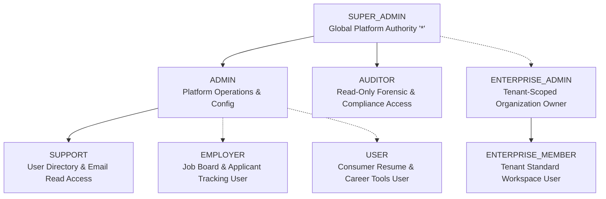

# Super Admin Target Operating Model (TOM) & Enterprise Architecture Blueprint

> **System**: ResumePilot AI SaaS Platform  
> **Audience**: Executive Leadership, Principal Architects, Platform Engineers  
> **Baseline Reference**: `2e211e0480ced45f0795e052df3a713875e00ffe`  
> **Certification Standard**: Enterprise SaaS Multi-Tenant Control Plane

---

## 1. Executive Vision & Architectural Mandate

The **Target Operating Model (TOM)** establishes the architectural, operational, and user experience standards required for a Super Admin to exercise complete, coherent, secure, and auditable control over the entire ResumePilot AI multi-tenant SaaS ecosystem.

```
┌─────────────────────────────────────────────────────────────────────────────────────────────────────────┐
│                                   SUPER ADMIN CONTROL PLANE (SINGLE PANE OF GLASS)                      │
├────────────────────────────────┬────────────────────────────────┬───────────────────────────────────────┤
│       1. IDENTITY & IAM        │      2. TENANT GOVERNANCE      │       3. AI ENTITLEMENT ENGINE        │
│  • 8-Role Enterprise Hierarchy │  • Tenant 360 Lifecycle        │  • Per-User & Tenant Quota Buckets    │
│  • Tenant-Scoped Permissions   │  • Namespace & Data Isolation  │  • Model Allowlist & Gateway Routing  │
│  • TOTP MFA + Step-Up Auth     │  • Delegated Org Admin         │  • Real-Time Token Burn Analytics     │
├────────────────────────────────┼────────────────────────────────┼───────────────────────────────────────┤
│     4. BILLING & CURRENCY      │     5. AUDIT & COMPLIANCE      │        6. PLATFORM OPERATIONS         │
│  • Global Currency Standard    │  • Immutable Before/After Diff │  • Feature Flag Orchestration         │
│  • Multi-Gateway Abstraction   │  • Structured Security Events  │  • Queue & DLQ Monitor Telemetry      │
│  • Subscription Lifecycle      │  • Traced Request Correlation  │  • Live Service Health Probes         │
└────────────────────────────────┴────────────────────────────────┴───────────────────────────────────────┘
```

---

## 2. Domain 1: Identity & Access Management (IAM) Target Model

### 2.1 The Standardized 8-Role RBAC Hierarchy

The platform must evolve from the legacy 4-role model to an 8-role unified governance hierarchy:



| Role Key | Scope | Core Granted Permissions | Gating Constraints |
|---|---|---|---|
| `SUPER_ADMIN` | Global Platform | `*` (Wildcard authority across all tenants, users, settings, and infrastructure) | Enforced TOTP MFA + 10-min `auth_time` step-up for destructive ops. Out-of-band provisioning. |
| `ADMIN` | Platform Operational | `users.*`, `tenants.*`, `system.config.*`, `payments.manage`, `email.*`, `notifications.send` | Multi-factor auth required. Cannot mutate `SUPER_ADMIN` claims. |
| `AUDITOR` | Global Read-Only | `audit.read`, `security.read`, `users.read`, `tenants.read`, `billing.read`, `ai.read` | Cannot execute state modifications. Read-only compliance inspection. |
| `SUPPORT` | Platform Triage | `users.read`, `email.logs.read`, `tenants.read`, `tickets.manage` | Read-only identity access; cannot view hashed secrets or alter billing. |
| `ENTERPRISE_ADMIN` | Tenant-Scoped | `tenant.members.manage`, `tenant.roles.manage`, `tenant.ai.policy`, `tenant.billing.view`, `tenant.audit.read` | Restricted strictly to tenant namespace via Firestore context filter. |
| `ENTERPRISE_MEMBER` | Tenant-Scoped | `tenant.resumes.write`, `tenant.interviews.execute`, `tenant.ai.consume` | Subject to tenant quota bucket policies and model allowlists. |
| `EMPLOYER` | Domain-Scoped | `jobs.manage`, `applications.review`, `candidates.contact` | Governed by Employer verification and review gates. |
| `USER` | Consumer Scope | `resumes.manage`, `coverletters.manage`, `interviews.execute`, `subscription.self` | Default self-service consumer account. |

### 2.2 Tenant-User Relationship & Cross-Tenant Binding

To bridge the critical disconnect between platform users and enterprise organizations, the database model and API projections must bind users to tenant memberships bi-directionally:

```
Firestore Schema:
users/{uid}
├── email, displayName, role (platform-level), preferredCurrency
├── tenantMemberships: [
│     { tenantId: "acme-corp", role: "ENTERPRISE_ADMIN", joinedAt: Timestamp },
│     { tenantId: "dev-labs", role: "ENTERPRISE_MEMBER", joinedAt: Timestamp }
│   ]
└── aiQuotaOverride: { dailyLimit: 500, expiresAt: Timestamp, reason: "Enterprise Pilot" }

tenants/{tenantId}/members/{uid}
├── uid: "usr_...", email: "john@acme.com", role: "ENTERPRISE_ADMIN"
└── status: "ACTIVE", joinedAt: Timestamp, invitedBy: "usr_superadmin"
```

---

## 3. Domain 2: Multi-Tenant Enterprise Governance (Tenant 360)

### 3.1 Tenant 360 Operational Architecture

Every organization record must provide a 360-degree control panel spanning 6 operational quadrants:

1. **Organizational Identity & Lifecycle**: Provisioning, renaming, isolation tiers (`STANDARD`, `ENTERPRISE`, `REGULATED`), region binding, and audited decommissioning.
2. **Membership & Role Delegation**: Live user roster, administrative role assignments, member invitations, and ownership transfer.
3. **Plan, Pricing & Commercial Contracts**: Enterprise plan binding, custom contract terms, seat counts, and payment status tracking.
4. **Tenant AI Governance**: Quota buckets, token consumption limits, approved model allowlists (`allowedModels`), and primary provider preference.
5. **M2M Security & Integration**: Service accounts, client credentials, vector namespace configurations, and IP allowlisting.
6. **Isolated Audit Trail**: Filtered append-only audit stream tracking all intra-tenant and administrative mutations.

---

## 4. Domain 3: Global AI Entitlement & Governance Architecture

### 4.1 Tiered AI Quota & Credit Allocation Engine

The AI administration engine must transition from hardcoded presets to a dynamic multi-level allocation hierarchy:

```
LEVEL 1: PLATFORM GLOBAL DEFAULT TIERS (Configured in Super Admin)
├── Basic Tier:      10 requests / day (15,000 max tokens/day)
├── Premium Tier:   100 requests / day (150,000 max tokens/day)
└── Enterprise Tier: 1,000 requests / day (1,500,000 max tokens/day)
         │
         ▼
LEVEL 2: TENANT-LEVEL ALLOCATIONS (Configured in Tenant 360)
└── Acme Corp: 50,000 requests / month shared pool across 50 seats
         │
         ▼
LEVEL 3: USER-LEVEL OVERRIDES & GRANTS (Configured in User 360)
└── Power User Exception: 500 requests / day (Valid until: 2026-12-31)
```

### 4.2 Architectural Rules for AI Control-Plane
1. **Zero Client Authority**: AI generation endpoints must never accept client-supplied model overrides, quota balances, or token limits. All constraints derive from server-verified tenant policies (`tenantAi.js`).
2. **Atomic Quota Bucketing**: Usage increments must execute via atomic Firestore transaction buckets (`tenantQuota.js`) preventing concurrency race overflows.
3. **Exhaustion Telemetry & Alerts**: System must trigger automated administrative notifications when a tenant or user reaches 80%, 90%, and 100% of their allocation limit.

---

## 5. Domain 4: Universal Billing & Multi-Currency Engine

### 5.1 Single Platform Currency Truth

1. **Centralized Platform Currency**: A single source of truth in Firestore (`data/system_settings.currency`) governing platform pricing, invoices, and analytics.
2. **Multi-Gateway Price Normalization**: Payment intents generated for Stripe (USD/EUR), Razorpay (INR), PayPal, Paytm, or PhonePe must dynamically resolve exchange rates and smallest currency units (cents/paise) against the central catalog.
3. **Currency-Aware Tax Engine**: GST rules (CGST, SGST, IGST) must automatically apply exclusively to INR domestic transactions, while international foreign-currency orders default to export tax-exempt status.

---

## 6. Domain 5: Security, Forensic Auditability & Compliance Fabric

### 6.1 Comprehensive Before/After State Audit Schema

Every administrative mutation must persist a cryptographic audit snapshot:

```json
{
  "id": "audit_89f72b9a10c",
  "occurredAt": "2026-08-25T03:30:00.000Z",
  "actorUid": "usr_superadmin_01",
  "actorEmail": "admin@resumepilot.ai",
  "actorRole": "SUPER_ADMIN",
  "action": "USER_ROLE_ELEVATED",
  "category": "iam.users",
  "severity": "HIGH",
  "targetType": "USER",
  "targetId": "usr_customer_42",
  "tenantId": "acme-corp",
  "changes": {
    "before": { "role": "USER", "membership": "Basic" },
    "after": { "role": "ADMIN", "membership": "Premium" }
  },
  "context": {
    "ipAddress": "203.0.113.19",
    "userAgent": "Mozilla/5.0 ... Chrome/128.0.0.0",
    "requestId": "req_8f7b2c9e4a",
    "authTime": 1756092500,
    "mfaVerified": true
  }
}
```

---

## 7. Domain 6: Control-Plane UX & Real-DOM Interaction Standards

### 7.1 UX Standards for Super Admin Control Plane

1. **Functional Component Architecture**: All administrative modules must use modern React functional components with custom hooks (`useAdminSession`, `usePagination`, `useDebounce`, `useTelemetry`).
2. **Server-Side Cursor Pagination**: Standardized page controls (`<Pagination controls />`) consuming backend `pageToken` with configurable page sizes (25, 50, 100).
3. **Accessible Modal & Menu Systems**: Strict WCAG 2.1 AA compliance:
   - Focus trapped inside active modals.
   - Dropdowns wired with `role="menu"` and full keyboard navigation (`ArrowUp`, `ArrowDown`, `Escape`, `Enter`).
   - Persistent alert banners with explicit dismiss controls.
4. **Responsive Card-Table Hybrid**: Tables automatically transform into accessible data cards on viewports `<768px`.

---

## 8. Phased Implementation Roadmap & Governance

```
PHASE 2A: P0 FOUNDATIONAL CONTROL (Sprint 1)
├── 1. Wire Server-Side User Pagination & Page Controls
├── 2. Add Tenant Membership Columns & Filtering to Users Manager
├── 3. Implement Central Platform Currency Configuration
├── 4. Establish Dynamic AI Quota Override API & UI Controls
└── 5. Create Administrative User Creation & Invitation Modal

PHASE 2B: P1 DEEP GOVERNANCE (Sprint 2)
├── 6. Build User 360 Full Telemetry Inspection Drawer
├── 7. Expand PlatformTenants into Complete Tenant 360 Workspace
├── 8. Formalize 8-Role RBAC Authorization Middleware
├── 9. Refactor UsersManager from Legacy Class to Functional Component
└── 10. Construct Dedicated Subscriptions Lifecycle Dashboard

PHASE 2C: P2 ADVANCED TELEMETRY (Sprint 3)
├── 11. Implement Batch Bulk Operations (Multi-Select, Suspend, Migrate)
├── 12. Build Historical AI Consumption Time-Series Dashboard
├── 13. Upgrade Security Audit Trail with Before/After Diff Snapshots
└── 14. Deliver WCAG 2.1 AA Accessible Keyboard Navigation

PHASE 2D: P3 POLISH & CERTIFICATION (Sprint 4)
├── 15. Real-DOM Playwright Browser Verification & Control Census
├── 16. Multi-Viewport Acceptance Verification (7 Breakpoints)
└── 17. Zero-Regression Production Build & Synchronized Deployment
```

---

## 9. Non-Negotiable Governance & Code Freeze Invariants

1. **AI Engine Immutability**: All AI prompts, models, provider cascades, response parsers, token generators, and CBT simulators remain strictly frozen. Changes are confined exclusively to administrative entitlement, quota allocation, and UI control planes.
2. **Certified Real-DOM Baseline**: The 1,716 certified Real-DOM controls (`REAL_DOM_CONTROL_CENSUS.json` and `REAL_BROWSER_CONTROL_EXECUTION.json`) must remain fully functional with 0 regressions.
3. **Continuous Test Verification**: All automated test suites (Security 246/246, Interview 28/28, Enterprise 23/23, Templates 72/72) must pass 100% prior to any deployment.
