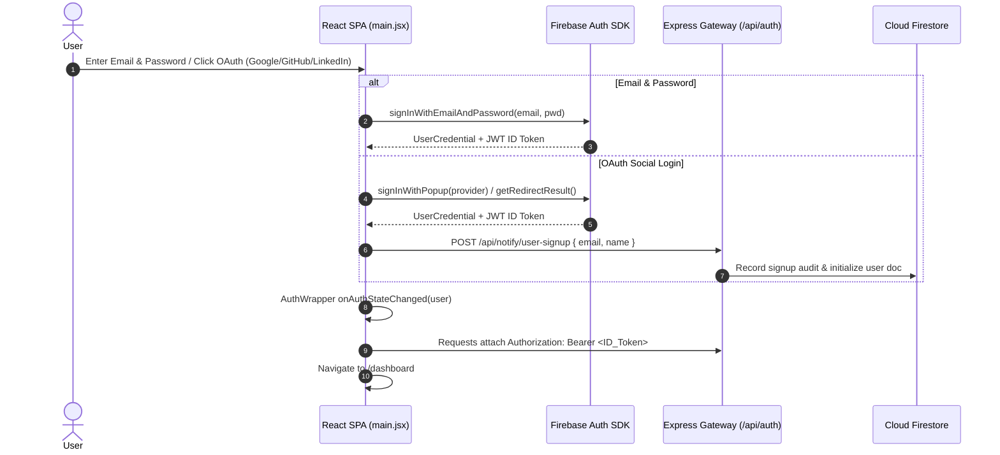
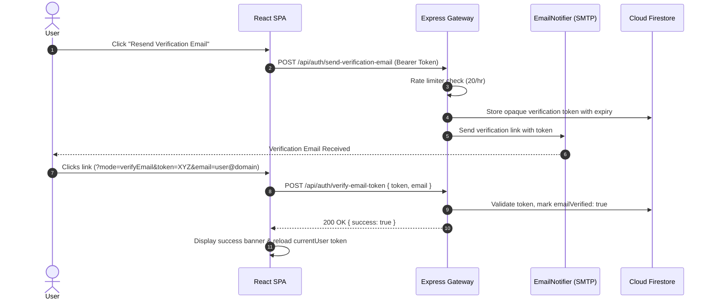
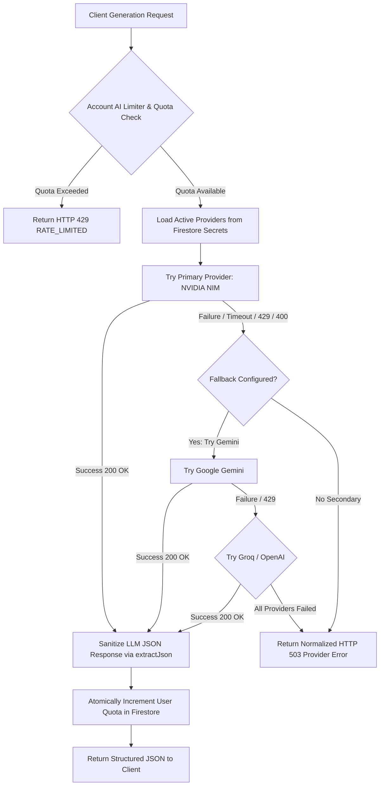
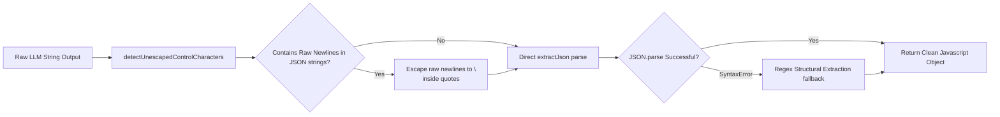
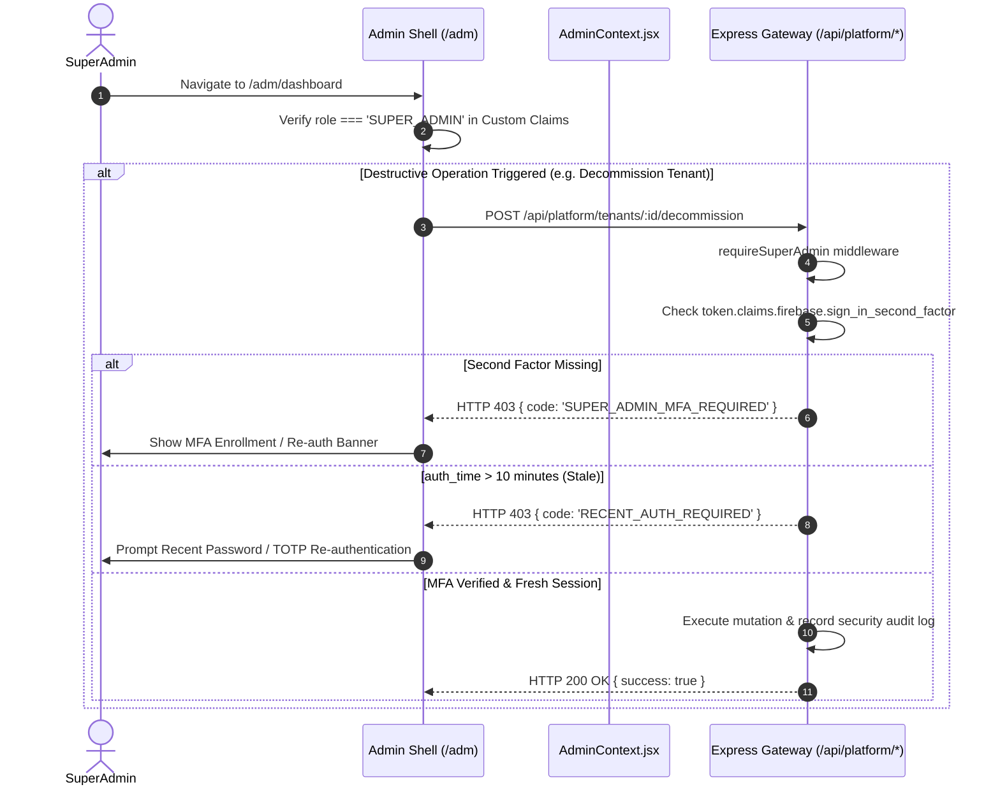
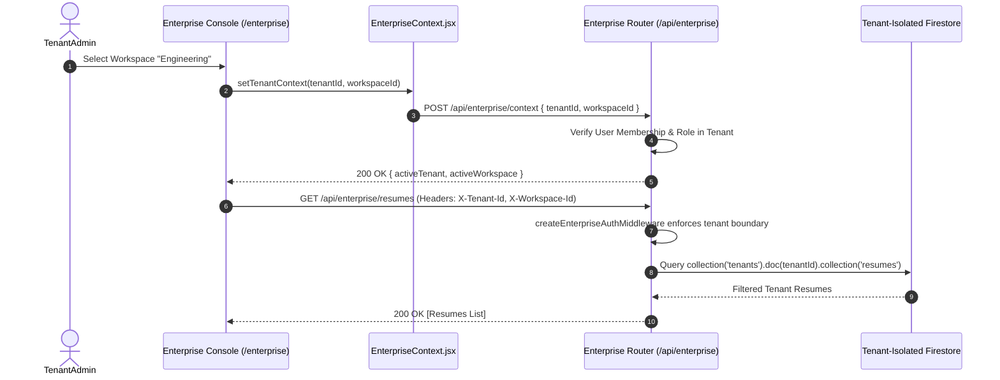
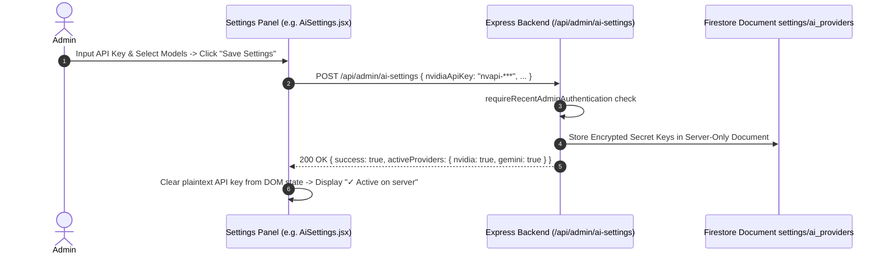
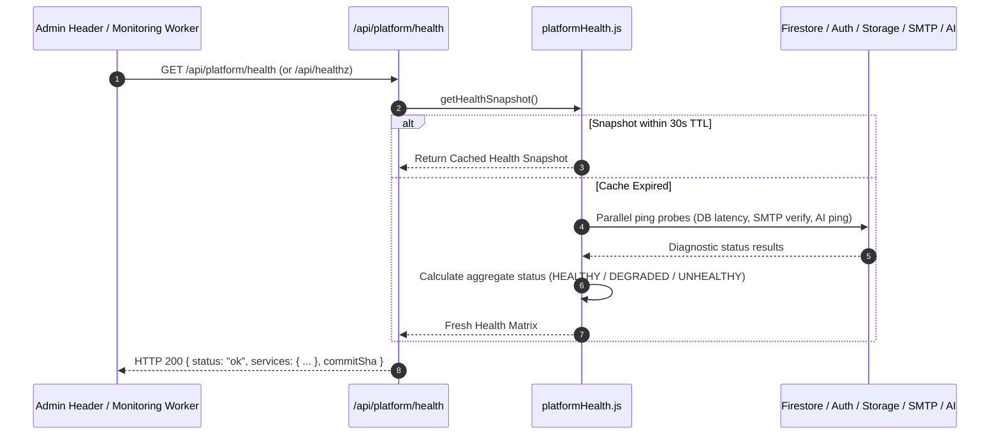
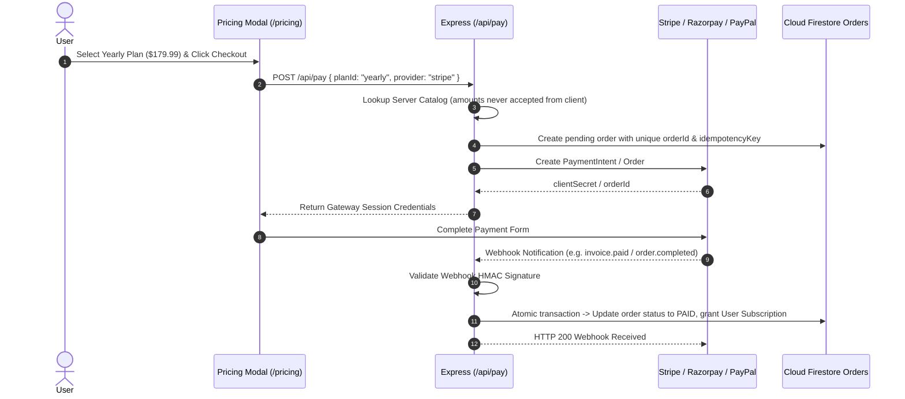
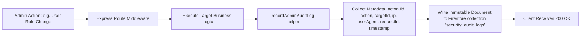

# ResumePilot AI — Master System Flowcharts

> **Authoritative System Flowcharts**  
> **Source Commit:** `8c7905f`  
> **Classification:** AUTHORITATIVE SOURCE OF TRUTH

---

## 1. Authentication Lifecycle

---

## 2. Email Verification Flow

---

## 3. AI Inference Request & Automatic Multi-Provider Failover

---

## 4. AI Output Control-Character Sanitization & Self-Healing

---

## 5. Super Admin Authentication & MFA/TOTP Step-Up Gate

---

## 6. Tenant Context Selection & Workspace Isolation

---

## 7. Configuration Management & Zero Client Secret Leakage

---

## 8. Platform Health Monitoring & Diagnostics

---

## 9. Payment Lifecycle & Idempotency Gate

---

## 10. Audit Logging & Non-Repudiation Trail

