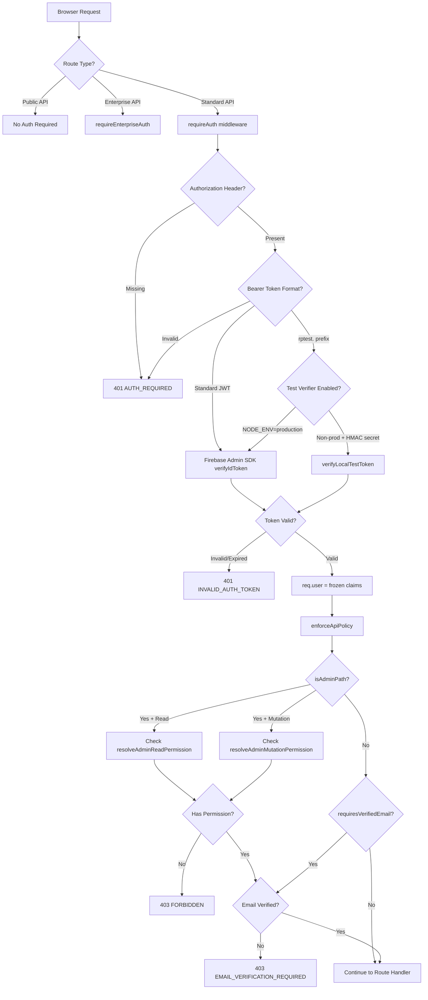
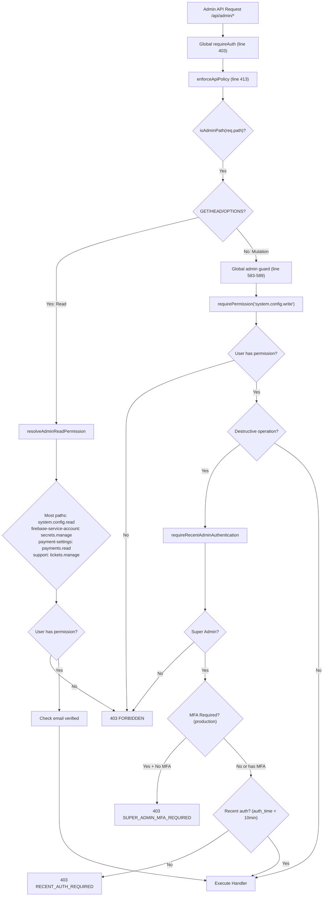
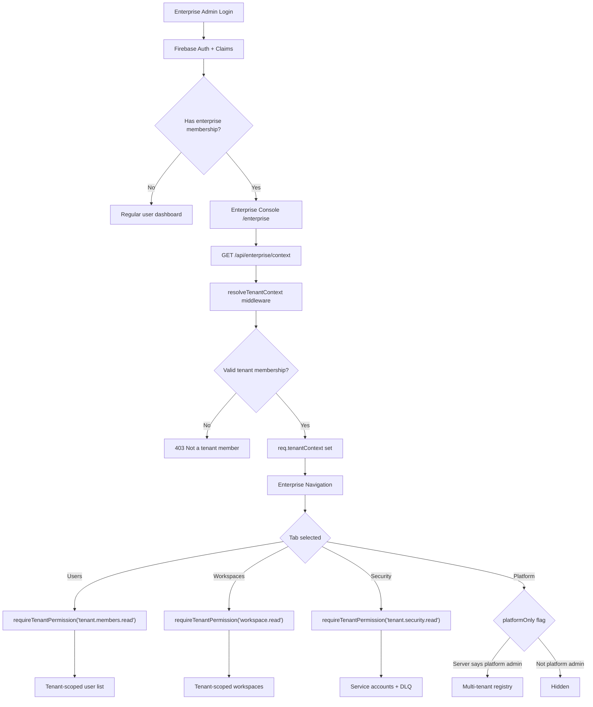
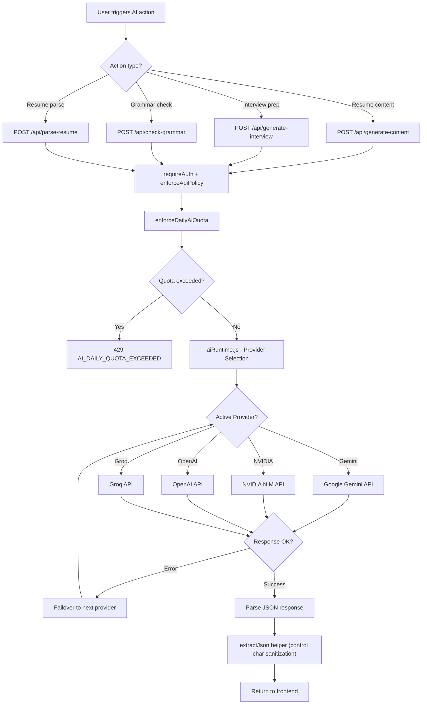

# Authentication & Authorization Flowcharts

> **Audit SHA**: `06f443d`

## Authentication Flow



## Admin Authorization Chain



## Candidate User Journey

```mermaid
flowchart TD
    A[Landing Page /] --> B{Authenticated?}
    B -->|No| C[Login / Sign Up]
    C --> D[Firebase Auth]
    D --> E{Email Verified?}
    E -->|No| F[Verification Email Sent]
    F --> G[Click Verify Link]
    G --> H[/api/auth/verify-email-token]
    E -->|Yes| I[Dashboard /dashboard]
    H --> I
    
    I --> J[Dashboard Homepage]
    J --> K{Action?}
    
    K -->|Build Resume| L[/build-resume/heading]
    L --> M[13 Step Wizard]
    M --> N[Save to MariaDB /api/resumes/:id]
    N --> O{Export?}
    O -->|PDF| P[/api/export with headless browser]
    O -->|DOCX| Q[/api/export-docx]
    
    K -->|AI Interview| R[/dashboard/interview]
    R --> S[Generate Questions /api/generate-interview]
    S --> T[Practice Session]
    
    K -->|Jobs| U[/dashboard/job-tracker]
    U --> V[Track Applications]
    
    K -->|Portfolio| W[/portfolio/builder]
    W --> X[Save /api/portfolios/:id]
    
    K -->|Settings| Y[/dashboard/settings]
    Y --> Z[Profile / Account / MFA]
    
    K -->|Billing| AA[/dashboard/plans]
    AA --> AB[Payment Flow]
```

## Payment Flow

```mermaid
flowchart TD
    A[User selects Plan] --> B[/billing/plans or /dashboard/plans]
    B --> C{Provider?}
    
    C -->|Stripe| D["POST /api/pay"]
    D --> E[Backend creates Stripe Checkout Session]
    E --> F[Redirect to Stripe]
    F --> G["Stripe Webhook /api/stripe-webhook"]
    G --> H[Verify webhook signature]
    H --> I[Activate subscription in MariaDB]
    
    C -->|PayPal| J["POST /api/paypal/create-order"]
    J --> K[Backend creates PayPal order]
    K --> L[PayPal approval]
    L --> M["POST /api/paypal/verify"]
    M --> I
    
    C -->|Razorpay| N["POST /api/razorpay/create-order"]
    N --> O[Backend creates Razorpay order]
    O --> P[Razorpay payment modal]
    P --> Q["POST /api/razorpay/verify-payment"]
    Q --> I
    
    C -->|Paytm| R["POST /api/paytm/initiate-transaction"]
    R --> S[Redirect to Paytm]
    S --> T["POST /api/paytm/callback"]
    T --> U["POST /api/paytm/verify-transaction"]
    U --> I
    
    C -->|PhonePe| V["POST /api/phonepe/initiate"]
    V --> W[Redirect to PhonePe]
    W --> X["POST /api/phonepe/callback"]
    X --> Y["POST /api/phonepe/status"]
    Y --> I
    
    I --> Z[User sees active subscription]
```

## Enterprise Tenant Flow



## AI Generation Flow


